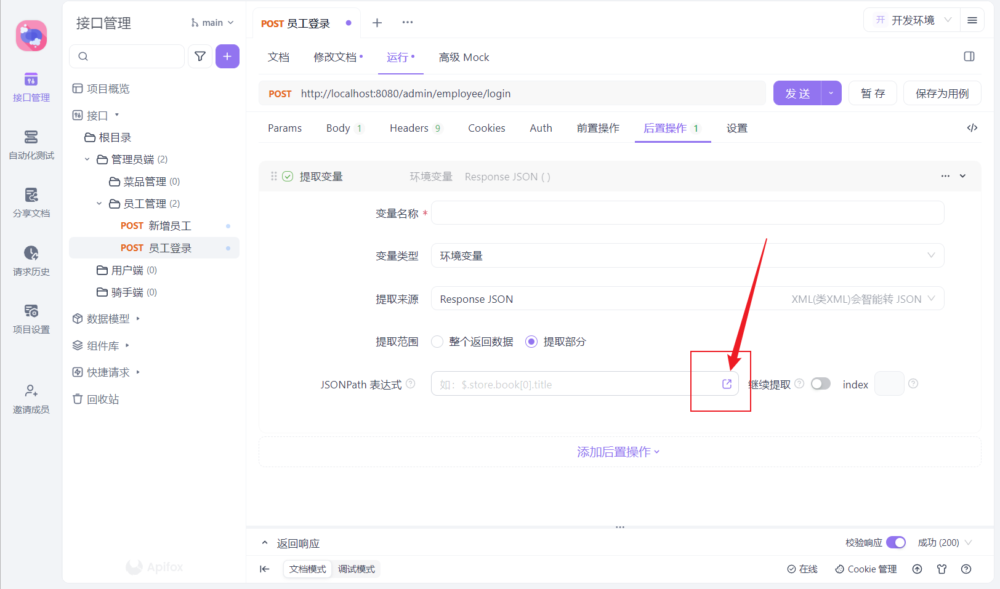

## Apifox发送请求时如何自动获取Token

官方文档[Apifox 发请求时如何自动获取Cookie 和 token](https://apifox.com/blog/cookies-and-token/)

### 1. 手动登陆获取Token

发送登录接口请求，获取响应数据结构如下

我们现在要将 `token` 这个字段提取到环境变量中

在【后置操作】中选择提取变量

点击组件，打开可视化的【JSONPath 提取工具】

填写 [JSONPath](https://apifox.com/help/reference/json-path/) 表达式 `$.data.token`，点击【确定】

然后填写“变量名称”，填写完毕后保存即可。

保存后来到运行页，点击""发送"按钮发送请求，你会看到”控制台“中token已经存取到了环境变量中，可以点开右上角的“环境管理”查看。

token 获取到了之后，我们就可以将这个 token 作用于其它接口了。

可以在“全局参数”中设置，所有接口运行时都会自动加上“全局参数”里的信息。

在全局参数中，点击组件“插入动态值”，选择“读取动态值”

选择【后置操作】中设置的变量名“token”，然后点击“插入"按钮

填入Header中需要的参数名，让保存即可。

