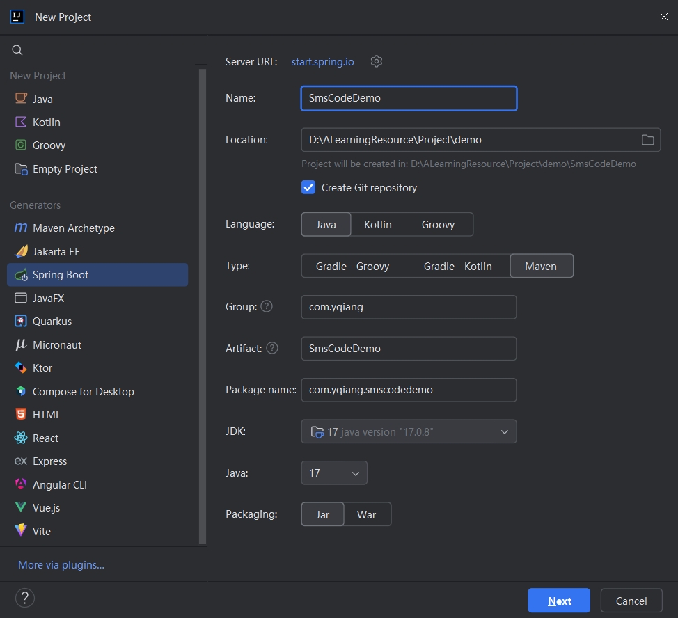
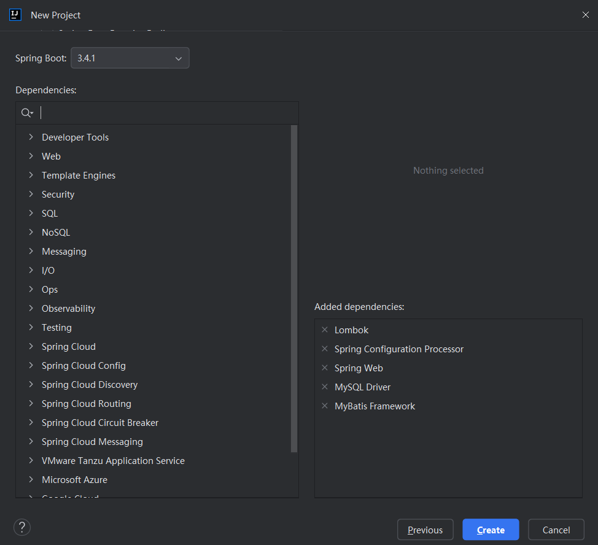
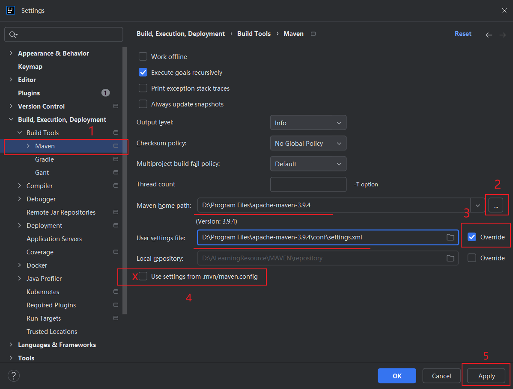
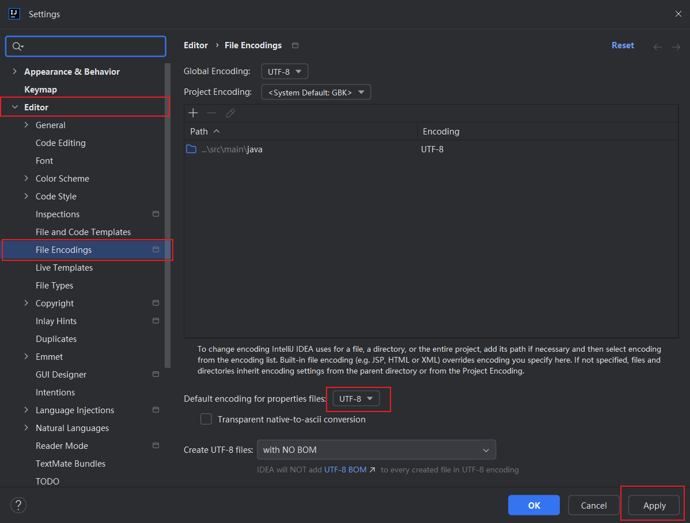
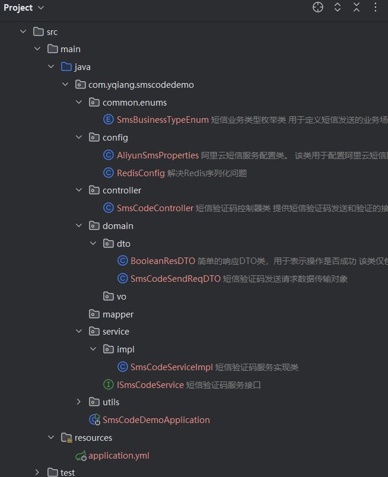

# 官方示例

阿里云官方示例代码[阿里云官方示例代码地址](https://help.aliyun.com/zh/sms/developer-reference/using-the-openapi-example?spm=a2c4g.11186623.help-menu-44282.d_4_4_0.44af5634O5Mi5f&scm=20140722.H_2411226._.OR_help-T_cn~zh-V_1)

```java
package com.aliyun.sample;

import com.aliyun.teaopenapi.models.Config;
import com.aliyun.dysmsapi20170525.Client;
import com.aliyun.dysmsapi20170525.models.SendSmsRequest;
import com.aliyun.dysmsapi20170525.models.SendSmsResponse;
import static com.aliyun.teautil.Common.toJSONString;

public class Sample {
    public static Client createClient() throws Exception {
        Config config = new Config()
                // 配置 AccessKey ID，请确保代码运行环境设置了环境变量 ALIBABA_CLOUD_ACCESS_KEY_ID。
                .setAccessKeyId(System.getenv("ALIBABA_CLOUD_ACCESS_KEY_ID"))
                // 配置 AccessKey Secret，请确保代码运行环境设置了环境变量 ALIBABA_CLOUD_ACCESS_KEY_SECRET。
                .setAccessKeySecret(System.getenv("ALIBABA_CLOUD_ACCESS_KEY_SECRET"));
        
        // 配置 Endpoint
        config.endpoint = "dysmsapi.aliyuncs.com";

        return new Client(config);
    }

    public static void main(String[] args) throws Exception {
        // 初始化请求客户端
        Client client = Sample.createClient();

        // 构造请求对象，请填入请求参数值
        SendSmsRequest sendSmsRequest = new SendSmsRequest()
                .setPhoneNumbers("1390000****")
                .setSignName("阿里云")
                .setTemplateCode("SMS_15305****")
                .setTemplateParam("{\"name\":\"张三\",\"number\":\"1390000****\"}");

        // 获取响应对象
        SendSmsResponse sendSmsResponse = client.sendSms(sendSmsRequest);

        // 响应包含服务端响应的 body 和 headers
        System.out.println(toJSONString(sendSmsResponse));
    }
}
```

# 验证码业务相关接口

## POST 发送短信验证码

POST /sms-code/send

> Body 请求参数

```json
{
  "phone": "173****6627",
  "businessType": "3"
}
```

### 请求参数

| 名称            | 位置   | 类型   | 必选 | 说明                                    |
| --------------- | ------ | ------ | ---- | --------------------------------------- |
| token           | header | string | 否   | none                                    |
| body            | body   | object | 否   | none                                    |
| » phone         | body   | string | 是   | 下发手机号码                            |
| » bussinessType | body   | string | 是   | 业务类型，1：注册，2：忘记密码，3：登录 |

> 返回示例

> 200 Response

```json
{}
```

### 返回结果

| 状态码 | 状态码含义 | 说明 | 数据模型 |
| ------ | ---------- | ---- | -------- |
| 200    | OK         | none | Inline   |

## GET 校验短信验证码

GET /sms-code/verify

### 请求参数

| 名称         | 位置   | 类型   | 必选 | 说明       |
| ------------ | ------ | ------ | ---- | ---------- |
| phone        | query  | string | 否   | 验证手机号 |
| businessType | query  | string | 否   | 业务类型   |
| verifyCode   | query  | string | 否   | 验证码     |
| token        | header | string | 否   | none       |

> 返回示例

> 200 Response

```json
{
  "isSuccess": true
}
```

### 返回结果

| 状态码 | 状态码含义 | 说明 | 数据模型 |
| ------ | ---------- | ---- | -------- |
| 200    | OK         | none | Inline   |

### 返回数据结构

状态码 **200**

| 名称        | 类型    | 必选 | 约束 | 中文名 | 说明                                        |
| ----------- | ------- | ---- | ---- | ------ | ------------------------------------------- |
| » isSuccess | boolean | true | none |        | true：验证码验证成功，flase：验证码验证失败 |

# 创建项目流程









# 验证码业务相关代码



## Maven依赖

```xml
<dependencies>
		<!-- 添加Spring Boot Web模块依赖，用于创建Web应用程序 -->
		<dependency>
			<groupId>org.springframework.boot</groupId>
			<artifactId>spring-boot-starter-web</artifactId>
		</dependency>
		
		<!-- 添加MyBatis Spring Boot启动器依赖，用于集成MyBatis框架 -->
		<dependency>
			<groupId>org.mybatis.spring.boot</groupId>
			<artifactId>mybatis-spring-boot-starter</artifactId>
			<version>3.0.4</version>
		</dependency>
		
		<!-- 添加MySQL数据库连接器依赖，用于在运行时与MySQL数据库通信 -->
		<dependency>
			<groupId>com.mysql</groupId>
			<artifactId>mysql-connector-j</artifactId>
			<scope>runtime</scope>
		</dependency>
		
		<!-- 添加Spring Boot配置处理器依赖，用于辅助配置元数据的生成 -->
		<dependency>
			<groupId>org.springframework.boot</groupId>
			<artifactId>spring-boot-configuration-processor</artifactId>
			<optional>true</optional>
		</dependency>
		
		<!-- 添加Lombok依赖，用于简化代码编写，如自动getter和setter等 -->
		<dependency>
			<groupId>org.projectlombok</groupId>
			<artifactId>lombok</artifactId>
			<optional>true</optional>
		</dependency>
		
		<!-- 添加Spring Boot Redis数据模块依赖，用于集成Redis数据库 -->
		<dependency>
			<groupId>org.springframework.boot</groupId>
			<artifactId>spring-boot-starter-data-redis</artifactId>
		</dependency>
		
		<!-- 添加Spring Boot测试模块依赖，用于进行单元测试和集成测试 -->
		<dependency>
			<groupId>org.springframework.boot</groupId>
			<artifactId>spring-boot-starter-test</artifactId>
			<scope>test</scope>
		</dependency>
		
		<!-- 添加MyBatis Spring Boot测试启动器依赖，用于测试MyBatis集成情况 -->
		<dependency>
			<groupId>org.mybatis.spring.boot</groupId>
			<artifactId>mybatis-spring-boot-starter-test</artifactId>
			<version>3.0.4</version>
			<scope>test</scope>
		</dependency>
    
	</dependencies>
```

添加阿里云短信Maven依赖

```xml
<dependency>
  <groupId>com.aliyun</groupId>
  <artifactId>dysmsapi20170525</artifactId>
  <version>3.1.0</version>
</dependency>
```

## yml配置

```yaml
# 配置服务器端口
server:
  port: 8080           # 设置HTTP服务器的监听端口为8080
# Spring框架相关配置
spring:
  # MySQL 数据库连接配置
  datasource:
    driver-class-name: com.mysql.cj.jdbc.Driver
    url: jdbc:mysql://localhost:3306/sms_code_demo?useUnicode=true&characterEncoding=UTF-8&serverTimezone=Asia/Shanghai
    username: root
    password: 123456
  # Redis 缓存配置
  data:
    redis:
      host: localhost
      port: 6379
      #password:                  # 如果Redis设置了密码，请在此处填写
      lettuce:
        pool:
          max-active: 8          # 设置Redis连接池的最大活跃连接数
          max-wait: -1           # 设置Redis连接池获取连接的最大等待时间，-1表示无限等待
          max-idle: 8            # 设置Redis连接池的最大空闲连接数
          min-idle: 0            # 设置Redis连接池的最小空闲连接数
  # Jackson配置，用于JSON序列化和反序列化
  jackson:
    date-format: yyyy-MM-dd HH:mm:ss  # 设置日期格式
    time-zone: Asia/Shanghai          # 设置时区

# MyBatis框架配置
mybatis:
  type-aliases-package: com.example.demo.entity  # 设置实体类包路径
  mapper-locations: classpath*:mapper/*.xml      # 设置Mapper XML文件路径
  configuration:
    map-underscore-to-camel-case: true           # 开启下划线到驼峰命名的自动转换

# 日志配置
logging:
  level:
    root: info          # 设置全局日志级别为info
    org.springframework.web: debug  # 设置Spring Web的日志级别为debug
    com.example.demo: debug         # 设置项目自身的日志级别为debug
  file:
    name: logs/sms-codedemo.log     # 设置日志文件路径和名称
```

添加阿里云配置

```yaml
aliyun:
  sms:
    accessKeyId: "****5tBMw44ydJPF3****"
    accessKeySecret: "*****xJKruVxcLJs5b7d****"
    signName: "短信接口"
    templateCode: "SMS_476795235"
```

## Controller层

```java
/**
 * 短信验证码控制器类
 * 提供短信验证码发送和验证的接口
 */
@RestController
@RequestMapping("/sms-code")
public class SmsCodeController {

    // 注入短信验证码服务接口
    @Resource
    private ISmsCodeService smsCodeService;

    /**
     * 发送短信验证码
     *
     * @param smsCodeSendReqDTO 包含发送短信验证码请求信息的数据传输对象
     */
    @PostMapping("/send")
    public void smsCodeSend(@RequestBody SmsCodeSendReqDTO smsCodeSendReqDTO) {
        smsCodeService.smsCodeSend(smsCodeSendReqDTO);
    }

    /**
     * 验证短信验证码
     *
     * @param phone 用户手机号
     * @param businessType 业务类型
     * @param verifyCode 验证码
     * @return 返回验证结果，true表示验证成功，false表示验证失败
     */
    @GetMapping("/verify")
    public BooleanResDTO verify(@RequestParam("phone") String phone,
                                @RequestParam("businessType") String businessType,
                                @RequestParam("verifyCode") String verifyCode){
        return new BooleanResDTO(smsCodeService.verify(phone,businessType,verifyCode));
    }
}
```

## Service层

```java
/**
 * 短信验证码服务实现类
 */
@Service
@Slf4j
public class SmsCodeServiceImpl implements ISmsCodeService {
    public static final String VERIFY_CODE = "PHONE:CODE:VERIFY_CODE_%s_%s";
    public static final String IP_COUNT = "IP:CODE:COUNT:VERIFY_CODE_%s_%s";
    public static final int VERIFY_CODE_LENGTH = 6;
    public static final int VERIFY_CODE_EXPIRE_SECONDS = 300;
    public static final int IP_SEND_LIMIT_HOURS = 10;
    public static final int IP_SEND_LIMIT_COUNT = 10;
    public static final int SEND_INTERVAL_MILLIS = 60000;
    @Resource
    private AliyunSmsUtils aliyunSmsUtils;
    @Resource
    private RedisTemplate<String,String> redisTemplate;
    @Resource
    private HttpServletRequest request;
    @Override
    public void smsCodeSend(SmsCodeSendReqDTO smsCodeSendReqDTO) {
        String phone  = smsCodeSendReqDTO.getPhone();
        String businessType = smsCodeSendReqDTO.getBusinessType();

        // 参数校验
        if (!StringUtils.hasText(phone)) {
            throw new IllegalArgumentException("手机号不能为空");
        }
        if (!StringUtils.hasText(businessType)) {
            throw new IllegalArgumentException("业务类型不能为空");
        }

        //记录并判断一定时间内同一个ip发送验证码的次数
        String ipAddress = IpUtil.getIpAddress(request);
        String ipCountKey = String.format(IP_COUNT, ipAddress,businessType);
        Long sendCount = redisTemplate.opsForValue().increment(ipCountKey);
        if(sendCount == 1){
            redisTemplate.expire(ipCountKey,IP_SEND_LIMIT_HOURS,TimeUnit.HOURS);
        }else if(sendCount>IP_SEND_LIMIT_COUNT){
            throw new RuntimeException("同一IP地址10个小时只能发送验证码10次");
        }

        //判断验证码是否发送过
        String verifyCodeKey = String.format(VERIFY_CODE, phone, businessType);
        Boolean isKeyExists = redisTemplate.hasKey(verifyCodeKey);
        if(Boolean.TRUE.equals(isKeyExists)){
            //验证码在Redis存储失败，表示在分钟内已经发送过验证码了
            //1.判断60s内是否重复发送
            String verifyCodeValue = redisTemplate.opsForValue().get(verifyCodeKey);
            if (StringUtils.hasText(verifyCodeValue)) {
                String[] split = verifyCodeValue.split("-");
                long sendTime = Long.parseLong(split[1]);
                long nowTime = System.currentTimeMillis();
                if (nowTime - sendTime <= SEND_INTERVAL_MILLIS) {
                    throw new RuntimeException("60秒之内不能重复发送验证码");
                }
            } else {
                throw new RuntimeException("验证码存储状态异常");
            }
        }
        // 生成6位验证码
        int random = ThreadLocalRandom.current().nextInt(100000, 1000000);
        String verifyCode = String.valueOf(random);
        long verifyTime = System.currentTimeMillis();
        //发送验证码
        Map<String, String> params = new HashMap<>();
        params.put("code", verifyCode);
        String templateParam = JSON.toJSONString(params);
        log.info("向手机号{}发送验证码{}",phone,verifyCode);
        SendSmsResponse response = aliyunSmsUtils.sendSms(phone, templateParam);
        if (Objects.equals(HttpStatus.OK.value(),response.getStatusCode())) {
            //验证码发送成功
            redisTemplate.opsForValue().set(verifyCodeKey,verifyCode+"-"+verifyTime,300,TimeUnit.SECONDS);
        }
    }

    @Override
    public boolean verify(String phone, String businessType, String verifyCode) {
        // 参数校验
        if (!StringUtils.hasText(phone)) {
            throw new IllegalArgumentException("手机号不能为空");
        }
        if (!StringUtils.hasText(businessType)) {
            throw new IllegalArgumentException("业务类型不能为空");
        }
        if (!StringUtils.hasText(verifyCode)) {
            throw new IllegalArgumentException("验证码不能为空");
        }
        String verifyCodeKey = String.format(VERIFY_CODE, phone, businessType);
        String verifyCodeValue = redisTemplate.opsForValue().get(verifyCodeKey);
        if (!StringUtils.hasText(verifyCodeValue)) {
            return false;
        }
        String[] split = verifyCodeValue.split("-");
        String code = split[0];
        return Objects.equals(verifyCode, code);
    }
}

```

## 配置类

```java
/**
 * 阿里云短信服务配置类。
 * 该类用于配置阿里云短信服务的相关属性，包括访问密钥、短信签名和短信模板等信息。
 */
@Data
@Component
@ConfigurationProperties(prefix = "aliyun.sms")
public class AliyunSmsProperties {
    /**
     * 阿里云访问密钥ID (AccessKeyId)。
     * 用于标识API请求的发送者身份，是调用阿里云服务时的身份验证凭证之一。
     */
    private String accessKeyId;

    /**
     * 阿里云访问密钥秘密 (AccessKeySecret)。
     * 与AccessKeyId配合使用，用于加密签名字符串和服务器端验证签名字符串的密钥。
     *
     */
    private String accessKeySecret;

    /**
     * 短信签名名称。
     *
     */
    private String signName;


    /**
     * 短信模板Code。
     * 发送短信时，会根据此模板Code来格式化短信内容。
     *
     */
    private String templateCode;

}
```

## 实体类

```java
/**
 * 简单的响应DTO类，用于表示操作是否成功
 * 该类仅包含一个布尔类型的字段，用于指示操作状态（成功或失败）
 */
@Data
@AllArgsConstructor
@NoArgsConstructor
public class BooleanResDTO {
    /**
     * 指示操作是否成功的布尔值
     * 默认值为false，即假设操作未成功，需要显式设置为true来表示成功
     */
    private Boolean isSuccess = false;
}
```

```java
/**
 * 短信验证码发送请求数据传输对象
 */
@Data
public class SmsCodeSendReqDTO {
    /**
     * 下发手机号码
     */
    private String phone;
    /**
     * 业务类型，1：注册，2：忘记密码,3: 登录
     */
    private String businessType;
}
```

工具类

```java

/**
 * 阿里云短信服务工具类
 */
@Component
public class AliyunSmsUtils {
    @Resource
    private AliyunSmsProperties aliyunSmsProperties;

    /**
     * 发送短信验证码
     *
     * @param phoneNumbers 接收短信的手机号码
     * @param templateParam 短信模板参数
     * @return 短信发送响应结果
     * @throws RuntimeException 如果短信发送失败，则抛出运行时异常
     */
    public SendSmsResponse sendSms(String phoneNumbers, String templateParam){
        // 配置阿里云短信服务客户端
        Config config = new Config()
                // 配置 AccessKey ID，请确保代码运行环境设置了环境变量 ALIBABA_CLOUD_ACCESS_KEY_ID。
                .setAccessKeyId(aliyunSmsProperties.getAccessKeyId())
                // 配置 AccessKey Secret，请确保代码运行环境设置了环境变量 ALIBABA_CLOUD_ACCESS_KEY_SECRET。
                .setAccessKeySecret(aliyunSmsProperties.getAccessKeySecret());
        // 配置 Endpoint
        config.endpoint = "dysmsapi.aliyuncs.com";
        try {
            // 初始化请求客户端
            Client client = new Client(config);
            // 构建发送短信请求
            SendSmsRequest sendSmsRequest = new SendSmsRequest()
                    .setPhoneNumbers(phoneNumbers)
                    .setSignName(aliyunSmsProperties.getSignName())
                    .setTemplateCode(aliyunSmsProperties.getTemplateCode())
                    .setTemplateParam(templateParam);

            // 发送短信并返回响应结果
            return client.sendSms(sendSmsRequest);
        }catch (Exception e){
            // 如果短信发送失败，则抛出运行时异常
            throw new RuntimeException("发送验证码失败");
        }
    }
}

```

```java
/**
 * IP工具类
 */
public class IpUtil {
    private static final String UNKNOWN = "unknown";
    private static final String LOCALHOST_IP = "127.0.0.1";
    // 客户端与服务器同为一台机器，获取的 ip 有时候是 ipv6 格式
    private static final String LOCALHOST_IPV6 = "0:0:0:0:0:0:0:1";
    private static final String SEPARATOR = ",";

    // 根据 HttpServletRequest 获取 IP
    public static String getIpAddress(HttpServletRequest request) {
        if (request == null) {
            return "unknown";
        }
        String ip = request.getHeader("x-forwarded-for");
        if (ip == null || ip.length() == 0 || UNKNOWN.equalsIgnoreCase(ip)) {
            ip = request.getHeader("Proxy-Client-IP");
        }
        if (ip == null || ip.length() == 0 || UNKNOWN.equalsIgnoreCase(ip)) {
            ip = request.getHeader("X-Forwarded-For");
        }
        if (ip == null || ip.length() == 0 || UNKNOWN.equalsIgnoreCase(ip)) {
            ip = request.getHeader("WL-Proxy-Client-IP");
        }
        if (ip == null || ip.length() == 0 || UNKNOWN.equalsIgnoreCase(ip)) {
            ip = request.getHeader("X-Real-IP");
        }
        if (ip == null || ip.length() == 0 || UNKNOWN.equalsIgnoreCase(ip)) {
            ip = request.getRemoteAddr();
            if (LOCALHOST_IP.equalsIgnoreCase(ip) || LOCALHOST_IPV6.equalsIgnoreCase(ip)) {
                // 根据网卡取本机配置的 IP
                InetAddress iNet = null;
                try {
                    iNet = InetAddress.getLocalHost();
                } catch (UnknownHostException e) {
                    e.printStackTrace();
                }
                if (iNet != null) {
                    ip = iNet.getHostAddress();
                }
            }
        }
        // 对于通过多个代理的情况，分割出第一个 IP
        if (ip != null && ip.length() > 15) {
            if (ip.indexOf(SEPARATOR) > 0) {
                ip = ip.substring(0, ip.indexOf(SEPARATOR));
            }
        }
        return LOCALHOST_IPV6.equals(ip) ? LOCALHOST_IP : ip;
    }
}
```

