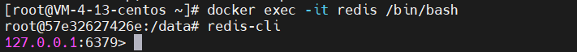
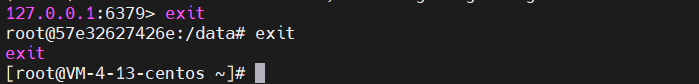

# Docker

Docker官网地址  <https://www.docker.com/>

# Docker安装

## Centos安装Docker

### 卸载旧版本

**（如果之前安装过的话）**

旧版本的 Docker 称为 docker 或者 docker-engine，使用以下命令卸载旧版本：

```
sudo yum remove docker \
                  docker-client \
                  docker-client-latest \
                  docker-common \
                  docker-latest \
                  docker-latest-logrotate \
                  docker-logrotate \
                  docker-engine
```

安装所需软件包（提供实用程序）

```
sudo yum install -y yum-utils
```

使用以下命令来设置稳定的仓库

> （使用官方源地址（比较慢）
>
> ```
> yum-config-manager --add-repo http://download.docker.com/linux/centos/docker-ce.repo
> ```
>
> （阿里仓库）
>
> ```
> yum-config-manager --add-repo http://mirrors.aliyun.com/docker-ce/linux/centos/docker-ce.repo
> ```
>

### 安装 Docker

+ 安装**最新Docker版本**

  安装最新版本的 Docker和containerd，或者转到下一步安装特定版本

  ```
  sudo yum install docker-ce docker-ce-cli containerd.io
  ```

+ 或者安装**特定Docker版本**

  1.查看可用版本有哪些

  ```
  sudo yum list docker-ce --showduplicates | sort -r
  ```

  查询结果，例如：

  ```
  docker-ce.x86_64  3:18.09.1-3.el7           docker-ce-stable
  docker-ce.x86_64  3:18.09.0-3.el7           docker-ce-stable
  docker-ce.x86_64  18.06.1.ce-3.el7           docker-ce-stable
  docker-ce.x86_64  18.06.0.ce-3.el7           docker-ce-stable
  ```

  2.选择一个版本并安装：

  > 通过其完整的软件包名称安装特定版本，该软件包名称是软件包名称（docker-ce）加上版本字符串（第二列），从第一个冒号（:）一直到第一个连字符，并用连字符（-）分隔。
  >
  > 例如：docker-ce-18.09.1

  ```
  sudo yum -y install docker-ce-18.09.1 docker-ce-cli-18.09.1 containerd.io
  ```


### 配置源并测试Docker

配置源，**修改`/etc/docker/daemon.json`文件**

该文件用于配置项目参数 默认是不存在的 需要自己创建

```
vi /etc/docker/daemon.json
```

然后**导入镜像仓库**

> Docker 官方中国区：https://registry.docker-cn.com
> 网易：http://hub-mirror.c.163.com
> 中国科技大学：https://docker.mirrors.ustc.edu.cn
> 阿里云：https://pee6w651.mirror.aliyuncs.com

插入并保存

```
{
	"registry-mirrors":[
		"https://registry.docker-cn.com",
		"http://hub-mirror.c.163.com",
		"https://docker.mirrors.ustc.edu.cn",
		"https://pee6w651.mirror.aliyuncs.com"
	]
}
```

启动Docker

```
sudo systemctl start docker
sudo systemctl enable docker #(Linux)设置开机自启动
```

通过运行 hello-world 镜像来验证是否正确安装了 Docker

```
sudo docker run hello-world
```

### 卸载 Docker

删除安装包：

```
yum remove docker-ce
```

删除镜像、容器、配置文件等内容：

```
rm -rf /var/lib/docker
```


# Docker命令

## 启动

```
systemctl start docker
```

### 查看本地镜像

```shell
docker images
```

### 删除容器

Docker 提供了多种删除容器的指令，以下是一些常用的指令：

#### 删除单个容器

```html
docker rm <container_id>
```

这个指令用于删除指定的容器，其中 `<container_id>` 是容器的唯一标识符。你可以使用 `docker ps -a` 命令查看所有容器的列表及其对应的标识符。

#### 强制删除容器

```html
docker rm -f <container_id>
```

有时候，容器可能处于运行状态或者被其他容器所依赖，此时使用 `docker rm` 指令会报错。你可以使用 `-f` 参数来强制删除容器。

#### 删除所有停止的容器

```html
docker container prune
```

如果你想一次性删除所有停止的容器，你可以使用 `docker container prune` 命令。这个命令会删除所有已停止的容器，但是会保留正在运行的容器。

# Docker实例

## Docker安装Redis

#### 取最新版的 Redis 镜像

`docker pull redis:latest`

```shell
docker pull redis:7.4.0
```

#### 查看本地镜像

```
docker images
```

创建目录 

```
mkdir -p /usr/local/redis/redis740/conf
mkdir -p /usr/local/redis/redis740/data
```

创建文件

```
touch /usr/local/redis/redis740/conf/redis.conf
```

### 创建Redis容器并启动

```
# Docker 创建 Redis 容器命令
docker run \
--restart=always \
--log-opt max-size=100m \
--log-opt max-file=2 \
-p 6379:6379 \
--name redis740 \
-v /usr/local/redis/redis740/conf:/etc/redis  \
-v /usr/local/redis/redis740/data:/data \
-d redis:7.4.0 \
redis-server /etc/redis/redis.conf \
--appendonly yes \
--requirepass 123456 
```

| 命令                                                         | 功能                                                         |
| ------------------------------------------------------------ | ------------------------------------------------------------ |
| docker run                                                   | 这是 Docker 用来创建并运行一个新的容器的命令                 |
| --restart=always                                             | 如果容器退出，这个选项会使得它自动重启                       |
| --log-opt max-size=100m                                      | 这是对容器日志的设置，最大大小为 100MB                       |
| --log-opt max-file=2                                         | 这是对容器日志文件的设置，最多可以有2个日志文件              |
| -p 6379:6379                                                 | 这是端口映射的设置，将宿主机的6379端口映射到容器的6379端口   |
| --name redis                                                 | 这是给新创建的容器命名的选项，名字是 "redis"                 |
| -v /opt/myredis/redis.conf:/etc/redis/redis.conf             | 这是对容器内的文件系统的挂载设置，将宿主机上的 /opt/myredis/redis.conf 文件挂载到容器内的 /etc/redis/redis.conf 位置 |
| -v /opt/myredis/data:/data                                   | 这是另一个文件系统的挂载选项，将宿主机上的 /opt/myredis/data 目录挂载到容器内的 /data目录 |
| -d                                                           | 这是 Docker 的分离模式，新创建的进程将会在后台运行           |
| redis redis-server /etc/redis/redis.conf --appendonly yes --requirepass 123456 | 这是容器内要运行的命令，启动 Redis 服务，使用 /etc/redis/redis.conf 配置文件，设置追加写入(appendonly)为 yes，设置密码为 "123456" |

#### 安装成功

docker ps命令查看容器运行情况

通过redis-cli连接测试使用redis服务

docker exec -it redis /bin/bash



exit退出容器



## Docker安装MySQL

### 安装MySQL:5.7

```shell
docker pull mysql:5.7

mkdir -p /usr/local/mysql/mysql/logs
mkdir -p /usr/local/mysql/mysql/data
mkdir -p /usr/local/mysql/mysql/conf
#  CentOS 7 不建议用这个命令
docker run --name mysql5.7 \
--privileged=true \
-p 3306:3306 -e MYSQL_ROOT_PASSWORD=123456 \
-v /usr/local/mysql/mysql/data:/var/lib/mysql \
-v /usr/local/mysql/mysql/conf:/etc/mysql/conf.d \
-v /usr/localmysql/mysql/logs:/var/log/mysql \
-d mysql:5.7
```

### 安装MySQL:8.0

```shell

#下载mysql8.0镜像
docker pull mysql:8.0
#创建映射路径
mkdir -p /usr/local/mysql/mysql8.0/log
mkdir -p /usr/local/mysql/mysql8.0/data
mkdir -p /usr/local/mysql/mysql8.0/conf
#配置my.cnf
cd /usr/local/mysql/mysql8.0/conf/
vi my.cnf
[client]
default-character-set=utf8mb4
[mysql]
default-character-set=utf8mb4
[mysqld]
# 设置东八区时区
default-time_zone = '+8:00'

#启动容器
docker run -p 3306:3306 --name mysql8.0 --restart=always --privileged=true \
-v /usr/local/mysql/mysql8.0/log:/var/log/mysql \
-v /usr/local/mysql/mysql8.0/data:/var/lib/mysql \
-v /usr/local/mysql/mysql8.0/conf:/etc/mysql/conf.d \
-v /etc/localtime:/etc/localtime:ro \
-e MYSQL_ROOT_PASSWORD=123456 -d mysql:8.0
```

报错 ：[Get](https://so.csdn.net/so/search?q=Get&spm=1001.2101.3001.7020) "https://registry-1.docker.io/v2/": net/http: request canceled while waiting for connection (Client.Timeout exceeded while awaiting headers)

配置加速地址

```cobol
vim /etc/docker/daemon.json
```

添加一下内容

```csharp
{
  "registry-mirrors": ["https://docker.1panel.live"]
}
```

保存

```ruby
:wq
```

重启docker

```undefined
systemctl restart docker
```

## Docker安装Nginx

```shell
#拷贝文件
docker run -d -p 80:80 --name nginx nginx
cd /home/nginx/nginx_cq/conf/
docker container cp nginx:/etc/nginx/nginx.conf .
docker container cp nginx:/etc/nginx/conf.d ./conf.d
docker container cp nginx:/etc/nginx/mime.types .
docker rm -f nginx
#下载镜像
docker pull nginx:latest

#创建映射路径
mkdir -p /home/nginx/nginx_cq/html
#启动容器
docker run -p 80:80 --name nginx_cq --restart=always \
-v /home/nginx/nginx_cq/html:/usr/share/nginx/html \
-v /home/nginx/nginx_cq/conf:/etc/nginx \
-v /home/nginx/nginx_cq/logs:/var/log/nginx \
-d nginx:latest
```

