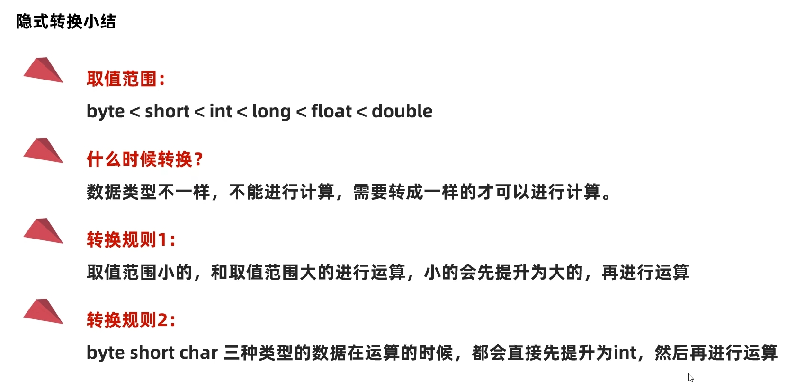
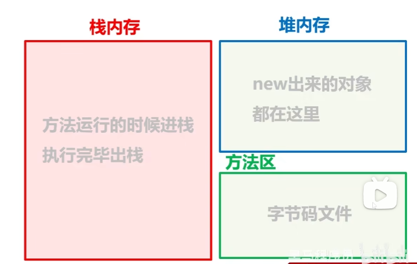
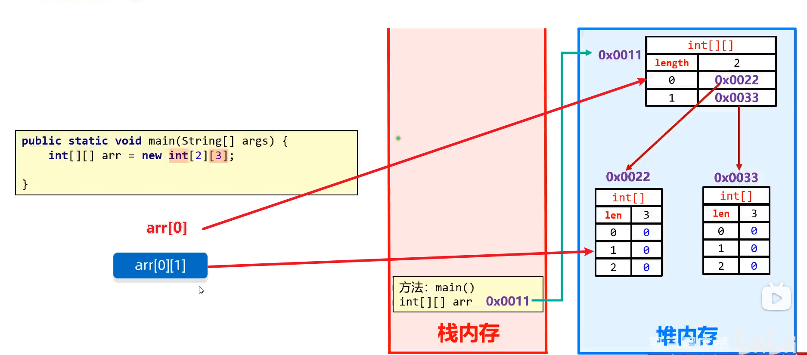
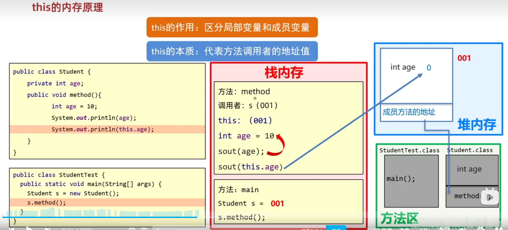
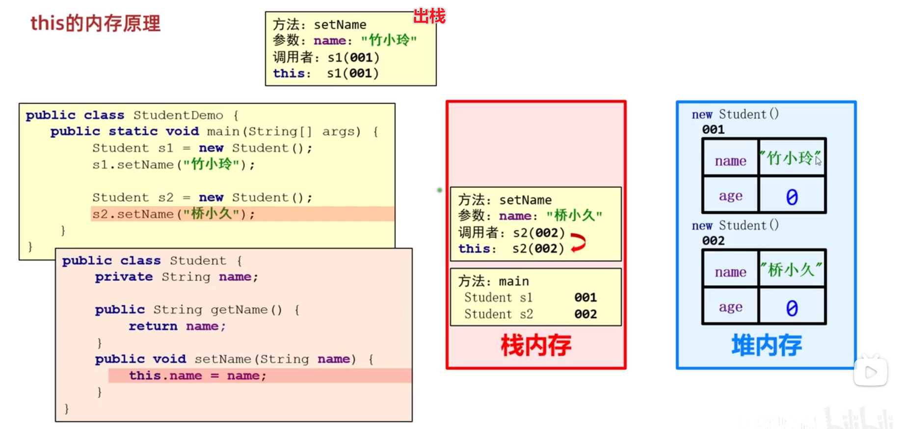
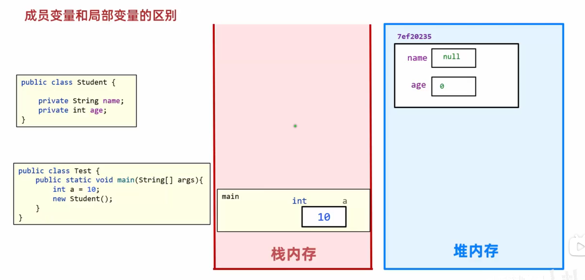
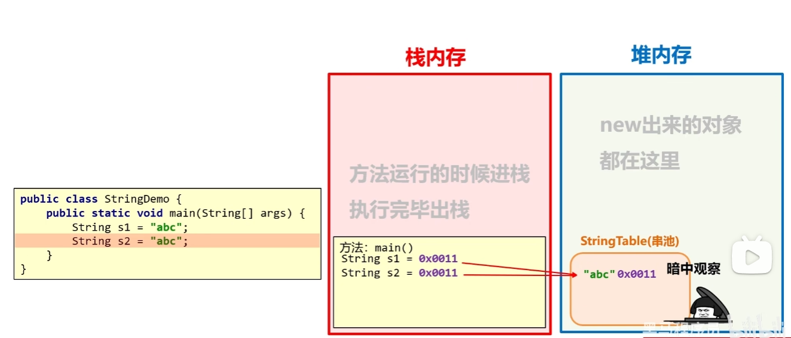
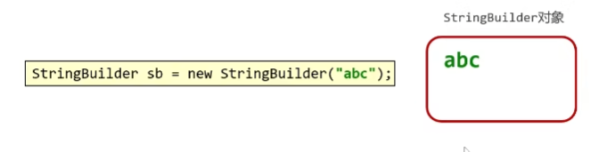
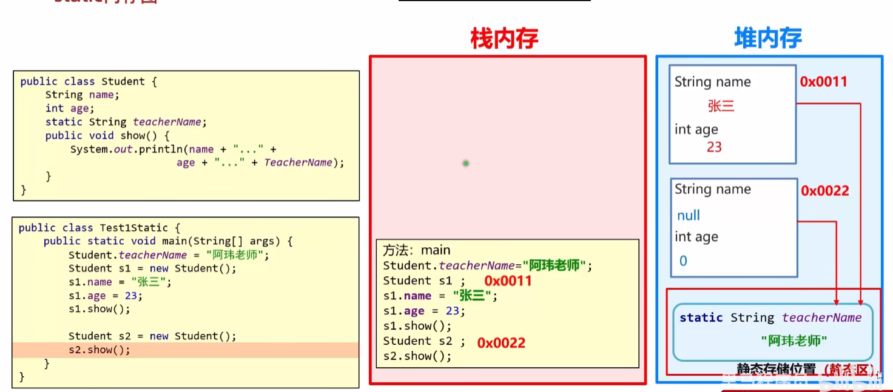
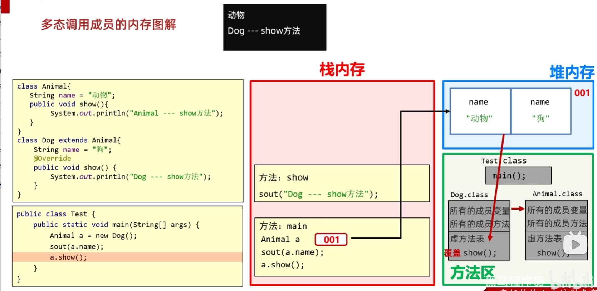

# JDK新增


## JDK11

新增String的strip()、isBlank()、isEmpty()

```java
String ss = " ";
System.out.println(ss.isBlank());//true
System.out.println(ss.isEmpty());//false
```

# 面试题

## ==与equals的区别

==

比较基本数据类型  ->真实值

比较引用数据类型 ->地址值

equals

不重写 ->  == （Object默认逻辑）

重写 -> 看重写逻辑

# 数据类型

## 基本数据类型

从内存角度看：数据值是存储在自己空间当中

特点：赋值给其他变量，也是赋的真实的值

```
整数：long , int, short, byte
浮点数：double, float
字符：char
布尔：boolean
```

## 引用数据类型

从内存角度看：数据值是存储在其他空间中，自己空间存储的是地址值

特点：赋值给其他变量，赋的地址值

```
类，接口，数组，String
```

# 运算符

## 算术运算符

隐式转换



赋值运算符
关系运算符/比较运算符
逻辑运算符

## 短路逻辑运算符 

&& 与 逻辑 并且的意思，全为true结果 才是true
|| 或 逻辑 或者的意思，全为false结果才是false

**&& || 和 & |**

&& 短路与 ，只要第一个为false，发生短路 ，优点提高程序运行效率
|| 短路或 ，只要第一个为true，发生短路

```java
int x = 12;
int y = 13;
boolean z = x>y && x++ < y ;
System.out.println(z);//flase
System.out.println(x);//12
z = x>y & x++ < y ;
System.out.println(z);//flase
System.out.println(x);//13
```


## 三元运算符

```java
public class TernaryDemo {
    public static void main(String[] args){
        int a = 20;
        int b = 40;
        int max = a>b ? a : b ;
        System.out.println(max+"是最大值");
    }
}
```

## 运算符优先级

# 分支语句

## switch

```java
Scanner sc = new Scanner(System.in);
System.out.println("请输入今天星期几：");
String week = sc.next();
String activity = "";
/*switch (week) {
    case "周一" :
        activity = "跑步";
        break;
    case "周二":
        activity = "游泳";
        break;
    default: activity = "输入错误";
}*/
```
jdk14 ：箭头语法 把case后的 -> 代替break
jdk12 ：case 多值语法，多个值用逗号隔开

```Java
//jdk14 箭头语法 把case后的: -> 代替break
//jdk12 case 多值语法，多个值用逗号隔开
switch (week) {
    case "周一","周三","周五" -> activity = "跑步";
    case "周二","周四","周六" -> activity = "游泳";
    case "周日" -> activity = "好好吃一顿";
    default -> activity = "输入错误";
}
```

## if与switch选择问题

优先使用 switch ：出现**byte/short/char/int，String，enum**，并且分支足够多（三个以上）

优先使用if ：出现范围条件时

# 循环语句

## for

```java
public static void main(String[] args){
    int a = 1;
     //首先执行 初始化语句,只能执行一次
    // 然后执行比较语句->true->执行循环体(重复的代码)->步进语句
    //              ->false -> 循环结束
    for(int i=0; i<100; i++){
        a = a++;//1
    }
    System.out.println(a);//1
}
```

## for与while的选择

```java
//循环次数确定 ： 优先使用for循环
//循环次数不确定 ：优先使用while循环 
```

# Random随机数

```java
Random r = new Random();
//jdk17新增语法 可以指定生成随机数的范围->由于计算机语言的差1性 ->[,)
int i = r.nextInt(1,7);
```

# 数组

## 静态初始化

```java
//静态初始化
//完整格式：
数据类型[] 数组名 = new 数据类型[]{元素1,元素2,.....};
//简化格式：
数据类型[] 数组名 ={元素1,元素2,.....};

int[] arr1 = new int[]{11, 12, 13};
int[] arr2 = {11, 12, 13};

double arr3 = new double[]{1.93, 1.75, 1.81}
double arr4 = {1.93, 1.75, 1.81}

String[] arr3 = new string[]{"zhangsan", "lisi", "wangwu"};
String[] arr4 = {"zhangsan", "lisi", "wangwu"};
```


## 地址值

```java
int[] arr = {1, 2, 3, 4};
System.out.println(arr);//地址值[I@4eec7777
//地址值：数组在整个内存中的位置

//扩展
//解释一下地址值的含义
//[ :表示当前是一个数组
//I :表示当前数组里的元素都是int类型的
//@ :表示间隔符号，（固定格式）
//4eec7777 :才是真正的地址值，（十六进制）
//平时我们会把这个整体叫做数组的地址值

```

## 遍历

```java
//数组的长度属性。
//调用方式  数组名.length

//扩展
//自动的快速生成数组的遍历方式
//idea提供的
//数组名.fori 回车
for (int i = 0; i < arr.length; i++) {

}
```

## 数组索引越界异常

```java
int[] ageArr = new int[5];
//3. 不能超出索引范围 
//ArrayIndexOutOfBoundsException 数组索引越界异常
//System.out.println(ageArr[5]);
```


## 动态初始化

动态初始化：初始化时只指定数组长度，由虚拟机分配默认的初始值。

格式：数据类型[] 数组名 = new  数组类型[数组长度];

数组**默认初始化**的规律

1. **整数**类型：默认初始化值**0**
2. **小数**类型：默认初始化值**0.0**
3. **字符**类型：默认初始化值**‘/u0000’ 空格**
4. **布尔**类型：默认初始化值**false**
5. **引用数据**类型：默认初始化值**null**

## 内存


1. jvm内存区域划分几块 ? 堆,栈,方法区（静态区）

2. 引用数据类型为什么要叫做引用数据类型? 
		
	动词 -> 拿着栈里面保存的地址值去堆里找
	
	名词 -> 堆数据的地址值
	
3. 字符串存在什么位置? 字符串常量池里面


### 内存分配

1. 栈：方法运行时使用的内存，比如main方法运行，进入方法栈中执行
2. 堆：储存对象或数组，new创建出来的，都储存在堆内存
3. 方法区：粗存可以运行的class文件（当类开始执行时，会把该类的字节码（.class）文件加载到方法区中临时存储）
4. 本地方法栈：JVM在使用操作系统时使用
5. 寄存器：给CPU使用


# 方法

## 什么是方法

方法是**程序中最小的执行单元**

## 什么时候用到方法

重复的代码，具有独立功能的代码可以抽取到方法中

## 方法的好处

可以**提高代码**的**复用性**和**可维护性**

## 形参和实参

形参：全称**形式参数**，方法**定义**中的参数（方法定义时，所声明的参数）

实参：全称**实际参数**，方法**调用**中的参数（调用方法时，实际传入的参数）

```java
method(10,20);//实参
public static void method(int num1, int num1){//形参
    
}
```

## 方法的重载

重载：同一个类，方法名相同，参数列表不同的方法。与返回值无关

参数列表不同：个数不同，类型不同，顺序不同

## 方法值的传递

传递**基本数据类型**时，传递的是**真实的数据**，形参改变，**不影响**实际参数的值

传递**引用数据类型**时，传递的是**地址值**，形参的改变，**影响**实际参数的值

# 二维数组

## 静态初始化

```java
//格式:数据类型[][] 数组名 =new 数据类型[][]{{元素1,元素2},{元素1,元素2}};
//范例:
int[][] arr=new int[][]{{11,22},{33,44}};

//简化格式:数据类型[][] 数组名 ={{元素1,元素2}，{元素1,元素2}};
//范例:
int[][] arr ={{11,22},{33,44}};
```

## 二维数组内存图



```java
System.out.println(arr[0]);//0x0022
System.out.println(arr[0][1]);//0

//用于定义随意长度的二维数组
int[][] arr = new int[2][];
arr1 = {1,2,3,4};
arr2 = {11,22};

//将arr1的地址值赋值给arr[0]
arr[0] = arr1;
//将arr2的地址值赋值给arr[1]
arr[1] = arr2;
```

# 进制

## 不同进制的书写格式

```
0b 二进制开头 (binary)
0  八进制开头 (octal)
0x 十二进制开头 (hexadecimal)
```

## 位运算


```java
//位运算符指的是二进制位的运算，先将十进制数转成二进制后再进行运算
//在二进制位运算中，1表示true，0表示false。
System.out.print(8>>2);//= 8/4 = 2
System.out.print(8<<2);//= 8*4 = 32
```


# 面向对象

## 类和对象

类（设计图）：是对象共同特征的描述；

对象：我们自己臆造出来的，具备属性和行为的东西

## 定义类

一个代码文件中可以定义多个类，但只能有一个类是public修饰的，

public修饰的**类名**必须是java代码的**文件名**

```java
public class 类名{
    //成员变量；(属性)
    //成员方法；(行为)
    //构造器；
    //代码块；
    //内部类；
}
public class Phone{
    //完整格式
    修饰符 数据类型 变量名称 = 初始化值;
    //成员变量；(属性)
    String beand;
    double price;
    
    //行为（方法）
    public void call(){
        
    }
}
```

## 获取类

```java
//类名 对象名 = new 类名();
Phone p = new Phone();

```

## 对象的成员变量的默认规则

| 数据类型     | 明细                    | 默认值 |
| ------------ | ----------------------- | ------ |
| 基本数据类型 | byte, short, int, long, | 0      |
|              | float, double           | 0.0    |
|              | boolean                 | false  |
| 引用数据类型 | 类，接口，数组，String  | null   |

## 封装

1. 什么是封装

对象代表什么，就得封装对应的数据，并提供数据对应的行为

2. 好处

有什么事，找对象，调方法就行，降低学习成本，

## private关键字

是个权限修饰符

可以修饰成员（成员变量和成员方法）

被private修饰的成员只能在本类中才能访问

```java
private String name;
//针对于每一个私有化的成员变量，都要提供get和set方法

//set方法:给成员变量赋值
public void setName(String n){
	name = n;
}
//get方法:对外提供成员变量的值
public String getName(){
    return name
};
```

## this关键字

this内存原理

this的作用：区分局部变量和成员变量

this的本质：代表方法调用者的地址值





## 构造方法

作用：创建对象的时候，虚拟机会自动调用构造方法，作用是给成员变量进行初始化的

构造方法默认调用

## 标准的JavaBean类

1. 类名需要见名之意

2. 成员变量使用private修饰

3. 提供至少两个构造方法

   无参构造方法

   全参构造方法

4. 成员方法

   提供每一个成员变量对应的get和set方法

   如有其他行为，也需要写上

## 成员变量和局部变量

成员变量在堆中（有默认初始值）

局部变量在栈中



# 字符串

## String概述

String是java定义好的类，在java.lang包中

```java
//jdk15 引入文本块
String s = """
    		
    		
    		""";
```


## String构造方法实现和内存分析

字符串值在创建后不能被改变

```java
//直接赋值方式创建字符串对象
String s1 = "abc";
//new一个空参字符串对象（空白字符串对象）
String s2 = new String();
//传递字符串，根据传递字符串内容创建一个新的字符串对象
String s3 = new String("abc");
//传递字符数组，根据字符数组的内容创建一个新的字符串对象
//需求：改变字符串的内容，通过修改字符数组来指定
char[] chs = {'a','b','c'};
String s4 = new String(chs);
//传递字节数组，根据字节数组的内容在创建一个新的字符串对象
//应用场景：在网络中传输的数据是字节信息
//把字节信息进行转换，转成字符串，需用到这个构造
byte[] bytes = {97. 98, 99, 100};
String s5 = new String(bytes);

```

内存中

只有**直接赋值**方式获取的字符串，才能存储到**StringTable**（**串池**[字符串常量池]）中

当使用双引号直接赋值时，系统会检查该字符串在串池中是否存在

不存在：创建新的

存在：直接复用



## 字符串比较

```java
String sl = new string("abc");//记录 堆 里面的地址值
String s2 ="Abc"//记录 串池 中的地址值
    
//==号比较
//基本数据类型:比的是数据值
//引用数据类型:比的是地址值
System.out.println(s1==s2);//false

//比较字符串对象中的内容是否相等
boolean result1=s1.equals(s2);
System.out.println(result1);

//比较字符串对象中的内容是否相等，忽略大小写
//场景 ：验证码
boolean result2=s1.equalsIgnoreCase(s2);
System.out.println(result2);//true
```

## String方法

String方法都要用变量，来接收改变之后的字符串

```java
String str = "AbCd你好";
//取字符串中该索引中的字符
str.charAt(索引);//
//字符串中字符长度
str.length();
//字符串转大写
str.toUpperCase();//ABCD你好
//字符串转小写
str.toLowerCase();//abcd你好
//忽略大小写进行比较
str.equalsIgnoreCase("ABCD你好");//true
//判断某个字符串开头或结尾
str.startsWith("Ab");//true


//jdk新增的一系列的strip方法
String s1 = "       abc     ";
//去除首尾 -> trim
System.out.println(s1.strip());//(abc)
//去除首尾空格
System.out.println(s1.stripLeading());//(abc    )
//去除尾空格
System.out.println(s1.stripTrailing());//(       abc)
//System.out.println(s1.stripIndent());
```

## StringBuilder

概述：StringBuilder对象可以看作一个容器，创建之后里面内容可变

作用：提高字符串操作效率

使用场景：1.字符串的拼接，2.字符串的反转



| 成员方法名                            | 说明                                                |
| ------------------------------------- | --------------------------------------------------- |
| public StringBuilder append(任意类型) | 添加数据，并返回对象本身                            |
| public StringBuilder reverse()        | 反转容器中的内容                                    |
| public int length()                   | 返回长度(字符出现的个数)                            |
| public String toString()              | 通过toString()就可以实现把StringBuilder转换为String |

## 打印输出

```java
//打印SB对象输出的不是地址值而是属性值
System.out.println();//自动调用引用数据类型的toString()方法
```


## StringJoiner（JDK8出现）

概述：StringJoiner也可以看成是一个容器，创建之后里的内容是可变的

作用：提高字符串操作效率，可以高效方便的拼接字符串

| 构造方法名                                        | 说明                                                         |
| ------------------------------------------------- | ------------------------------------------------------------ |
| public StringJoiner (间隔符号)                    | 创建一个StringJoiner对象，指定拼接时的间隔符号               |
| public StringJoiner(间隔符号，开始符号，结束符号) | 创建一个StringJoiner对象，指定拼接时的间隔符号开始符号、结束符号 |

```java
StringJoiner sj = new StringJoiner("---");//1---2---3
StringJoiner sj = new StringJoiner(", ","[","]");//[1, 2, 3]
```

| 方法名                               | 说明                                       |
| ------------------------------------ | ------------------------------------------ |
| public Stringjoiner add (添加的内容) | 添加数据，并返回对象本身                   |
| public int length()                  | 返回长度(字符出现的个数)                   |
| public String toString()             | 返回一个字符串(该字符串就是拼接之后的结果) |


## 字符串原理

字符串储存的内存原理

- 直接赋值会复用字符常量池中的

- new出来的不会复用，而是开辟一个新的空间

==号比的到底是什么

- 基础数据类型，比的是实际的值

- 引用数据类型，比的是地址值

字符串拼接的底层原理

- 如果没有变量参与，都是字符串直接相加，编译之后就是拼接之后的结果，会复用串池中的字符串。
- 如果有变量参与，每一行拼接的代码，都会在内存中创建新的字符串，浪费内存。

StringBuilder提高效率原理图

- 所有要拼接的内容都会往StringBuilder中放，不会创建很多无用的空间，节约内存

```java
public class Test3{
    public static void main(string[] args){
        String s1 ="abc";//记录串池中的地址值
        String s2 ="ab";
        String s3 = s2 +"c";//新new出来的对象
        System.out.psintln(s1== s3);//false
    }
}
字符串拼接的时候，如果有变量:
JDK8以前:
系统底层会自动创建一个StringBuilder对象，然后再调用其append方法完成拼接。
拼接后，再调用其toString方法转换为String类型，而toString方法的底层是直接new了一个字符串对象。
JDK8版本:
系统会预估要字符串拼接之后的总大小，把要拼接的内容都放在数组中，此时也是产生一个新的字符串。
```


字符串拼接的时候，如果有变量:
JDK8以前:系统底层会自动创建一个StringBuilder对象，然后再调用其append方法完成拼接。
拼接后，再调用其toString方法转换为String类型，而toString方法的底层是直接new了一个字符串对象。

JDK8版本:系统会预估要字符串拼接之后的总大小，把要拼接的内容都放在数组中，此时也是产生一个新的字符串。

# 集合

## 集合和数组的对比

数组：数组**长度固定**    可以**存储基本数据类型 **和 **引用数据类型**

集合：集合**长度可变**     可以**存基本类型的包装类** 和 **引用数据类型**

##  ArrayList


```java
//集合是jdk1.2引入的->1.5引入泛型->1.7菱形推断语法(只写前面泛型，后面自动推断)
//泛型：限定集合中存储的数据类型
ArrayList<String> list = new ArrayList<String>();//jdk7之前
ArrayList<String> list = new ArrayList<>();
```

```java
//打印对象不是地址值，二十集合中存储的内容
System.out.println(list);//[]
list.add("aaa");
list.add("bbb");
list.add("ccc");//[aaa, bbb, ccc]

Boolean result = list.remove("aaa");//返回值判断是否删除成功
String result = list.remove(0);//返回被删除的元素

String result = list.set(0,"aaa");//返回被覆盖的元素
System.out.println(result);//ccc
```

| 方法名               | 说明                                |
| -------------------- | ----------------------------------- |
| boolean add(E e)     | 添加元素，返回值表示是否添加成功    |
| boolean remove(E e)  | 删除指定元素,返回值表示是否删除成功 |
| E remove(int index)  | 删除指定索引的元素,返回被删除元素   |
| E set(int index,E e) | 修改指定索引下的元素,返回原来的元素 |
| E get(int index)     | 获取指定索引的元素                  |
| int size()           | 集合的长度，也就是集合中元素的个数  |


# 面向对象进阶

## static

static表示静态，是java中的一个修饰符，可以修饰成员方法，成员变量

### 静态变量

被static修饰成员变量，叫静态变量

特点

- 被所有类对象共享

调用方式 

- 类名调用（推荐）
- 对象名调用

单独存放的静态变量的空间叫**静态区**（类信息）

静态区存放着这个类所有静态变量

**静态变量是随着类的加载而加载的，优先于对象出现**




### 静态方法

被static修饰的成员方法，叫静态方法

特点：

- 多用在测试类和工具类中
- Javabean类很少用

## Util工具类

### 工具类的规范

1. 名字要以Util结尾
2. 构造器私有化（为了不能实例化或被创建对象）
3. 工具类中一般只有静态方法

```java
public static class MyUtil{
    private MyUtil(){
        
    }
    public static void print(String s){
        System.out.println(s);
    }
    //.....
}
```

### 调用格式

```java
//类名.方法(实参);
```

## 继承

### 什么是继承、继承的好处、什么时候用?

继承是面向对象三大特征之一，可以让类与类之间产生父子关系

可以把多个子类中重复的代码抽取到父类中，子类可以直接使用，减少代码沉余，提高代码复用性

当类与类之间，存在相同（共性）的内容，且、并满足子类是父类的一种，就可以考虑使用继承，优化代码

### 优缺点

提高复用性，便于维护

降低了子类的独立性，父类更改属性和行为所有子类都更改属性和行为

### 继承的格式

```java
public class Student extends Person{}
```

Student称为子类（派生类），Person父类（基类或超类）

### 继承后子类的特点

子类可以得到父类的属性和行为，子类可以使用。
子类可以在父类的基础上新增其他功能，子类更强大。

### 继承的特点

java只能单继承：一个类只能继承一个直接父类

Java不支持多继承、但支持多层继承

Java中所有的类都直接或间接继承Object类

子类只能访问父类中非私有的成员

### 子类能继承父类中的哪些内容

|          | 非私有          | private       |
| -------- | --------------- | ------------- |
| 构造方法 | 不能继承        | 不能调用      |
| 成员变量 | 能继承          | 能调用        |
| 成员方法 | 虚方法表 能继承 | 否则 不能调用 |

虚方法表：非private修饰、非static修饰、非final修饰

Object有五个虚方法，虚方法表中没有的成员方法，能继承，但不能被调用

每个类都有自己的虚方法表，添加子类非private、static、final修饰的方法和父类虚方法表中的方法

### 继承中：成员变量的访问特点

继承中成员变量的特点 ：就近原则

先在局部位置找，本类成员位置找，父类成员位置找，逐级往上

```java
public class Fu{
    String name = "Fu";
}
class Zi extends Fu{
    String name = "Zi";
    public void ziShow(){
        String name = "ziSAhow"
        System.out.println(name);//ziShow
        System.out.println(this.name);//Zi
        System.out.println(super.name);//Fu
    }
}
```

### 继承中：成员方法的访问特点

this调用:就近原则。
super调用:直接找父类。


### 继承中：构造器的访问特点

父类的构造方法不会被子类继承

子类中所用的构造方法默认先访问父类的无参构造，在执行自己

#### 为什么？

子类在初始化的时候，可能会用到父类当中的数据，如果父类没有完成初始化，子类将无法使用父类中的数据

子类初始化之前，一定要先调用父类构造方法完成父类数据空间的初始化

#### 怎么调用父类构造方法的？

子类构造方法的第一行语句默认都是：super（），不写也存在，且必须在第一行

### this和super使用区别

相同点：super与this 都能调用构造器，成员变量以及成员方法

​				super与this调用构造器必须在构造器里面

​				且一定要放在第一行

不同点：super调用父类的public的成员

​				this调用本类的成员

```java
public Cat(String name, int age, String gender){
    //System.out.println(123);报错
    //this();报错
    super(name, age, gender);
    super.run();
    this.run();
}
```


### 方法的重写

当父类的方法不能满足子类现在的需求时，需要对方法重写

#### 什么是方法重写

在继承体系中，子类出现和父类一样的方法声明，就称子类的这个方法是重写方法

#### 方法重写的本质

子类覆盖了父类继承下来的虚方法表里的方法

#### 方法重写建议加上哪个注解，有什么好处？

1. @Override是放在重写方法上，校验子类重写的语法是否正确，同时可读性好。

#### 方法重写注意事项和要求

1.重写方法的名称、形参列表必须与父类中的一致。

2.子类重写父类方法时，访问权限子类必须大于等于父类(暂时了解:空着不写<protected<public)

3.子类重写父类方法时，返回值类型子类必须小于等于父类

**4.子类重写的方法尽量和父类保持一致。**

**5.只有被添加到虚方法表中的方法才能被重写**


## 多态

### 学习多态的目的


### 什么是多态

对象的多种形态（就是同一个对象在不同情况下的不同形态）

```java
//普通创建对象 -> 调用子类构造器 指向相应类型
Cat cat = new Cat();
//多态创建对象 -> 调用子类的构造器，指向父类的引用-> 原因：在继承前提下，调用子类构造器会先调用父类的构造器
Animal animal = new Cat();
Object object = new Cat();
```

### 多态的前提

有继承/实现关系

有父类引用指向子类对象

有方法的重写

### 多态的好处

使用父类型作为参数，可以接收所有子类型

体现多态的扩展性和便利性

### 多态的弊端

不能使用子类特有的功能

### 引用数据类型的类型转换，有几种方式?

自动类型转换、强制类型转换

```java
//向上转型
Person p=new student();
//向下转型
Student s(student)p;
```

### 强制类型转换能解决什么问题?

转换类型与真实对象类型不一致会报错

```java
//抛出java.lang.ClassCastException（类型转换异常）
```

可以转换成真正的子类类型，从而调用子类独有功能，

```java
//使用 instanceof 关键字判断是否是真实对象类型
//父类对象 instanceof 子类
Animal animal = new Dog();
if(animal instanceof Dog){
    //Dog dog = (Dog)animal;
    //dog.look();
    (Dog)animal.look();
}
```


### 多态调用成员

//调用成员变量:编译看左边，运行也看左边

//编译看左边:javac编译代码的时候，会看左边的父类中有没有这个变量，如果有，编译成功，如果没有编译失败。

//运行也看左边:java运行代码的时候，实际获取的就是左边父类中成员变量的值

//调用成员方法:编译看左边，运行看右边
//编译看左边:javac编译代码的时候，会看左边的父类中有没有这个方法，如果有，编译成功，如果没有编译失败。
//运行看右边:java运行代码的时候，实际上运行的是子类中的方法。

### 多态调用成员的内存图解




## 包

### 包的作用?

包就是文件夹，用来管理各种不同功能的Java类

### 什么是全类名?

包名+类名

## final

final关键字是最终的意思，可以修饰类、修饰方法、修饰变量。

```java
- final修饰类：最终类，不能被继承
- final修饰方法：最终方法，不能被重写
- final修饰变量：是常量，不能被修改（不能再重新赋值）
//修饰变量
基本数据类型:变量的值不能修改
引用数据类型:地址值不能修改，内部的属性值可以修改
```


## 权限修饰符的分类

有四种作用范围由小到大(private<空着不写<protected<public)

| 修饰符    | 同一 个类中 | 同一个包中其他类 | 不同包下的子类 | 不同包下的无关类 |
| --------- | ----------- | ---------------- | -------------- | ---------------- |
| private   | √           |                  |                |                  |
| 空着不写  | √           | √                |                |                  |
| protected | √           | √                | √              |                  |
| public    | √           | √                | √              | √                |

## 代码块

### 代码块分类

局部代码块，构造代码块，

静态代码块 static{}

### 局部代码块的作用

提前结束变量的生命周期（已淘汰）

### 构造代码块的作用

抽取构造代方法中的重复代码

```java
public class Student{
    //{
    //    System.Out.Println("在创建本类对象时，会先执行构造代码块再执行构造方法")
    //}
    private string name;
    private int age;
	public student(){
        调用方法();
    }
	public student(string name,int age){
		调用方法();
		this.name = name;
        this.age = age;
	}

```

### 静态代码块的作用

数据的初始化

```java
public class Student{
    static {
        System.Out.Println("随着类的加载而加载，并且自动出大、只执行一次")
    }
}
```

## 抽象类

### 抽象类的作用

抽取共性时，无法确定方法体，就把方法定义为抽象的。

强制让子类按照某种格式重写

抽象方法所在的类，必须是抽象类

### 抽象类和抽象方法的格式

public abstract 返回值类型 方法名（参数）；

public abstract class 类名{}

### 继承抽象类有哪些要注意?

抽象类不能被实例化

抽象类的子类 1. 要么重写抽象类中的所有抽象方法 2. 要么是抽象类


## 接口

### 接口的作用

1. 定义规范 -> 解决代码的维护性问题

2. 定义抽象行为 -> 解决了单继承的缺点，接口时多实现的，而且接口与接口之间时多继承的
3. 标记性作用 -> jdk中有很多标记性接口，这些接口只有名称，没有任何内容，用于区分类与类之间的作用
4. 方便定义常量 -> 因为接口中的常量默认被 public、static、final修饰 
5. 函数式接口 -> 实现lamba表达式，取代匿名内部类

### interface

接口的定义格式（接口不能**实例化**（**创建对象**），所以没有构造方法）

```java
public interface 接口名{
    //成员变量（常量）
    //成员方法（抽象方法）
}
```

```java
public interface A{
    //成员变量->默认被public static final修饰符修饰
    //public static final String SCHOOL_NAME = "常量";
    String SCHOOL_NAME = "常量";
    
    //成员方法->默认被public abstract修饰符修饰
    //public abstract void test();
    void test();
}
```

### implements

接口和类之间是实现关系，或者说接口是用来被类实现的，通过implements关键字表示

```java
public class implements 接口名{}
```

接口的子类(实现类)

​	要么重写接口中的所有抽象方法

​	要么是抽象类

### 接口中成员的特点

成员变量  默认修饰符 **public static final**

构造方法  **没有**

成员方法  默认修饰符: **public abstract**

JDK7及以前 ：接口中只能定义抽象方法

JDK8：接口中可以定义有方法体的方法，**默认default、静态static**

JDK9：接口中可以定义私有方法。**private 私有方法**分为两种 普通的私有方法   静态的私有方法

### 接口和类之间的关系

**类和类**之间的关系：只能单继承，不能多继承

```java
class Fu{}
public Zi extends Fu{}
```

**类与接口**的关系: 实现关系，可以单实现，可多实现，继承一个类的同时实现多接口

```java
interface Inter1{
    void show();
}
interface Inter2{
    void show();
}
public class Impl implements Inter1, Inter2{
    @Overrid
    void show(){
        System.out.println("实现接口里的方法");
    }
}
```

**接口和接口**的关系：继承关系，可以单继承，也可以多继承

```java
interface Inter1{}
interface Inter2{}
public interface Inter extends Inter1, Inter2{}
```

### IDEA接口实现类Select Methods to lmplement 界面


Select Methods to lmplement 选择要实现的方法


Copy javaDoc **生成注释文档**

Generate missed JavaDoc **生成遗漏的注释文档**

Insert @Override（默认选中）**插入 @Override**


### 标记性接口（空接口）


### 适配器设计模式

当一个接口中抽象方法过多，但是我们只要使用其中一部分的时候，就可以适配器设计模式

#### 书写步骤

编写中间类XXXAdapter ，实现对应接口

对接口中的抽象方法进行空实现

让真正的实现类继承中间类，并重写需要的方法

为了避免其他类创建适配器类的对象，中间的适配器类用abstract进行修饰

## 内部类

定义：

内部类是类中五大成分之一（成员变量、成员方法、构造器、内部类、代码块）

如果一个类定义在另一个类的内部，这个类就是内部类

```java 
public class Outer{
	/**
     * 内部类
     */
    public class Inner{
        
    }
}
```

### 成员内部类

成员内部类是类中的一个普通成员，与成员变量、成员方法平级

```java
public class Outer {
    private int a = 200;
    /**
     * 成员内部类
     */
    public class Inner{
        private int a= 100;

        public void show(){
            int a = 300;
            System.out.println(a);//300
            System.out.println(Outer.this.a);//200
            System.out.println(this.a);//100
        }
    }
}
```

```java
public static void main(String[] args) {
    //外部类.内部类 变量名 = new 外部类().new 内部类();
    Outer.Inner inner = new Outer().new Inner();
    //调用内部类的方法
    inner.show();
}
```

### 静态内部类

静态内部类，就是在成员内部类中添加static关键字

```java
public class Outer {
    private int age = 18;
    public static String name = "YQiang";
    /**
     * 静态内部类
     */
    public static class Inner{
        //静态内部类
        //可以访问外部类的静态变量
        //不能访问实例变量
        public void show(){
            System.out.println(name);//YQiang
            //System.out.println(age);//报错
        }
    }
}
```

```java
public static void main(String[] args) {
    //外部类.内部类 变量名 = new 外部类().内部类();
    Outer.Inner inner = new Outer().Inner();
    //调用内部类的方法
    inner.show();
}
```

### 局部内部类

局部内部类是定义在方法中的类，和局部变量平级，只能在方法中有效。（毛用没有）

```java
public class Outer{
    public void test(){
        //局部内部类
        class Inner{
            public void show(){
                System.out.println("Inner...show");
            }
        }
        
        //局部内部类只能在方法中创建对象，并使用
        Inner inner = new Inner();
        inner.show();
    }
}
```

### 匿名内部类

匿名内部类：本质上是没有名字（引用）的子类对象、或者接口的实现对象

#### 匿名内部类的格式

```java
new 父类/接口(参数值){
    @Override
    重写父类/接口的方法;
}
```

使用案例

```java
/**
 * 函数时接口就是只有一个抽象方法的接口
 * 一般会加上FunctionalInterface 来标记一下
 */
@FunctionalInterface
public interface ISing {
    void sing();
}
```

```java
public static void main(String[] args) {
        /**
         * 匿名内部类
         */
    	//这里后面new 的部分，其实就是一个Animal的子类对象
    	//隐含多态性质
        ISing sing = new ISing(){
            @Override
            public void sing() {
                System.out.println("调用sing方法");
            }
            public void show(){
                System.out.println("show");
            }
        };
    	sing.sing();//调用sing方法
    }
```

匿名内部类在编写代码时没有名字，编译后系统会为自动为匿名内部类生产字节码，字节码的名称会以`外部类$1.class`的方法命名


#### 匿名内部类的作用

简化了创建子类对象、实现类对象的书写格式。

# lambda表达式

JDK8新增的一种语法形式，叫做Lambda表达式

## 作用

用于简化匿名内部类代码的书写

## lambda省略模式

```java
/**
 * 函数式接口@FunctionalInterface注解
 * 前提：有且仅有一个抽象方法，但是可以有多个非抽象方法的接口
 * 
 */
@FunctionalInterface
public interface ISingWithParam {
    void sing(String song,String place);
}
@FunctionalInterface
interface IPlay {
    void play(String gameName);
}
@FunctionalInterface
interface Add {
    int add(int a, int b);
}
```

```java
/**
 * lambda表达式省略模式
 */
public static void main(String[] args) {
    //省略模式1，参数类型可以省略，但是要省略就全部省略
    //ISingWithParam sing = (String song, String place) -> {};
    ISingWithParam sing = (song, place) -> {
        System.out.println("在" + place + "唱了" + song);
    };
    sing.sing("千里之外", "黑马KTV");
    //省略模式2：参数只有一个，小括号也可以省略
    IPlay play = gameName -> {
        System.out.println("玩" + gameName);
    };
    play.play("CF");
    //省略模式3；方法体如果只有一条语句，大括号可以省略
    //如果方法有返回值，必须得写return，如果有只一条return语句，return也可以省略
    Add add = (a, b) -> a = b;
    add.add(2, 3);
}
//输出
//在黑马KTV唱了千里之外
//玩CF
```


# 常用API

## System

### exit

System.exit(0);正常退出，程序正常执行结束退出

System.exit(1);是非正常退出，就是说无论程序正在执行与否，都退出，

### currentTimeMillis

```java
//时间戳：时间的整数表示形式
//时间计算原点：1970.1.1 00:00:00
long l = System.currentTimeMillis();
System.out.println(l);//1720165524836
```

计算程序运行所有时间

```java
long start = System.currentTimeMillis();
StringBuilder s = new StringBuilder();
for (int i = 0; i < 10000000; i++) {
    s.append(i);
}
long end = System.currentTimeMillis() - start;
System.out.println(end);//147
```

### arraycopy

```java
int[] src = {1,2,3,4};
int[] dest = new int[src.length];
//数组拷贝
System.arraycopy(src, 0, dest, 0, src.length);
for (int i = 0; i < dest.length; i++) {
    System.out.print(dest[i]);
}
//1234
```

### gc

garbage collection 垃圾收集

```java
System.gc();
//native 关键字 表示面向操作系统的本子源码，源码是由c/c++实现的
```


## Math

## Object

## Objects

```java
Objects.isNull()


```

## requireNonNull

检查对象是或否为空，抛出NullPointerException异常

```java
 int[] arr = null;
Objects.requireNonNull(arr,"数组不能为空");
//Exception in thread "main" java.lang.NullPointerException: 数组不能为空
```


## BigDecimal

为了解决计算精度缺失的问题，java提供了BigDecimal类

```java
System.out.println(0.1 + 0.2);//0.30000000000000004
System.out.println(1 / 0.0);//Infinity
double a = 1;
double b = 20.2;
double c = 300.03;
System.out.println(a + b + c);//321.22999999999996
```

```java
//传递double构造器无法解决计算精度问题
BigDecimal aDecimal = new BigDecimal(a);
BigDecimal bDecimal = new BigDecimal(b);
BigDecimal cDecimal = new BigDecimal(c);
BigDecimal add = aDecimal.add(bDecimal).add(cDecimal);
System.out.println(add);//321.229999999999972004616211052052676677703857421875
```

```java
//JDK1.1引入
//把double 转成String -> String.valueOf
BigDecimal aString = new BigDecimal(String.valueOf(a));
BigDecimal bString = new BigDecimal(String.valueOf(b));
BigDecimal cString = new BigDecimal(String.valueOf(c));
BigDecimal sum = aString.add(bString).add(cString);
System.out.println(sum);//321.23
```

```java
//jdk1.5引入的静态方法会自动创建BigDecimal对象并把double转成字符串
BigDecimal aString = BigDecimal.valueOf(a);
BigDecimal bString = BigDecimal.valueOf(b);
BigDecimal cString = BigDecimal.valueOf(c);
BigDecimal sum = aString.add(bString).add(cString);
System.out.println(sum);
```

```java
BigDecimal a1 = BigDecimal.valueOf(a);
BigDecimal b1 = BigDecimal.valueOf(b);

// 2、public BigDecimal add(BigDecimal augend): 加法
BigDecimal c1 = a1.add(b1);
System.out.println(c1);

// 3、public BigDecimal subtract(BigDecimal augend): 减法
BigDecimal c2 = a1.subtract(b1);
System.out.println(c2);

// 4、public BigDecimal multiply(BigDecimal augend): 乘法
BigDecimal c3 = a1.multiply(b1);
System.out.println(c3);

// 5、public BigDecimal divide(BigDecimal b): 除法
BigDecimal c4 = a1.divide(b1);
System.out.println(c4);
//使用除法一定要使用带有三个参数（除数，小数，舍入模式）的重载方法
BigDecimal result = a1.divide(b1, 8, RoundingMode.DOWN);
```


## 基本数据包装类

基本数据类型以及对应的包装类

| 基本数据类型 | 对应的包装类 |
| ------------ | ------------ |
| byte         | Byte         |
| short        | Short        |
| char         | Character    |
| int          | Integer      |
| long         | Long         |
| float        | Float        |
| double       | Double       |
| boolean      | Boolean      |

### Integer

如何把基本数据类型变成包装类

```java
//1.如何把基本数据类型变成包装类
int a = 10;
//过时的构造方法
//Integer i = new Integer();
Integer i = Integer.valueOf(a);
System.out.println(i);//10
```

装箱：把基本数据类型转换为对应的包装类类型
拆箱：把包装类类型转换为对应的基本数据类型   

```java
//装箱
Integer b = Integer.valueOf(100);
Integer c = Integer.valueOf(2000);
//拆箱
int i1 = b.intValue();
int i2 = c.intValue();
System.out.println(i2 + i1);//2100
```

自动装拆箱指的是系统底层自动帮我们调用包装类的valueOf()方法

```java
//自动装箱与拆箱 -> jvm自动调用装箱valueOf方法 以及自动拆箱...value
Integer d =300;
Integer e = 500;
int f =d;
int g =e;
System.out.println(d+e);//800
System.out.println(f-g);//-200
```

类型转换（字符串与包装类的转化）

```java
//基本数据类型转字符串 String.valueOf
String s = String.valueOf(123);
System.out.println(s);//123

//把字符串转成数值 得是正常的数字字符串
Integer i = Integer.valueOf("123");
int i1 = Integer.parseInt("123");
System.out.println(i);//123
System.out.println(i1);//123

//获取不到正确的false和true字符 都返回false
Boolean true1 = Boolean.valueOf("true1");
boolean b1 = Boolean.parseBoolean("true1");
System.out.println(true1);//false
```

包装类比较大小

```java
//包装类比较大小
//在自动装箱中，valueOf方法中会缓存[-128,128)之间的常用整数，会复用缓存中的对象，因此，对象地址值一样
//超出这个范围返回 new 一个新对象
Integer a = Integer.valueOf(127);
Integer b = Integer.valueOf(127);
System.out.println(a==b);//true
System.out.println(a.equals(b));//true

Integer c = Integer.valueOf(128);
Integer d = Integer.valueOf(128);
System.out.println(c==d);//false
System.out.println(c.equals(d));//true

//所有能参与比较的类，都实现了Comparable接口的compareTo 方法
System.out.println(a.compareTo(b));//0
//0 相等
//-1 前小于后
//1 前大于后
```

### 基本类型包装类与基本类型的区别

默认值不一样
内存模型存储位置不一样

# Arrays


# Exception异常

## 为什么引入异常

是代码更加健壮，提高用户体验

识别错误并相应错误机制

## Throwable

### Error

#### VirtualMachineError

StackOverFlowError

OutOfMemoryError (OOM)

### Exception

#### RunTimeException

#### ClassNotFountException

异常分类

编译时异常（受检异常）

除RuntimeException之外异常

运行时异常（非受检异常）

RuntimeException及其子类

### Throwable的成员方法


```java
public class ThrowAbleDemo {
    public static void main(String[] args) {
        method();
    }
    public static void method() {
        try {
            throw new RuntimeException("运行时异常");
        }catch (RuntimeException e) {
            System.out.println(e.getMessage());
            System.out.println(e.toString());
            e.printStackTrace();
        }
    }
}
/*
运行时异常
java.lang.RuntimeException: 运行时异常
java.lang.RuntimeException: 运行时异常
	at com.itheima.day05.exception.ThrowAbleDemo.method(ThrowAbleDemo.java:9)
	at com.itheima.day05.exception.ThrowAbleDemo.main(ThrowAbleDemo.java:5)
*/
```

## 自定义异常

 

## 面试题

### throw和throws的区别

throws用于方法头，表示的只是异常的声明，而throw用于方法内部，抛出的是异常对象。
throws可以一次性抛出多个异常，而throw只能一个
throws抛出异常时，它的上级（调用者）也要申明抛出异常或者捕获，不然编译报错。而throw的话，可以不申明或不捕获（这是非常不负责任的方式）但编译器不会报错。

### finally 的作用

finally代码块，总是在try和任何catch块之后，方法前之前运行，不管是否抛出或捕获异常finally块都会执行

# 集合

# stream流

# IO流

# 网络

# 基础加强

# 设计模式

