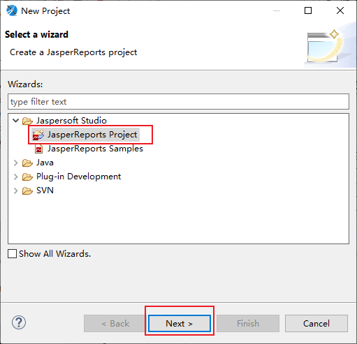
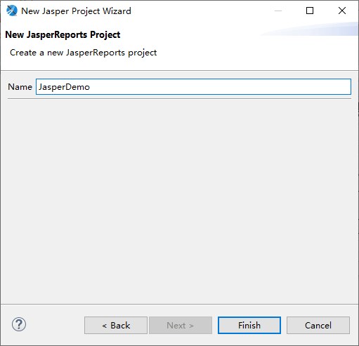
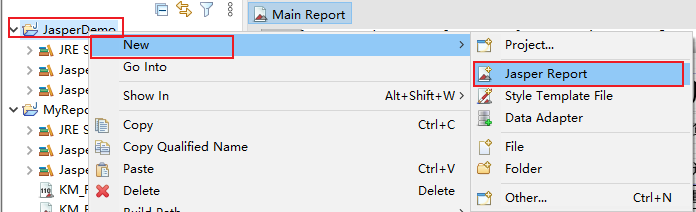
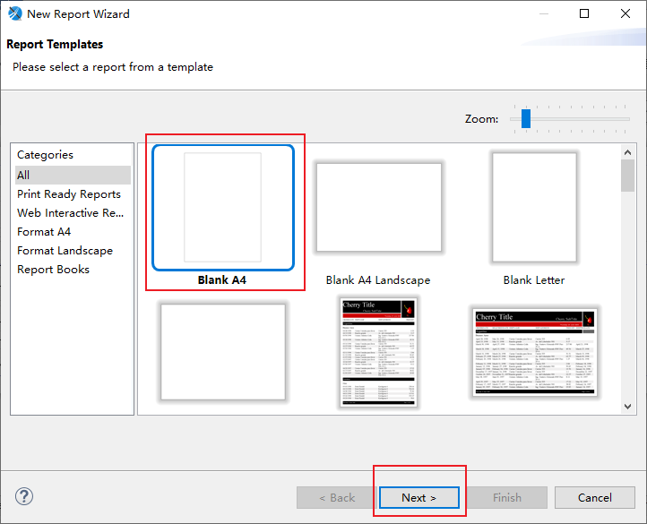
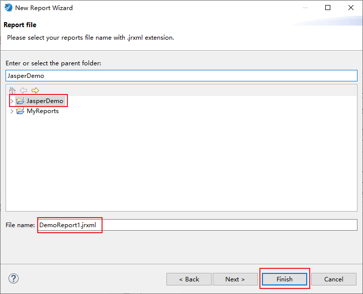
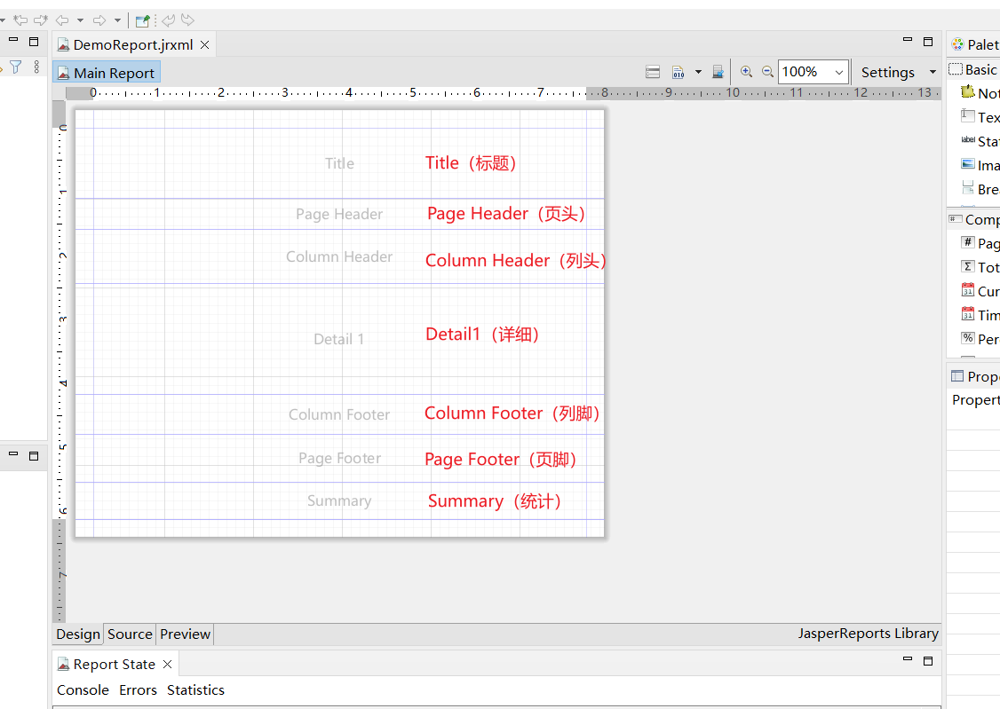
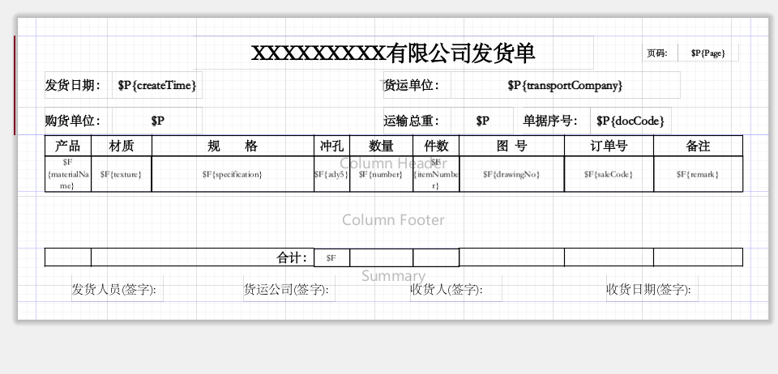
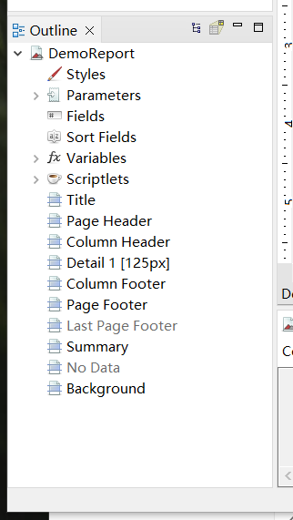
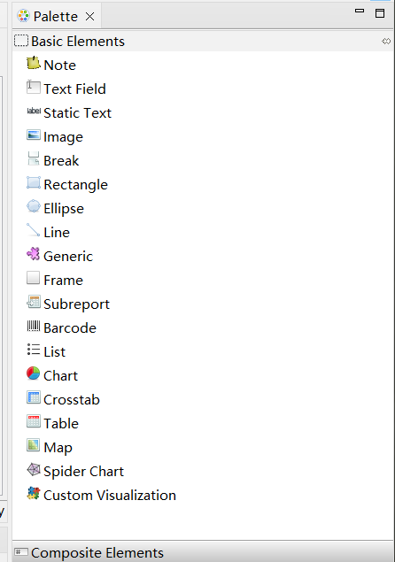

[JasperReports+Jaspersoft Studio前后端打印模式 学习教程 V1.0.docx](https://www.yuque.com/attachments/yuque/0/2024/docx/43512689/1735482449863-33f77ead-62cb-4473-bcf5-1cf3ada359dd.docx)

下载 Jspersorft Studio 

新建一个Project

File->New->Project->JasperReports Project






新建一个Jasper Report模板

项目右键->New->Jasper Report



选择Blank A4（A4纸大小的模板），然后Next。



命名为DemoReport1.jrxml，点击Finish，生成一个报表模板



# Studio 功能区域介绍

## Main Report

报表模板被垂直的分层，每一个部分都是一个Band，每一个Band的特点不同




+ **Title（标题）**

  只在整个报表的第一页的最上端显示。只在第一页显示，其他页面均不显示。

+ **Page Header（页头）**

  在整个报表中每一页都会显示。在第一页中，出现的位置在Title Band的下面。在除了第一页的其他页面中Page Header的内容均在页面的最上端显示。

+ **Column Header（列头）**

  Detail中打印的是一张表的话，这Column Header就是表中列的列头。

+ **Detail 1（详细）**

  报表内容，每一页都会显示。

+ **Column Footer（列脚）**

  Detail中打印的是一张表的话，这Column Footer就是表中列的列脚。

+ **Page Footer（页脚）**

  在整个报表中每一页都会显示。显示在页面的最下端。一般用来显示页码。

+ **Summary（统计）**

  表格的合计段，出现在整个报表的最后一页中，在Detail1 Band后面。主要是用来做报表的合计显示。



## Outline

Outline显示模板结构：




Palette




```plain
@Log(title = "工单批量打印")
    @PostMapping("/purRcvDetail/{template}")
    public AjaxResult mergePwoPdfs(@RequestBody Long[] ids,@PathVariable("template") String template) throws IOException, JRException, NoSuchMethodException {
        AjaxResult ajax = new AjaxResult();
        ajax.put("pdfURL", wmsPurchaseReceiveService.purRcvDetail(ids, template));
        return ajax;
    }
```