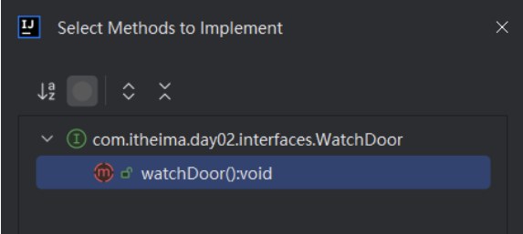
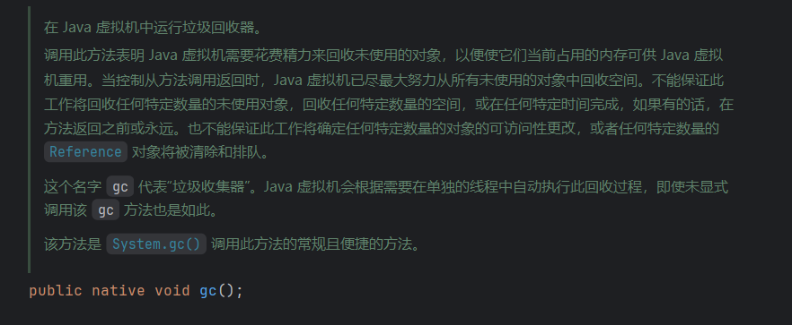
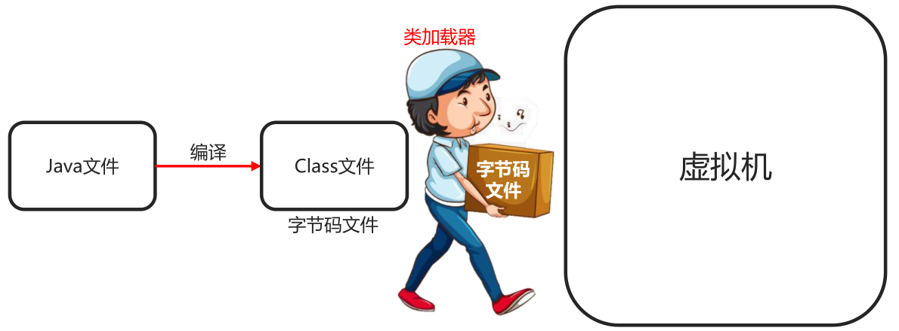

# JDK新增语法

## JDK8


## JDK11

> 新增String的strip()、isBlank()、isEmpty()

```java
String ss = " ";
System.out.println(ss.isBlank());//true
System.out.println(ss.isEmpty());//false
```

## JDK13

> 文本块——预览特性引入

```java
String textBlock = """
        题目：《咏鹅》
        
        鹅，鹅，鹅，
        曲项向天歌。
        白毛浮绿水，
        红掌拨清波。
        
        —— 唐·骆宾王
        """;
System.out.println(textBlock);
/*
题目：《咏鹅》

    鹅，鹅，鹅，
    曲项向天歌。
    白毛浮绿水，
    红掌拨清波。

—— 唐·骆宾王
*/
```


## JDK14

switch新语法——JDK12预览特性引入，JDK14正式引入

> 箭头语法 -> 替换break
>
> case多值匹配语法，case后面可以跟多个值，多个值使用逗号隔开

```java

public class Test {
    public static void main(String[] args) {
        int season = 1;
		doSomething(season);
    }
    public static void doSomething(int season){
        switch (season){
            case 1,2,3 -> System.out.println("春游");
            case 4,5,6 -> System.out.println("夏游");
            case 7,8,9 -> System.out.println("秋游");
            case 10,11,12 -> System.out.println("冬游");
            default -> System.out.println("没有此季节");
        }
    }
}
/*
春游
*/
```


## JDK17

# 面试题

## ==与equals的区别

==

比较基本数据类型  ->真实值

比较引用数据类型 ->地址值

equals

不重写 ->  == （Object默认逻辑）

重写 -> 看重写逻辑

## 浮点数为什么不能用来表示金额

在金融领域，要表示货币的精度，至少要精确到0.1或0.01的货币数值，这样在进行资金运算的时候，避免精度丢失，造成用户的资金的损失，而浮点数使用二进制科学计数法表示，他不能精确的表示所有十进制小数，所以使用浮点数进行算术运算时，比如使用使用加减乘除，可能产生舍入错误，在大多数情况下这个错误影响不大，但是在金融领域，处理资金问题的场景中，这些小的错误可能会累积起来，导致最后的结果与期望的结果，有明显的差距。所以为了避免这一类问题呢，在处理金钱或者货币的时候，推荐使用特殊的货币类型，比如BigDecimal来表示金钱，这样的话，确保可以在进行算术运算的时候，能够保证精确的结果，以上呢就是我对这个问题的理解

## 说一下java集合继承结构


## 说一下List中常用的类及其特点

List接口有两个常用的实现类，ArrayList、LinkedList

ArrayList 数据结构是动态数组，

LinkedList 数据结构是链表

## 说一下如何使用LinkedList模拟栈和队列

## 说一下List常见的数据结构


## 为什么ArrayList是1.5倍扩容因子  HashMap是2倍扩容因子

## java创建线程有几种方式，分别说一下哪几种


## 你刚才讲的这几种创建方式有什么不同？


java线程六种状态

操作系统六种状态

# 数据类型

## 基本数据类型

从内存角度看：数据值是存储在自己空间当中

特点：赋值给其他变量，也是赋的真实的值

```
整数：long , int, short, byte
浮点数：double, float
字符：char
布尔：boolean
```

## 引用数据类型

从内存角度看：数据值是存储在其他空间中，自己空间存储的是地址值

特点：赋值给其他变量，赋的地址值

```
类，接口，数组，String
```

# 运算符

## 算术运算符

隐式转换


赋值运算符
关系运算符/比较运算符
逻辑运算符

## 短路逻辑运算符 

&& 与 逻辑 并且的意思，全为true结果 才是true
|| 或 逻辑 或者的意思，全为false结果才是false

**&& || 和 & |**

&& 短路与 ，只要第一个为false，发生短路 ，优点提高程序运行效率
|| 短路或 ，只要第一个为true，发生短路

```java
int x = 12;
int y = 13;
boolean z = x>y && x++ < y ;
System.out.println(z);//flase
System.out.println(x);//12
z = x>y & x++ < y ;
System.out.println(z);//flase
System.out.println(x);//13
```


## 三元运算符

```java
public class TernaryDemo {
    public static void main(String[] args){
        int a = 20;
        int b = 40;
        int max = a>b ? a : b ;
        System.out.println(max+"是最大值");
    }
}
```

## 运算符优先级

# 分支语句

## switch

```java
Scanner sc = new Scanner(System.in);
System.out.println("请输入今天星期几：");
String week = sc.next();
String activity = "";
/*switch (week) {
    case "周一" :
        activity = "跑步";
        break;
    case "周二":
        activity = "游泳";
        break;
    default: activity = "输入错误";
}*/
```
jdk14 ：箭头语法 把case后的 -> 代替break
jdk12 ：case 多值语法，多个值用逗号隔开

```Java
//jdk14 箭头语法 把case后的: -> 代替break
//jdk12 case 多值语法，多个值用逗号隔开
switch (week) {
    case "周一","周三","周五" -> activity = "跑步";
    case "周二","周四","周六" -> activity = "游泳";
    case "周日" -> activity = "好好吃一顿";
    default -> activity = "输入错误";
}
```

## if与switch选择问题

优先使用 switch ：出现**byte/short/char/int，String，enum**，并且分支足够多（三个以上）

优先使用if ：出现范围条件时

# 循环语句

## for

```java
public static void main(String[] args){
    int a = 1;
     //首先执行 初始化语句,只能执行一次
    // 然后执行比较语句->true->执行循环体(重复的代码)->步进语句
    //              ->false -> 循环结束
    for(int i=0; i<100; i++){
        a = a++;//1
    }
    System.out.println(a);//1
}
```

## for与while的选择

```java
//循环次数确定 ： 优先使用for循环
//循环次数不确定 ：优先使用while循环 
```

# 随机数

- Random类
- Math.random()
- 时间戳

## Random类

```java
Random r = new Random();
//jdk17新增语法 可以指定生成随机数的范围->由于计算机语言的差1性 ->[,)
int i = r.nextInt(1,7);
```

## Math.random()


## 时间戳


# 数组

## 静态初始化

```java
//静态初始化
//完整格式：
数据类型[] 数组名 = new 数据类型[]{元素1,元素2,.....};
//简化格式：
数据类型[] 数组名 ={元素1,元素2,.....};

int[] arr1 = new int[]{11, 12, 13};
int[] arr2 = {11, 12, 13};

double arr3 = new double[]{1.93, 1.75, 1.81}
double arr4 = {1.93, 1.75, 1.81}

String[] arr3 = new string[]{"zhangsan", "lisi", "wangwu"};
String[] arr4 = {"zhangsan", "lisi", "wangwu"};
```


## 地址值

```java
int[] arr = {1, 2, 3, 4};
System.out.println(arr);//地址值[I@4eec7777
//地址值：数组在整个内存中的位置

//扩展
//解释一下地址值的含义
//[ :表示当前是一个数组
//I :表示当前数组里的元素都是int类型的
//@ :表示间隔符号，（固定格式）
//4eec7777 :才是真正的地址值，（十六进制）
//平时我们会把这个整体叫做数组的地址值

```

## 遍历

```java
//数组的长度属性。
//调用方式  数组名.length

//扩展
//自动的快速生成数组的遍历方式
//idea提供的
//数组名.fori 回车
for (int i = 0; i < arr.length; i++) {

}
```

## 数组索引越界异常

```java
int[] ageArr = new int[5];
//3. 不能超出索引范围 
//ArrayIndexOutOfBoundsException 数组索引越界异常
//System.out.println(ageArr[5]);
```


## 动态初始化

动态初始化：初始化时只指定数组长度，由虚拟机分配默认的初始值。

格式：数据类型[] 数组名 = new  数组类型[数组长度];

数组**默认初始化**的规律

1. **整数**类型：默认初始化值**0**
2. **小数**类型：默认初始化值**0.0**
3. **字符**类型：默认初始化值**‘/u0000’ 空格**
4. **布尔**类型：默认初始化值**false**
5. **引用数据**类型：默认初始化值**null**

## 内存


1. jvm内存区域划分几块 ? 堆,栈,方法区（静态区）

2. 引用数据类型为什么要叫做引用数据类型? 
		
	动词 -> 拿着栈里面保存的地址值去堆里找
	
	名词 -> 堆数据的地址值
	
3. 字符串存在什么位置? 字符串常量池里面


### 内存分配

1. 栈：方法运行时使用的内存，比如main方法运行，进入方法栈中执行
2. 堆：储存对象或数组，new创建出来的，都储存在堆内存
3. 方法区：粗存可以运行的class文件（当类开始执行时，会把该类的字节码（.class）文件加载到方法区中临时存储）
4. 本地方法栈：JVM在使用操作系统时使用
5. 寄存器：给CPU使用


# 方法

## 什么是方法

方法是**程序中最小的执行单元**

## 什么时候用到方法

重复的代码，具有独立功能的代码可以抽取到方法中

## 方法的好处

可以**提高代码**的**复用性**和**可维护性**

## 形参和实参

形参：全称**形式参数**，方法**定义**中的参数（方法定义时，所声明的参数）

实参：全称**实际参数**，方法**调用**中的参数（调用方法时，实际传入的参数）

```java
method(10,20);//实参
public static void method(int num1, int num1){//形参
    
}
```

## 方法的重载

重载：同一个类，方法名相同，参数列表不同的方法。与返回值无关

参数列表不同：个数不同，类型不同，顺序不同

## 方法值的传递

传递**基本数据类型**时，传递的是**真实的数据**，形参改变，**不影响**实际参数的值

传递**引用数据类型**时，传递的是**地址值**，形参的改变，**影响**实际参数的值

# 二维数组

## 静态初始化

```java
//格式:数据类型[][] 数组名 =new 数据类型[][]{{元素1,元素2},{元素1,元素2}};
//范例:
int[][] arr=new int[][]{{11,22},{33,44}};

//简化格式:数据类型[][] 数组名 ={{元素1,元素2}，{元素1,元素2}};
//范例:
int[][] arr ={{11,22},{33,44}};
```

## 二维数组内存图


```java
System.out.println(arr[0]);//0x0022
System.out.println(arr[0][1]);//0

//用于定义随意长度的二维数组
int[][] arr = new int[2][];
arr1 = {1,2,3,4};
arr2 = {11,22};

//将arr1的地址值赋值给arr[0]
arr[0] = arr1;
//将arr2的地址值赋值给arr[1]
arr[1] = arr2;
```

# 进制

## 不同进制的书写格式

```
0b 二进制开头 (binary)
0  八进制开头 (octal)
0x 十二进制开头 (hexadecimal)
```

## 位运算


```java
//位运算符指的是二进制位的运算，先将十进制数转成二进制后再进行运算
//在二进制位运算中，1表示true，0表示false。
System.out.print(8>>2);//= 8/4 = 2
System.out.print(8<<2);//= 8*4 = 32
```


# 面向对象

## 类和对象

类（设计图）：是对象共同特征的描述；

对象：我们自己臆造出来的，具备属性和行为的东西

## 定义类

一个代码文件中可以定义多个类，但只能有一个类是public修饰的，

public修饰的**类名**必须是java代码的**文件名**

```java
public class 类名{
    //成员变量；(属性)
    //成员方法；(行为)
    //构造器；
    //代码块；
    //内部类；
}
public class Phone{
    //完整格式
    修饰符 数据类型 变量名称 = 初始化值;
    //成员变量；(属性)
    String beand;
    double price;
    
    //行为（方法）
    public void call(){
        
    }
}
```

## 获取类

```java
//类名 对象名 = new 类名();
Phone p = new Phone();

```

## 对象的成员变量的默认规则

| 数据类型     | 明细                    | 默认值 |
| ------------ | ----------------------- | ------ |
| 基本数据类型 | byte, short, int, long, | 0      |
|              | float, double           | 0.0    |
|              | boolean                 | false  |
| 引用数据类型 | 类，接口，数组，String  | null   |

## 封装

1. 什么是封装

对象代表什么，就得封装对应的数据，并提供数据对应的行为

2. 好处

有什么事，找对象，调方法就行，降低学习成本，

## private关键字

是个权限修饰符

可以修饰成员（成员变量和成员方法）

被private修饰的成员只能在本类中才能访问

```java
private String name;
//针对于每一个私有化的成员变量，都要提供get和set方法

//set方法:给成员变量赋值
public void setName(String n){
	name = n;
}
//get方法:对外提供成员变量的值
public String getName(){
    return name
};
```

## this关键字

this内存原理

this的作用：区分局部变量和成员变量

this的本质：代表方法调用者的地址值


## 构造方法

作用：创建对象的时候，虚拟机会自动调用构造方法，作用是给成员变量进行初始化的

构造方法默认调用

## 标准的JavaBean类

1. 类名需要见名之意

2. 成员变量使用private修饰

3. 提供至少两个构造方法

   无参构造方法

   全参构造方法

4. 成员方法

   提供每一个成员变量对应的get和set方法

   如有其他行为，也需要写上

## 成员变量和局部变量

成员变量在堆中（有默认初始值）

局部变量在栈中


# 字符串

## String概述

String是java定义好的类，在java.lang包中

```java
//jdk15 引入文本块
String s = """
    		
    		
    		""";
```


## String构造方法实现和内存分析

字符串值在创建后不能被改变

```java
//直接赋值方式创建字符串对象
String s1 = "abc";
//new一个空参字符串对象（空白字符串对象）
String s2 = new String();
//传递字符串，根据传递字符串内容创建一个新的字符串对象
String s3 = new String("abc");
//传递字符数组，根据字符数组的内容创建一个新的字符串对象
//需求：改变字符串的内容，通过修改字符数组来指定
char[] chs = {'a','b','c'};
String s4 = new String(chs);
//传递字节数组，根据字节数组的内容在创建一个新的字符串对象
//应用场景：在网络中传输的数据是字节信息
//把字节信息进行转换，转成字符串，需用到这个构造
byte[] bytes = {97. 98, 99, 100};
String s5 = new String(bytes);

```

内存中

只有**直接赋值**方式获取的字符串，才能存储到**StringTable**（**串池**[字符串常量池]）中

当使用双引号直接赋值时，系统会检查该字符串在串池中是否存在

不存在：创建新的

存在：直接复用


## 字符串比较

```java
String sl = new string("abc");//记录 堆 里面的地址值
String s2 ="Abc"//记录 串池 中的地址值
    
//==号比较
//基本数据类型:比的是数据值
//引用数据类型:比的是地址值
System.out.println(s1==s2);//false

//比较字符串对象中的内容是否相等
boolean result1=s1.equals(s2);
System.out.println(result1);

//比较字符串对象中的内容是否相等，忽略大小写
//场景 ：验证码
boolean result2=s1.equalsIgnoreCase(s2);
System.out.println(result2);//true
```

## String方法

String方法都要用变量，来接收改变之后的字符串

```java
String str = "AbCd你好";
//取字符串中该索引中的字符
str.charAt(索引);//
//字符串中字符长度
str.length();
//字符串转大写
str.toUpperCase();//ABCD你好
//字符串转小写
str.toLowerCase();//abcd你好
//忽略大小写进行比较
str.equalsIgnoreCase("ABCD你好");//true
//判断某个字符串开头或结尾
str.startsWith("Ab");//true
//字符拆分   特殊字符需要转义  符号前加\\  如\\$
String str1 = "1,2,3,4,5"
System.out.println(str1.split(",")[0])

//jdk新增的一系列的strip方法
String s1 = "       abc     ";
//去除首尾 -> trim
System.out.println(s1.strip());//(abc)
//去除首尾空格
System.out.println(s1.stripLeading());//(abc    )
//去除尾空格
System.out.println(s1.stripTrailing());//(       abc)
//System.out.println(s1.stripIndent());
```

## StringBuilder

概述：StringBuilder对象可以看作一个容器，创建之后里面内容可变

作用：提高字符串操作效率

使用场景：1.字符串的拼接，2.字符串的反转


| 成员方法名                            | 说明                                                |
| ------------------------------------- | --------------------------------------------------- |
| public StringBuilder append(任意类型) | 添加数据，并返回对象本身                            |
| public StringBuilder reverse()        | 反转容器中的内容                                    |
| public int length()                   | 返回长度(字符出现的个数)                            |
| public String toString()              | 通过toString()就可以实现把StringBuilder转换为String |

## 打印输出

```java
//打印SB对象输出的不是地址值而是属性值
System.out.println();//自动调用引用数据类型的toString()方法
```


## StringJoiner（JDK8出现）

概述：StringJoiner也可以看成是一个容器，创建之后里的内容是可变的

作用：提高字符串操作效率，可以高效方便的拼接字符串

| 构造方法名                                        | 说明                                                         |
| ------------------------------------------------- | ------------------------------------------------------------ |
| public StringJoiner (间隔符号)                    | 创建一个StringJoiner对象，指定拼接时的间隔符号               |
| public StringJoiner(间隔符号，开始符号，结束符号) | 创建一个StringJoiner对象，指定拼接时的间隔符号开始符号、结束符号 |

```java
StringJoiner sj = new StringJoiner("---");//1---2---3
StringJoiner sj = new StringJoiner(", ","[","]");//[1, 2, 3]
```

| 方法名                               | 说明                                       |
| ------------------------------------ | ------------------------------------------ |
| public Stringjoiner add (添加的内容) | 添加数据，并返回对象本身                   |
| public int length()                  | 返回长度(字符出现的个数)                   |
| public String toString()             | 返回一个字符串(该字符串就是拼接之后的结果) |


## 字符串原理

字符串储存的内存原理

- 直接赋值会复用字符常量池中的

- new出来的不会复用，而是开辟一个新的空间

==号比的到底是什么

- 基础数据类型，比的是实际的值

- 引用数据类型，比的是地址值

字符串拼接的底层原理

- 如果没有变量参与，都是字符串直接相加，编译之后就是拼接之后的结果，会复用串池中的字符串。
- 如果有变量参与，每一行拼接的代码，都会在内存中创建新的字符串，浪费内存。

StringBuilder提高效率原理图

- 所有要拼接的内容都会往StringBuilder中放，不会创建很多无用的空间，节约内存

```java
public class Test3{
    public static void main(string[] args){
        String s1 ="abc";//记录串池中的地址值
        String s2 ="ab";
        String s3 = s2 +"c";//新new出来的对象
        System.out.psintln(s1== s3);//false
    }
}
字符串拼接的时候，如果有变量:
JDK8以前:
系统底层会自动创建一个StringBuilder对象，然后再调用其append方法完成拼接。
拼接后，再调用其toString方法转换为String类型，而toString方法的底层是直接new了一个字符串对象。
JDK8版本:
系统会预估要字符串拼接之后的总大小，把要拼接的内容都放在数组中，此时也是产生一个新的字符串。
```


字符串拼接的时候，如果有变量:
JDK8以前:系统底层会自动创建一个StringBuilder对象，然后再调用其append方法完成拼接。
拼接后，再调用其toString方法转换为String类型，而toString方法的底层是直接new了一个字符串对象。

JDK8版本:系统会预估要字符串拼接之后的总大小，把要拼接的内容都放在数组中，此时也是产生一个新的字符串。

# 集合

## 集合和数组的对比

数组：数组**长度固定**    可以**存储基本数据类型 **和 **引用数据类型**

集合：集合**长度可变**     可以**存基本类型的包装类** 和 **引用数据类型**

##  ArrayList


```java
//集合是jdk1.2引入的->1.5引入泛型->1.7菱形推断语法(只写前面泛型，后面自动推断)
//泛型：限定集合中存储的数据类型
ArrayList<String> list = new ArrayList<String>();//jdk7之前
ArrayList<String> list = new ArrayList<>();
```

```java
//打印对象不是地址值，二十集合中存储的内容
System.out.println(list);//[]
list.add("aaa");
list.add("bbb");
list.add("ccc");//[aaa, bbb, ccc]

Boolean result = list.remove("aaa");//返回值判断是否删除成功
String result = list.remove(0);//返回被删除的元素

String result = list.set(0,"aaa");//返回被覆盖的元素
System.out.println(result);//ccc
```

| 方法名               | 说明                                |
| -------------------- | ----------------------------------- |
| boolean add(E e)     | 添加元素，返回值表示是否添加成功    |
| boolean remove(E e)  | 删除指定元素,返回值表示是否删除成功 |
| E remove(int index)  | 删除指定索引的元素,返回被删除元素   |
| E set(int index,E e) | 修改指定索引下的元素,返回原来的元素 |
| E get(int index)     | 获取指定索引的元素                  |
| int size()           | 集合的长度，也就是集合中元素的个数  |


# Static

static表示静态，是java中的一个修饰符，可以修饰成员方法，成员变量

## 静态变量

被static修饰成员变量，叫静态变量

特点

- 被所有类对象共享

调用方式 

- 类名调用（推荐）
- 对象名调用

单独存放的静态变量的空间叫**静态区**（类信息）

静态区存放着这个类所有静态变量

**静态变量是随着类的加载而加载的，优先于对象出现**


## 静态方法

被static修饰的成员方法，叫静态方法

特点：

- 多用在测试类和工具类中
- Javabean类很少用

# Util工具类

## 工具类的规范

1. 名字要以Util结尾
2. 构造器私有化（为了不能实例化或被创建对象）
3. 工具类中一般只有静态方法

```java
public static class MyUtil{
    private MyUtil(){
        
    }
    public static void print(String s){
        System.out.println(s);
    }
    //.....
}
```

## 调用格式

```java
//类名.方法(实参);
```

# 继承

## 什么是继承、继承的好处、什么时候用?

继承是面向对象三大特征之一，可以让类与类之间产生父子关系

可以把多个子类中重复的代码抽取到父类中，子类可以直接使用，减少代码沉余，提高代码复用性

当类与类之间，存在相同（共性）的内容，且、并满足子类是父类的一种，就可以考虑使用继承，优化代码

## 优缺点

提高复用性，便于维护

降低了子类的独立性，父类更改属性和行为所有子类都更改属性和行为

## 继承的格式

```java
public class Student extends Person{}
```

Student称为子类（派生类），Person父类（基类或超类）

## 继承后子类的特点

子类可以得到父类的属性和行为，子类可以使用。
子类可以在父类的基础上新增其他功能，子类更强大。

## 继承的特点

java只能单继承：一个类只能继承一个直接父类

Java不支持多继承、但支持多层继承

Java中所有的类都直接或间接继承Object类

子类只能访问父类中非私有的成员

## 子类能继承父类中的哪些内容

|          | 非私有          | private       |
| -------- | --------------- | ------------- |
| 构造方法 | 不能继承        | 不能调用      |
| 成员变量 | 能继承          | 能调用        |
| 成员方法 | 虚方法表 能继承 | 否则 不能调用 |

虚方法表：非private修饰、非static修饰、非final修饰

Object有五个虚方法，虚方法表中没有的成员方法，能继承，但不能被调用

每个类都有自己的虚方法表，添加子类非private、static、final修饰的方法和父类虚方法表中的方法

## 继承中：成员变量的访问特点

继承中成员变量的特点 ：就近原则

先在局部位置找，本类成员位置找，父类成员位置找，逐级往上

```java
public class Fu{
    String name = "Fu";
}
class Zi extends Fu{
    String name = "Zi";
    public void ziShow(){
        String name = "ziSAhow"
        System.out.println(name);//ziShow
        System.out.println(this.name);//Zi
        System.out.println(super.name);//Fu
    }
}
```

## 继承中：成员方法的访问特点

this调用:就近原则。
super调用:直接找父类。


## 继承中：构造器的访问特点

父类的构造方法不会被子类继承

子类中所用的构造方法默认先访问父类的无参构造，在执行自己

### 为什么？

子类在初始化的时候，可能会用到父类当中的数据，如果父类没有完成初始化，子类将无法使用父类中的数据

子类初始化之前，一定要先调用父类构造方法完成父类数据空间的初始化

### 怎么调用父类构造方法的？

子类构造方法的第一行语句默认都是：super（），不写也存在，且必须在第一行

## this和super使用区别

相同点：super与this 都能调用构造器，成员变量以及成员方法

​				super与this调用构造器必须在构造器里面

​				且一定要放在第一行

不同点：super调用父类的public的成员

​				this调用本类的成员

```java
public Cat(String name, int age, String gender){
    //System.out.println(123);报错
    //this();报错
    super(name, age, gender);
    super.run();
    this.run();
}
```


## 方法的重写

当父类的方法不能满足子类现在的需求时，需要对方法重写

### 什么是方法重写

在继承体系中，子类出现和父类一样的方法声明，就称子类的这个方法是重写方法

### 方法重写的本质

子类覆盖了父类继承下来的虚方法表里的方法

### 方法重写建议加上哪个注解，有什么好处？

1. @Override是放在重写方法上，校验子类重写的语法是否正确，同时可读性好。

### 方法重写注意事项和要求

1.重写方法的名称、形参列表必须与父类中的一致。

2.子类重写父类方法时，访问权限子类必须大于等于父类(暂时了解:空着不写<protected<public)

3.子类重写父类方法时，返回值类型子类必须小于等于父类

**4.子类重写的方法尽量和父类保持一致。**

**5.只有被添加到虚方法表中的方法才能被重写**


# 多态

## 学习多态的目的


## 什么是多态

对象的多种形态（就是同一个对象在不同情况下的不同形态）

```java
//普通创建对象 -> 调用子类构造器 指向相应类型
Cat cat = new Cat();
//多态创建对象 -> 调用子类的构造器，指向父类的引用-> 原因：在继承前提下，调用子类构造器会先调用父类的构造器
Animal animal = new Cat();
Object object = new Cat();
```

## 多态的前提

有继承/实现关系

有父类引用指向子类对象

有方法的重写

## 多态的好处

使用父类型作为参数，可以接收所有子类型

体现多态的扩展性和便利性

## 多态的弊端

不能使用子类特有的功能

## 引用数据类型的类型转换，有几种方式?

自动类型转换、强制类型转换

```java
//向上转型
Person p=new student();
//向下转型
Student s(student)p;
```

## 强制类型转换能解决什么问题?

转换类型与真实对象类型不一致会报错

```java
//抛出java.lang.ClassCastException（类型转换异常）
```

可以转换成真正的子类类型，从而调用子类独有功能，

```java
//使用 instanceof 关键字判断是否是真实对象类型
//父类对象 instanceof 子类
Animal animal = new Dog();
if(animal instanceof Dog){
    //Dog dog = (Dog)animal;
    //dog.look();
    (Dog)animal.look();
}
```


## 多态调用成员

//调用成员变量:编译看左边，运行也看左边

//编译看左边:javac编译代码的时候，会看左边的父类中有没有这个变量，如果有，编译成功，如果没有编译失败。

//运行也看左边:java运行代码的时候，实际获取的就是左边父类中成员变量的值

//调用成员方法:编译看左边，运行看右边
//编译看左边:javac编译代码的时候，会看左边的父类中有没有这个方法，如果有，编译成功，如果没有编译失败。
//运行看右边:java运行代码的时候，实际上运行的是子类中的方法。

## 多态调用成员的内存图解


# 包

## 包的作用?

包就是文件夹，用来管理各种不同功能的Java类

## 什么是全类名?

包名+类名

# 关键字

## final

final关键字是最终的意思，可以修饰类、修饰方法、修饰变量。

```java
- final修饰类：最终类，不能被继承
- final修饰方法：最终方法，不能被重写
- final修饰变量：是常量，不能被修改（不能再重新赋值）
//修饰变量
基本数据类型:变量的值不能修改
引用数据类型:地址值不能修改，内部的属性值可以修改
```

# 修饰符

## 权限修饰符的分类

有四种作用范围由小到大(private<空着不写<protected<public)

| 修饰符    | 同一 个类中 | 同一个包中其他类 | 不同包下的子类 | 不同包下的无关类 |
| --------- | ----------- | ---------------- | -------------- | ---------------- |
| private   | √           |                  |                |                  |
| 空着不写  | √           | √                |                |                  |
| protected | √           | √                | √              |                  |
| public    | √           | √                | √              | √                |

# 代码块

## 代码块分类

局部代码块，构造代码块，

静态代码块 static{}

## 局部代码块的作用

提前结束变量的生命周期（已淘汰）

## 构造代码块的作用

抽取构造代方法中的重复代码

```java
public class Student{
    //{
    //    System.Out.Println("在创建本类对象时，会先执行构造代码块再执行构造方法")
    //}
    private string name;
    private int age;
	public student(){
        调用方法();
    }
	public student(string name,int age){
		调用方法();
		this.name = name;
        this.age = age;
	}

```

## 静态代码块的作用

数据的初始化

```java
public class Student{
    static {
        System.Out.Println("随着类的加载而加载，并且自动出大、只执行一次")
    }
}
```

# 抽象类

## 抽象类的作用

抽取共性时，无法确定方法体，就把方法定义为抽象的。

强制让子类按照某种格式重写

抽象方法所在的类，必须是抽象类

## 抽象类和抽象方法的格式

public abstract 返回值类型 方法名（参数）；

public abstract class 类名{}

## 继承抽象类有哪些要注意?

抽象类不能被实例化

抽象类的子类 1. 要么重写抽象类中的所有抽象方法 2. 要么是抽象类


# 接口

## 接口的作用

1. 定义规范 -> 解决代码的维护性问题

2. 定义抽象行为 -> 解决了单继承的缺点，接口时多实现的，而且接口与接口之间时多继承的
3. 标记性作用 -> jdk中有很多标记性接口，这些接口只有名称，没有任何内容，用于区分类与类之间的作用
4. 方便定义常量 -> 因为接口中的常量默认被 public、static、final修饰 
5. 函数式接口 -> 实现lamba表达式，取代匿名内部类

## interface

接口的定义格式（接口不能**实例化**（**创建对象**），所以没有构造方法）

```java
public interface 接口名{
    //成员变量（常量）
    //成员方法（抽象方法）
}
```

```java
public interface A{
    //成员变量->默认被public static final修饰符修饰
    //public static final String SCHOOL_NAME = "常量";
    String SCHOOL_NAME = "常量";
    
    //成员方法->默认被public abstract修饰符修饰
    //public abstract void test();
    void test();
}
```

## implements

接口和类之间是实现关系，或者说接口是用来被类实现的，通过implements关键字表示

```java
public class implements 接口名{}
```

接口的子类(实现类)

​	要么重写接口中的所有抽象方法

​	要么是抽象类

## 接口中成员的特点

成员变量  默认修饰符 **public static final**

构造方法  **没有**

成员方法  默认修饰符: **public abstract**

JDK7及以前 ：接口中只能定义抽象方法

JDK8：接口中可以定义有方法体的方法，**默认default、静态static**

JDK9：接口中可以定义私有方法。**private 私有方法**分为两种 普通的私有方法   静态的私有方法

## 接口和类之间的关系

**类和类**之间的关系：只能单继承，不能多继承

```java
class Fu{}
public Zi extends Fu{}
```

**类与接口**的关系: 实现关系，可以单实现，可多实现，继承一个类的同时实现多接口

```java
interface Inter1{
    void show();
}
interface Inter2{
    void show();
}
public class Impl implements Inter1, Inter2{
    @Overrid
    void show(){
        System.out.println("实现接口里的方法");
    }
}
```

**接口和接口**的关系：继承关系，可以单继承，也可以多继承

```java
interface Inter1{}
interface Inter2{}
public interface Inter extends Inter1, Inter2{}
```

## IDEA接口实现类Select Methods to lmplement 界面



Select Methods to lmplement 选择要实现的方法


Copy javaDoc **生成注释文档**

Generate missed JavaDoc **生成遗漏的注释文档**

Insert @Override（默认选中）**插入 @Override**


## 标记性接口（空接口）


# 内部类

定义：

内部类是类中五大成分之一（成员变量、成员方法、构造器、内部类、代码块）

如果一个类定义在另一个类的内部，这个类就是内部类

```java 
public class Outer{
	/**
     * 内部类
     */
    public class Inner{
        
    }
}
```

## 成员内部类

成员内部类是类中的一个普通成员，与成员变量、成员方法平级

```java
public class Outer {
    private int a = 200;
    /**
     * 成员内部类
     */
    public class Inner{
        private int a= 100;

        public void show(){
            int a = 300;
            System.out.println(a);//300
            System.out.println(Outer.this.a);//200
            System.out.println(this.a);//100
        }
    }
}
```

```java
public static void main(String[] args) {
    //外部类.内部类 变量名 = new 外部类().new 内部类();
    Outer.Inner inner = new Outer().new Inner();
    //调用内部类的方法
    inner.show();
}
```

## 静态内部类

静态内部类，就是在成员内部类中添加static关键字

```java
public class Outer {
    private int age = 18;
    public static String name = "YQiang";
    /**
     * 静态内部类
     */
    public static class Inner{
        //静态内部类
        //可以访问外部类的静态变量
        //不能访问实例变量
        public void show(){
            System.out.println(name);//YQiang
            //System.out.println(age);//报错
        }
    }
}
```

```java
public static void main(String[] args) {
    //外部类.内部类 变量名 = new 外部类().内部类();
    Outer.Inner inner = new Outer().Inner();
    //调用内部类的方法
    inner.show();
}
```

## 局部内部类

局部内部类是定义在方法中的类，和局部变量平级，只能在方法中有效。（毛用没有）

```java
public class Outer{
    public void test(){
        //局部内部类
        class Inner{
            public void show(){
                System.out.println("Inner...show");
            }
        }
        
        //局部内部类只能在方法中创建对象，并使用
        Inner inner = new Inner();
        inner.show();
    }
}
```

## 匿名内部类

匿名内部类：本质上是没有名字（引用）的子类对象、或者接口的实现对象

### 匿名内部类的格式

```java
new 父类/接口(参数值){
    @Override
    重写父类/接口的方法;
}
```

使用案例

```java
/**
 * 函数时接口就是只有一个抽象方法的接口
 * 一般会加上FunctionalInterface 来标记一下
 */
@FunctionalInterface
public interface ISing {
    void sing();
}
```

```java
public static void main(String[] args) {
        /**
         * 匿名内部类
         */
    	//这里后面new 的部分，其实就是一个Animal的子类对象
    	//隐含多态性质
        ISing sing = new ISing(){
            @Override
            public void sing() {
                System.out.println("调用sing方法");
            }
            public void show(){
                System.out.println("show");
            }
        };
    	sing.sing();//调用sing方法
    }
```

匿名内部类在编写代码时没有名字，编译后系统会为自动为匿名内部类生产字节码，字节码的名称会以`外部类$1.class`的方法命名


### 匿名内部类的作用

简化了创建子类对象、实现类对象的书写格式。

# lambda表达式

JDK8新增的一种语法形式，叫做Lambda表达式

## 作用

用于简化匿名内部类代码的书写

## lambda省略模式

```java
/**
 * 函数式接口@FunctionalInterface注解
 * 前提：有且仅有一个抽象方法，但是可以有多个非抽象方法的接口
 * 
 */
@FunctionalInterface
public interface ISingWithParam {
    void sing(String song,String place);
}
@FunctionalInterface
interface IPlay {
    void play(String gameName);
}
@FunctionalInterface
interface Add {
    int add(int a, int b);
}
```

```java
/**
 * lambda表达式省略模式
 */
public static void main(String[] args) {
    //省略模式1，参数类型可以省略，但是要省略就全部省略
    //ISingWithParam sing = (String song, String place) -> {};
    ISingWithParam sing = (song, place) -> {
        System.out.println("在" + place + "唱了" + song);
    };
    sing.sing("千里之外", "黑马KTV");
    //省略模式2：参数只有一个，小括号也可以省略
    IPlay play = gameName -> {
        System.out.println("玩" + gameName);
    };
    play.play("CF");
    //省略模式3；方法体如果只有一条语句，大括号可以省略
    //如果方法有返回值，必须得写return，如果有只一条return语句，return也可以省略
    Add add = (a, b) -> a = b;
    add.add(2, 3);
}
//输出
//在黑马KTV唱了千里之外
//玩CF
```

## 方法引用

```java
/*
lambda表达式方法引用的使用前提:
1.lambda表达式方法体内只存在一条语句,并这条语句是在调用某个方法
2.该方法与函数式接口的参数列表和返回值一致时可以替换成方法引用
本质上简化了lambda表达式的参数传递
*/
```

## 构造器引用

```java
/*
lambda表达式构造方法引用使用前提
1.lambda表达式方法体只有一条语句，并且这条语句输在调用某个构造器
2.该构造器的参数列表与函数式接口参数的参数列表一致时可以替换成构造方法引用  类名(构造器名).::new
*/
```

闭包

```java
List<Integer> integers = List.of(1, 2, 3, 4, 5, 6);
final int[] a = {10};
//闭包:在 lambda表达式中使用外界变量时，会给该变量自动加上final
//使用一个元素的数组解决lambda闭包问题
integers.forEach(o -> {
    System.out.println(a[0]++);
    System.out.println(o);
});
```


# 常用API

API(Application Programming interface) ：应用程序编程接口

## System

### exit

System.exit(0);正常退出，程序正常执行结束退出

System.exit(1);是非正常退出，就是说无论程序正在执行与否，都退出，

### currentTimeMillis

```java
//时间戳：时间的整数表示形式
//时间计算原点：1970.1.1 00:00:00
long l = System.currentTimeMillis();
System.out.println(l);//1720165524836
```

计算程序运行所有时间

```java
long start = System.currentTimeMillis();
StringBuilder s = new StringBuilder();
for (int i = 0; i < 10000000; i++) {
    s.append(i);
}
long end = System.currentTimeMillis() - start;
System.out.println(end);//147
```

### arraycopy

```java
int[] src = {1,2,3,4};
int[] dest = new int[src.length];
//数组拷贝
System.arraycopy(src, 0, dest, 0, src.length);
for (int i = 0; i < dest.length; i++) {
    System.out.print(dest[i]);
}
//1234
```

### gc

garbage collection 垃圾收集

```java
System.gc();
//native 关键字 表示面向操作系统的本子源码，源码是由c/c++实现的
```



## Math

| Math类提供的常见方法                                         |                                   |
| ------------------------------------------------------------ | --------------------------------- |
| public static int abs(int a)<br />public static double abs(double a) | 取绝对值（拿到的结果一定是正数）  |
| public static double ceil(double a)<br />public static double floor | 向上取整<br />向下取整            |
| public static long round(double a)                           | 四舍五入                          |
| public static int max(int a, int b)<br />public static int min(int a, int b) | 取较大值<br />取较小值            |
| public static double pow(double a, double b)                 | 取次方                            |
| public static double random()                                | 取随机数 [0.0 , 1.0) (包前不包后) |


```java
public class MathTest {
    public static void main(String[] args) {
        // 目标：了解下Math类提供的常见方法。
        // 1、public static int abs(int a)：取绝对值（拿到的结果一定是正数）
        System.out.println(Math.abs(-12)); // 12
        System.out.println(Math.abs(123)); // 123
        System.out.println(Math.abs(-3.14)); // 3.14

        // 2、public static double ceil(double a): 向上取整
        System.out.println(Math.ceil(4.0000001)); // 5.0
        System.out.println(Math.ceil(4.0)); // 4.0

        // 3、public static double floor(double a): 向下取整
        System.out.println(Math.floor(4.999999)); // 4.0
        System.out.println(Math.floor(4.0)); // 4.0

        // 4、public static long round(double a)：四舍五入
        System.out.println(Math.round(3.4999)); // 3
        System.out.println(Math.round(3.50001)); // 4

        // 5、public static int max(int a, int b)：取较大值
        //   public static int min(int a, int b)：取较小值
        System.out.println(Math.max(10, 20)); // 20
        System.out.println(Math.min(10, 20)); // 10

        // 6、 public static double pow(double a, double b)：取次方
        System.out.println(Math.pow(2, 3)); // 2的3次方   8.0
        System.out.println(Math.pow(3, 2)); // 3的2次方   9.0

        // 7、public static double random()： 取随机数 [0.0 , 1.0) (包前不包后)
        System.out.println(Math.random());
    }
}
```


## Object

toStirng

hashCode

equals

| 方法名                          | 说明                       |
| ------------------------------- | -------------------------- |
| public String toString()        | 返回对象的字符串表示形式。 |
| public boolean equals(Object o) | 判断两个对象是否相等。     |
| protected Object clone()        | 对象克隆                   |

## Objects

工具类

| 方法名                                            | 说明                                           |
| ------------------------------------------------- | ---------------------------------------------- |
| public  static boolean equals(Object a, Object b) | 先做非空判断，再比较两个对象                   |
| public  static boolean isNull(Object obj)         | 判断对象是否为null，为null返回true ,反之       |
| public  static boolean nonNull(Object obj)        | 判断对象是否不为null，不为null则返回true, 反之 |

### equals


### isNull


### nonNull


### requireNonNull

检查对象是或否为空，抛出NullPointerException异常

```java
 int[] arr = null;
Objects.requireNonNull(arr,"数组不能为空");
//Exception in thread "main" java.lang.NullPointerException: 数组不能为空
```


## BigDecimal

为了解决计算精度缺失的问题，java提供了BigDecimal类

```java
System.out.println(0.1 + 0.2);//0.30000000000000004
System.out.println(1 / 0.0);//Infinity
double a = 1;
double b = 20.2;
double c = 300.03;
System.out.println(a + b + c);//321.22999999999996
```

```java
//传递double构造器无法解决计算精度问题
BigDecimal aDecimal = new BigDecimal(a);
BigDecimal bDecimal = new BigDecimal(b);
BigDecimal cDecimal = new BigDecimal(c);
BigDecimal add = aDecimal.add(bDecimal).add(cDecimal);
System.out.println(add);//321.229999999999972004616211052052676677703857421875
```

```java
//JDK1.1引入
//把double 转成String -> String.valueOf
BigDecimal aString = new BigDecimal(String.valueOf(a));
BigDecimal bString = new BigDecimal(String.valueOf(b));
BigDecimal cString = new BigDecimal(String.valueOf(c));
BigDecimal sum = aString.add(bString).add(cString);
System.out.println(sum);//321.23
```

```java
//jdk1.5引入的静态方法会自动创建BigDecimal对象并把double转成字符串
BigDecimal aString = BigDecimal.valueOf(a);
BigDecimal bString = BigDecimal.valueOf(b);
BigDecimal cString = BigDecimal.valueOf(c);
BigDecimal sum = aString.add(bString).add(cString);
System.out.println(sum);
```

```java
BigDecimal a1 = BigDecimal.valueOf(a);
BigDecimal b1 = BigDecimal.valueOf(b);

// 2、public BigDecimal add(BigDecimal augend): 加法
BigDecimal c1 = a1.add(b1);
System.out.println(c1);

// 3、public BigDecimal subtract(BigDecimal augend): 减法
BigDecimal c2 = a1.subtract(b1);
System.out.println(c2);

// 4、public BigDecimal multiply(BigDecimal augend): 乘法
BigDecimal c3 = a1.multiply(b1);
System.out.println(c3);

// 5、public BigDecimal divide(BigDecimal b): 除法
BigDecimal c4 = a1.divide(b1);
System.out.println(c4);
//使用除法一定要使用带有三个参数（除数，小数，舍入模式）的重载方法
BigDecimal result = a1.divide(b1, 8, RoundingMode.DOWN);
```


## 包装类

基本数据类型以及对应的包装类

| 基本数据类型 | 对应的包装类 |
| ------------ | ------------ |
| byte         | Byte         |
| short        | Short        |
| char         | Character    |
| int          | Integer      |
| long         | Long         |
| float        | Float        |
| double       | Double       |
| boolean      | Boolean      |

### Integer

如何把基本数据类型变成包装类

```java
//1.如何把基本数据类型变成包装类
int a = 10;
//过时的构造方法
//Integer i = new Integer();
Integer i = Integer.valueOf(a);
System.out.println(i);//10
```

装箱：把基本数据类型转换为对应的包装类类型
拆箱：把包装类类型转换为对应的基本数据类型   

```java
//装箱
Integer b = Integer.valueOf(100);
Integer c = Integer.valueOf(2000);
//拆箱
int i1 = b.intValue();
int i2 = c.intValue();
System.out.println(i2 + i1);//2100
```

自动装拆箱指的是系统底层自动帮我们调用包装类的valueOf()方法

```java
//自动装箱与拆箱 -> jvm自动调用装箱valueOf方法 以及自动拆箱...value
Integer d =300;
Integer e = 500;
int f =d;
int g =e;
System.out.println(d+e);//800
System.out.println(f-g);//-200
```

自动装箱时空指针异常

```java
public class Wrap {
    Integer i;
    int x;
    public Wrap (int y){
        x = i + y;
        System.out.println(x);
    }
    public static void main(String[] args){
        new Wrap (new Integer(4));
    }
}


```


类型转换（字符串与包装类的转化）

```java
//基本数据类型转字符串 String.valueOf
String s = String.valueOf(123);
System.out.println(s);//123

//把字符串转成数值 得是正常的数字字符串
Integer i = Integer.valueOf("123");
int i1 = Integer.parseInt("123");
System.out.println(i);//123
System.out.println(i1);//123

//获取不到正确的false和true字符 都返回false
Boolean true1 = Boolean.valueOf("true1");
boolean b1 = Boolean.parseBoolean("true1");
System.out.println(true1);//false
```

包装类比较大小

```java
//包装类比较大小
//在自动装箱中，valueOf方法中会缓存[-128,128)之间的常用整数，会复用缓存中的对象，因此，对象地址值一样
//超出这个范围返回 new 一个新对象
Integer a = Integer.valueOf(127);
Integer b = Integer.valueOf(127);
System.out.println(a==b);//true
System.out.println(a.equals(b));//true

Integer c = Integer.valueOf(128);
Integer d = Integer.valueOf(128);
System.out.println(c==d);//false
System.out.println(c.equals(d));//true

//所有能参与比较的类，都实现了Comparable接口的compareTo 方法
System.out.println(a.compareTo(b));//0
//0 相等
//-1 前小于后
//1 前大于后
```

### 基本类型包装类与基本类型的区别

默认值不一样
内存模型存储位置不一样

## Arrays

Arrays的常用方法

| 方法名                                           | 说明                               |
| ------------------------------------------------ | ---------------------------------- |
| public static String toString(int[] a)           | 返回指定数组的内容的字符串表示形式 |
| public static void sort(int[] a)                 | 按照数字顺序排列指定的数组         |
| public static int binarySearch(int[] a, int key) | 利用二分查找返回指定元素的索引     |

```java
public class MyArraysDemo {
      public static void main(String[] args) {
          //返回指定数组的内容的字符串表示形式
          int [] arr1 = {3,2,4,6,7};
          System.out.println(Arrays.toString(arr1));//[3, 2, 4, 6, 7]

          //按照数字顺序排列指定的数组
          int [] arr2 = {3,2,4,6,7};
          Arrays.sort(arr2);
          System.out.println(Arrays.toString(arr2));//[2, 3, 4, 6, 7]

          //利用二分查找返回指定元素的索引
          int [] arr3 = {1,2,3,4,5,6,7,8,9,10};
          int index = Arrays.binarySearch(arr3, 0);
          System.out.println(index);//-1
          //使用二分查找的要求
          //1,数组必须有序
          //2.如果要查找的元素存在,那么返回的是这个元素实际的索引
          //3.如果要查找的元素不存在,那么返回的是 (-插入点-1)
              //插入点:如果这个元素在数组中,他应该在哪个索引上.
      }
  }
```


## Time时间

1. 计算机中时间原点（UNIX操作系统,C语言的诞生日）

   1970年1月1日 00:00:00

2. 时间换算单位

   1秒 = 1000毫秒

   1毫秒 = 1000微秒

   1微秒 = 1000 纳秒

### JDK1.0 java.util下相关类

> Date
>
> SimpleDateFormat
>
> TimeZone

1. Date

```java
//date对象代表当前时间
Date date = new Date();
System.out.println(date);//Sun Jul 07 11:04:12 CST 2024
// date.compareTo()
//获取当前时间毫秒时间戳
long time = date.getTime();
System.out.println(time);//1720321452972
long l = System.currentTimeMillis();//1720321452993
System.out.println(l);
```

2. SimpleDateFormat

```java
Date date = new Date();
System.out.println(date);//Sun Jul 07 11:05:14 CST 2024
SimpleDateFormat sdf = new SimpleDateFormat("yyyy/MM/dd HH:mm:ss.SSS");
String format = sdf.format(date);
System.out.println(format);//2024/07/07 11:05:14.723
//时间字符串转换成事件对象
String s = "2024/07/07 10:41:20.183";
try {
    //声明了一个编译异常，->捕获此编译异常->catch抛出一个运行时异常
    Date parse = sdf.parse(s);
} catch (ParseException e) {
    throw new RuntimeException(e);
}
```

3. TimeZone

```java
TimeZone aDefault = TimeZone.getDefault();
System.out.println(aDefault.getDisplayName());//中国标准时间
System.out.println(aDefault.getID());//Asia/Shanghai
```

### JDK1.8 java.time下相关类

> LocalDateTime LocalDate LocalTime
>
> DateTimeFormatter 格式化类
>
> Instant 时间戳类 (某一时刻)
>
> Duration 时间日期区间类

1. 时间类LocalDateTime LocalDate LocalTime

```java
LocalDateTime now = LocalDateTime.now();
System.out.println(now);//2024-07-11T15:49:20.269742400
System.out.println(LocalDate.now());//2024-07-11
System.out.println(LocalTime.now());//15:49:20.270739300
```


2. DateTimeFormatter 格式化类

时间格式化

```java
LocalDateTime now = LocalDateTime.now();
System.out.println(now);//2024-07-11T15:49:20.269742400

//1.创建一个日期时间格式化器对象出来
DateTimeFormatter dtf = DateTimeFormatter.ofPattern("yyyy-MM-dd HH:mm:ss");

//2.对时间格式化
String format2 = dtf.format(now);// 正向格式化
System.out.println(format2);//2024-07-11 15:55:28
String format1 = now.format(dtf);// 反向格式化
System.out.println(format1);//2024-07-11 15:55:28

LocalDate localDate = LocalDate.now();
System.out.println(localDate);//2024-07-11
//System.out.println(localDate.format(dtf));//报错,因为格式不匹配
//java.time.temporal.UnsupportedTemporalTypeException: Unsupported field: HourOfDay

```

解析时间(字符串转时间)

```java
DateTimeFormatter formatter = DateTimeFormatter.ofPattern("yyyy年MM月dd日 HH:mm:ss");
// 3、解析时间：解析时间一般使用LocalDateTime提供的解析方法来解析。
String dateStr = "2029年12月12日 12:12:11";
LocalDateTime ldt = LocalDateTime.parse(dateStr, formatter);
System.out.println(ldt);//2029-12-12T12:12:11


String dateStr2 = "2024-07-11 15:55:28";
LocalDateTime ldt2 = LocalDateTime.parse(dateStr2, formatter);
System.out.println(ldt2);//报错   要转换的日期字符串格式和指定的日期格式对不上。
//java.time.format.DateTimeParseException: Text '2024-07-11 15:55:28' could not be parsed at index 4
```


3. Instant 时间戳类 (某一时刻)

相较于 System.currentTimeMillis()获取到【毫秒】，Instant 可以更为精确的获取到【纳秒】。


```java

/*
Instant 类的常用API 就是获取时间戳了
* Instant 类的 getEpochSecond () :获取的是秒
* Instant 类的 toEpochMilli () :获取的是毫秒，同 System.currentTimeMillis()
* Instant 类的 getNano () :获取的是纳秒，更精确了
*/

//获取此刻时间信息,不可变对象 零时区
Instant now = Instant.now();
System.out.println(now);//2024-07-11T06:31:41.256419500Z

//获取总秒数
System.out.println(now.getEpochSecond());
//获取总毫秒数  同 System.currentTimeMillis()
System.out.println(now.toEpochMilli());
//获取纳秒数   不够1秒的纳秒数
System.out.println(now.getNano());

//时刻与时区无关的概念
//要获取某一时区的时刻时 ,要指定一下时区
//如果获取的时刻是1754667260000,不同的时区代表着不同的时间

//自定义时间
LocalDateTime localDateTime = LocalDateTime.of(2025, 8, 8, 15, 34, 20);
Instant instant = localDateTime.toInstant(ZoneOffset.UTC);
System.out.println(instant.toEpochMilli());//1754667260000
```

Instant对象的作用

做代码的性能分析，或者记录用户的操作时间点


4. Duration 时间日期区间类


```java
public class Test8_Duration {
    public static void main(String[] args) {
        LocalDateTime start = LocalDateTime.of(2025, 11, 11, 11, 10, 10);
        LocalDateTime end = LocalDateTime.of(2025, 11, 11, 11, 11, 11);
        // 1、得到Duration对象
        Duration duration = Duration.between(start, end);

        // 2、获取两个时间对象间隔的信息
        System.out.println(duration.toDays());// 间隔多少天
        System.out.println(duration.toHours());// 间隔多少小时
        System.out.println(duration.toMinutes());// 间隔多少分
        System.out.println(duration.toSeconds());// 间隔多少秒
        System.out.println(duration.toMillis());// 间隔多少毫秒
        System.out.println(duration.toNanos());// 间隔多少纳秒

    }
}
```


### JDK1.0和JDK1.8的操作时间

1.如何获取当前时间？

|        |                                                       |
| :----: | :---------------------------------------------------: |
| JDK1.0 |                      new Date();                      |
| JDK8.0 | LocalTime.now()、LocalDate.now()、LocalDateTime.now() |

2.如何获取时间戳？

|        |                                       |
| :----: | :-----------------------------------: |
| JDK1.0 | System.currentTimeMillis()、getTime() |
| JDK8.0 |              toInstant()              |

3.如何进行时间日期的相互转换

**SDF**指的是**SimpleDateFormat**

**DTF**指的是**DateTimeFormatter**

|        | format    (格式化时间) | parse    (解析时间) |
| :----: | :--------------------: | :-----------------: |
| JDK1.0 |     new SDF(模式)      |                     |
| JDK8.0 |      DTF.of(模式)      |                     |


# Exception异常

## 为什么引入异常

是代码更加健壮，提高用户体验

识别错误并相应错误机制

## Throwable

### Error

#### VirtualMachineError

StackOverFlowError

OutOfMemoryError (OOM)

### Exception

#### RunTimeException

#### ClassNotFountException

### 异常分类

#### 编译时异常（受检异常）

除RuntimeException之外异常

#### 运行时异常（非受检异常）

RuntimeException及其子类

### Throwable的成员方法

```java
public class ThrowAbleDemo {
    public static void main(String[] args) {
        method();
    }
    public static void method() {
        try {
            throw new RuntimeException("运行时异常");
        }catch (RuntimeException e) {
            System.out.println(e.getMessage());
            System.out.println(e.toString());
            e.printStackTrace();
        }
    }
}
/*
运行时异常
java.lang.RuntimeException: 运行时异常
java.lang.RuntimeException: 运行时异常
	at com.itheima.day05.exception.ThrowAbleDemo.method(ThrowAbleDemo.java:9)
	at com.itheima.day05.exception.ThrowAbleDemo.main(ThrowAbleDemo.java:5)
*/
```

## 自定义异常

 

## 面试题

### throw和throws的区别

throws用于方法头，表示的只是异常的声明，而throw用于方法内部，抛出的是异常对象。
throws可以一次性抛出多个异常，而throw只能一个
throws抛出异常时，它的上级（调用者）也要申明抛出异常或者捕获，不然编译报错。而throw的话，可以不申明或不捕获（这是非常不负责任的方式）但编译器不会报错。

### finally 的作用

finally代码块，总是在try和任何catch块之后，方法前之前运行，不管是否抛出或捕获异常finally块都会执行

# 集合

迭代循环

## 集合继承体系

- Iterable
  		Collection(单列)
    				List(重复)
    						ArrayList
    						LinkedList
    				~~Vector~~
    						~~Stack~~
    				Set（不重复）
    						HashSet
    						TreeSet
    				~~Queue~~
- Map(双列)
  			HashTable
        			HashMap(无序）
        			TreeMap(有序)


## 泛型

JDK1.5引进的

菱形推断语法是JDK1.7引用的

不写泛型的缺点 什么引用数据类型都能存

使用泛型

编译期间就检查类型安全

消除类型转换

如果想使用泛型，类必须是泛型类

<E>  E反省通配符号，代表所有数据类型

常见的泛型通配字母

E：element 元素

T：type 类型

R：return 返回值的类型

K：key 键

V：value 值

N：Number（数值类型）

？：表示不确定的 java 类型

## Set

set没有get方法 get方法是定义在List接口中 set不在list子接口下

### HashSet

底层数据结构就是HashMap 调用的都是HashMap里的方法,存的值都是存在HashMap的Key中

HashSet默认按地址值去重

HashSet自定义对象去重必须重写equals和HashCode

//为什么重写equals的时候同时重写hashCode

hash(哈希):是由hash算法对任意的输入产生一个整数，并且值是固定的

哈希碰撞 : 同一个输入生成的hash值永远都一样,但是不同的输入生成的hash值有可能一样

### TreeSet

使用TreeSet 必须制定排序规则，因为TreeSet和Add方法都依赖于元素的比较能力来维护元素的有序性

实现Comparable<>


## Map(容器)


HashMap,怎么指定初始化大小,为什么要指定初始化大小

### 接口中的方法

put

get

remove

containsKey

containsValue

clear

isEmply

siz

keySet

entrySet

values

## Collections

reverse反转

## 可变参数

## 不可变集合

JDK9新增，只要不是new出来的集合对象,基本上都是不可变集合

创建List不可变集合

```java
//创建List不可变集合
//List<Integer> integerList = Arrays.asList(1, 2, 3, 4, 5, 6);
List<Integer> integerList = List.of(1, 2, 3, 4, 5, 6);
integerList.forEach(System.out::println);
integers.add(7);//Exception in thread "main" java.lang.UnsupportedOperationException
```

创建Set不可变集合

```java
//创建Set不可变集合
Set<Integer> integersSet = Set.of(1, 2, 3, 4, 5);
System.out.println(integersSet);
```

创建不可变的Map集合

```java
//创建不可变的Map集合
Map<String, Integer> map = Map.of("A", 1, "B", 2, "C", 3);
System.out.println(map);
```


# 枚举

JDK1.5引用

## 为什么要引入枚举类型

为了解决常量的缺点

常量不做任何检查,想传什么值都可以,甚至出现越界情况

这时使用枚举就可以减少参数传递的错误性

列举的值，之列举范围之内

## 格式

- 格式

  ```java
  public enum s {   
  	枚举项1,枚举项2,枚举项3;
  }
  注意: 定义枚举类要用关键字enum
  ```

- 示例代码

  ```java
  // 定义一个枚举类，用来表示春，夏，秋，冬这四个固定值
  public enum Season {
      SPRING,SUMMER,AUTUMN,WINTER;
  }
  ```


## 特点

+ 所有的枚举都是Enum的子类

+ 我们可以通过“枚举类名.枚举项名”去访问指定的枚举项

+ 每个枚举项其实就是该枚举的一个对象

+ 枚举也是一个类，也可以去定义成员变量

+ 枚举类的第一行上必须是枚举项，最后一个枚举项后的分号是可以省略的，但是如果枚举类有其他的东西，这个分号就不能省略，建议不要省略

+ 枚举类可以有构造器，但必须是private的，它默认的也是private的。

  枚举项的用法比较特殊：枚举("");

+ 枚举类也可以由抽象方法，但是枚举项必须重写该方法

所有的枚举都是Enum的子类


```java

enum SeasonEnum {
    /**
     * 春天
     */
    SPRING,
    /**
     * 夏天
     */
    SUMMER,
    /**
     * 秋天
     */
    AUTUMN,
    /**
     * 冬天
     */
    WINTER;
}
public class TestSeasonEnum {
    public static void main(String[] args) {
        //限定了，只能传枚举项
        doSomethingByEnum(SeasonEnum.SPRING);
    }
    public static void doSomethingByEnum(SeasonEnum season) {
        //switch 和枚举类特别契合 因为jdk做了专门的优化
        switch (season) {
            case SPRING->System.out.println("春天");
            case SUMMER->System.out.println("夏天");
            case AUTUMN->System.out.println("秋天");
            case WINTER->System.out.println("冬天");
        }
    }
}
```

## 枚举类中的常见方法

name()——获取枚举项的名称
values——获取所有枚举项

# Stream流

面向函数的编程风格

缺点 不便于Debug调式


## 执行过程

首先要开启流

中间操作

最后终止流


reduce 规约/折叠 

## 方法

groupingBy

```java
//groupingBy可以根据返回值灵活定义分组的名字以及分的组数
Map<String, List<Integer>> collect = integers.stream().collect(Collectors.groupingBy(t -> {
    if (t >= 0 && t <= 10) {
        return "1";
    } else if (t > 10 && t <= 25) {
        return "2";
    } else {
        return "3";
    }
}));
collect.forEach((k, v) -> {
    System.out.println(k+"="+v);
});
/*
1=[8]
2=[12, 16, 18]
3=[30, 45, 60]
*/
```

range()

```
range
```

## 并行流

```java

import java.util.Arrays;
import java.util.List;
import java.util.stream.LongStream;

public class Test {
    public static void main(String[] args) {
        //数组并行流.parallel()
        //stream可以开启并行流进行多线程计算
        long[] array = LongStream.range(1, 50000).toArray();
        long start = System.currentTimeMillis();
        System.out.println(Arrays.stream(array).parallel().sum());
        long end = System.currentTimeMillis();
        System.out.println("数组并行流执行时间："+ (end - start)+ "ms");
        //集合并行流
        List<Long> list = Arrays.stream(array).boxed().toList();
        System.out.println(list.parallelStream().reduce(Long::sum));
    }
}
/*
1249975000
数组并行流执行时间：6ms
Optional[1249975000]
*/
```

# File


## 为什么要学习File?

​	实现对文件或者文件夹的操作
​		创建
​		删除
​		复制
​		判断文件是否存在

本质式对某个文件或某个文件夹路径的一个抽象

## 使用

​	File(String pathName)
​	File(String parent,String child)
​	File(File file,String child)

```java
// \是特殊字符，需要转义
// windows \\
//mac linux /
//jdk1.5之后，目录分隔符都用 /
File file = new File("D:/a.txt");
try {
    //创建新文件
    System.out.println(file.createNewFile());
    //获取文件名
    System.out.println(file.getName());
    //判断文件/文件夹是不是存在
    System.out.println(file.exists());
} catch (IOException e) {
    throw new RuntimeException(e);
}
```

```java
File file = new File("G:/aaa");
//创建目录/文件夹  mkdir = make directory
//mkdir 只能创建单级目录
file.mkdir();
//创建多级目录
file = new File("G:/aaa/bbb");
file.mkdirs();
//只能删除文件和空文件夹
file = new File("G:/aaa/a.txt");
file.delete();
```

```java
File file = new File("D:/");
System.out.println(file.isDirectory());
System.out.println(file.isFile());

String[] list = file.list();
for (String s : list) {
    System.out.println(s);
}
/*
true
false
$RECYCLE.BIN
ALearningResource
Cloud
Documents
Downloads
Greenware
Program Files
Program Files (x86)
System Volume Information
Videos
*/
```

```java
//从工作目录中补全相对路径
File file = new File("resource");
file.mkdir();
file = new File("resource/b.txt");
file.createNewFile();
```

## 绝对路径与相对路径

- ​	绝对路径
  ​		**windows**
  ​			从盘符开始
  ​				举例:D:/summer/a.txt
  ​		**linux**或者**Mac**
  ​			从"根"开始,/代表根目录
  ​				举例: /User/summer/a.txt
- ​	相对路径
  ​		相对于当前项目下的路径
  ​			模块名/具体文件名

# IO流

以java程序为中心

I：Input 输入》》读取本地磁盘资源到Java程序（内存）

O：Output 输出》》把数据从java程序（内存）输出到本地磁盘

## IO流体系

## 字节流 

富文本文件： excel，word 》》 不仅有文字字符，图片，视频。。。》》字节流

能操作所有类型的文件

- InPutStream
  1. ByteArrayInputStream 字节数组输入流
  2. FileInputStream 文件输入流
  3. ObjectInputStream 对象输入流
  4. FilterInputStream 过滤输入流
							DataInputStream 对象输入流
					BufferedInputStream 缓冲输入流

- OutputStream

  1. ByteArrayOutputStream 字节数组输出流
2. FileOutputStream 文件输出流
  3. ObjectOutputStream 对象输出流
4. FilterOutputStream 过滤输出流
     ​			DataOutputStream 对象输出流
   ​			BufferedOutputtStream 缓冲输出流

FileInputStream 文件输入流

```java
//FileInputStream in = null;
//try {
//in = new FileInputStream("resource/b.txt");
//自动关闭源资源的try方法 jdk1.7引入
try (FileInputStream in = new FileInputStream("resource/b.txt");) {
    byte[] bytes = new byte[1024];
    //read变量的作用：-1 终止读取，不是-1 代表正常每次读取的有效长度
    int read = 0;
    while ((read = in.read(bytes)) != -1) {
        String s = new String(bytes, 0, read);

        System.out.println(s);
    }

} catch (FileNotFoundException e) {
    throw new RuntimeException(e);
} catch (IOException e) {
    throw new RuntimeException(e);
}
//finally {
//		try {
// 		   in.close();
//		} catch (IOException e) {
//		    throw new RuntimeException(e);
//		}
//}
```

FileOutputStream 文件输出流

```java
//如果没有文件会自动创建一个文件
//默认创建的没有开启续写，第二参数指定true就可以
try (FileOutputStream out = new FileOutputStream("resource/c.txt", true)){
    String s = "你好";
    //字符串转字节数组
    out.write(s.getBytes());
    out.write("\r\n".getBytes());
} catch (FileNotFoundException e) {
    throw new RuntimeException(e);
} catch (IOException e) {
    throw new RuntimeException(e);
}
```


## 字符流

纯文本文件：txr，java... 》》 只有字符  》》字符流

仅仅能操作文本文件，例如txt.java文件

磁盘IO


网络IO

## 序列化和反序列化

自定义序列化对象 ,对象类必须实现Serializable标记性接口

```java
import java.io.Serial;
import java.io.Serializable;

public class Phone implements Serializable {

    @Serial
    private static final long serialVersionUID = 1L;
    private String brand;
    private double price;

    public Phone(String brand, double price) {this.brand = brand;this.price = price;}

    public String getBrand() {return brand;}

    public void setBrand(String brand) {this.brand = brand;}

    public double getPrice() {return price;}

    public void setPrice(double price) {this.price = price;}

    @Override
    public String toString() {
        return "Phone{" +
               "brand='" + brand + '\'' +
               ", price=" + price +
               '}';
    }
}
```

序列化

```java
import java.io.FileNotFoundException;
import java.io.FileOutputStream;
import java.io.IOException;
import java.io.ObjectOutputStream;
import java.util.ArrayList;

/**
 * 序列化
 */
public class SerializationDemo {
    public static void main(String[] args) {
        try (FileOutputStream fo = new FileOutputStream("resource/phone.txt");
             ObjectOutputStream out = new ObjectOutputStream(fo);) {
            Phone phone = new Phone("小米", 1999.0);
            ArrayList<Phone> list = new ArrayList<>();
            list.add(phone);
            list.add(phone);
            out.writeObject(list);
        } catch (FileNotFoundException e) {
            throw new RuntimeException(e);
        } catch (IOException e) {
            throw new RuntimeException(e);
        }
    }
}
//�� sr java.util.ArrayListx����a� I sizexp   w   sr %com.itheima.day11.serialization.Phone        D priceL brandt Ljava/lang/String;xp@�<     t 小米q ~ x
```

反序列化

```java
import java.io.*;
import java.util.ArrayList;

/**
 * 反序列化
 */
public class DeSerializationDemo {
    public static void main(String[] args) {
        try (FileInputStream fi = new FileInputStream("resource/phone.txt");
             ObjectInputStream in = new ObjectInputStream(fi);) {
            ArrayList<Phone> o = (ArrayList<Phone>) in.readObject();
            System.out.println(o);
        } catch (FileNotFoundException e) {
            throw new RuntimeException(e);
        } catch (IOException e) {
            throw new RuntimeException(e);
        } catch (ClassNotFoundException e) {
            throw new RuntimeException(e);
        }
    }
}
//[Phone{brand='小米', price=1999.0}, Phone{brand='小米', price=1999.0}]
```

java.io.InvalidClassException异常

```java
Exception in thread "main" java.lang.RuntimeException: java.io.InvalidClassException: com.itheima.day11.serialization.Phone; local class incompatible: stream classdesc serialVersionUID = 2881963794599405131, local class serialVersionUID = -7536434461589385810
	at com.itheima.day11.serialization.DeSerializationDemo.main(DeSerializationDemo.java:18)
Caused by: java.io.InvalidClassException: com.itheima.day11.serialization.Phone; local class incompatible: stream classdesc serialVersionUID = 2881963794599405131, local class serialVersionUID = -7536434461589385810
```


## Properties


```java
import java.io.FileWriter;
import java.io.IOException;
import java.util.Properties;

public class PropertiesDemo {
    public static void main(String[] args) {
        Properties properties = new Properties();
        properties.setProperty("username", "admin");
        properties.setProperty("password", "123456");
        try (FileWriter fileWriter = new FileWriter("resource/user.properties")) {
            try {
                //\u6CE8\u91CA unicode编码
                properties.store(fileWriter, "注释");
            } catch (IOException e) {
                throw new RuntimeException(e);
            }
        } catch (IOException e) {
            throw new RuntimeException(e);
        }
    }
}
```

```properties
#\u6CE8\u91CA
#Fri Jul 19 22:54:16 CST 2024
password=123456
username=admin
```

```java
import java.io.FileNotFoundException;
import java.io.FileReader;
import java.io.IOException;
import java.util.Properties;

public class PropertiesDemo1 {
    public static void main(String[] args) {
        try (FileReader fileReader = new FileReader("resource/account.properties");) {
            Properties properties = new Properties();
            properties.load(fileReader);
            properties.forEach((key, value) -> System.out.println(key + "=" + value));
        } catch (FileNotFoundException e) {
            throw new RuntimeException(e);
        } catch (IOException e) {
            throw new RuntimeException(e);
        }
    }
}
/*
password=123456
username=admin
*/
```

# 线程 Thread

## 概念

### 进程与线程

进程与进程之间的堆栈并不共享，线程共享一个进程的堆（但不共享栈）

一个进程，最少有一个线程

**进程**

可以简单的理解为正在运行的程序,是线程的容器

进程是操作系统资源分配的最小单元。一个进程拥有的资源有⾃⼰的堆、栈等资源(例如jvm进程)

**线程**

从属于进程,一个进程可以包含很多个线程
线程是操作系统能够进行运算调度的最小单元。是进程中实际运行的单位。一个进程中每个线程执行不同的任务 。
每个java程序至少包含两个线程
				一个main线程
				一个垃圾回收线程

### 并发与并行

**并发Concurrent / kənˈkɜːrənt /**

同一时刻有多个任务(指令)在单个Cpu上交替执行》》》针对单核CPU提出

**并行parallel / ˈpærəlel /**

同一时刻有多个任务(指令)在多个CPU上同时执行》》》针对多核CPU提出

### 同步与异步

**同步synchronized / ˈsɪŋkrənaɪzd /**

​		按照顺序一步步执行代码

**异步Future**

​		代码获取结果需要分开执行

## 多线程的实现方式

-    继承Thread类的方式进行实现
-    实现Runnable接口的方式进行实现
-    利用Callable和Future接口方式实现

继承Thread类的方式进行实现

```java
class Mythread extends Thread{
    private int num;
    public Mythread(int num){
        this.num = num;
    }
    @Override
    public void run() {
        System.out.println("线程执行"+num);

    }
}

public class TestThread {
    public static void main(String[] args) {
        for (int i = 0; i < 1000; i++) {
            Mythread mythread = new Mythread(i);
            // 启动线程
            //这里采用start方法而不是直接调用run方法，因为start方法会开启一个新的线程来执行run方法中的代码
//            mythread.run();
            //启动线程之后，run方法由操作系统执行
            mythread.start();
        }
    }
}
/*
线程执行10
线程执行7
线程执行0
线程执行33
线程执行30
线程执行23
线程执行21
线程执行24
...
...执行1000次
*/

```

实现Runnable接口的方式进行实现

```java

import java.util.Arrays;

class MyRunnable implements Runnable{
    @Override
    public void run() {
        int[] arr = {1,2,3,4,5,6};
        int sum  = Arrays.stream(arr).sum();
        System.out.println("sum is ="+sum);
    }
}

public class TestRunnable {
    public static void main(String[] args) {
        // 创建一个MyRunnable实例，并用它来创建一个线程
        MyRunnable myRunnable = new MyRunnable();
        Thread thread = new Thread(myRunnable);
        thread.start();
        // 使用Lambda表达式创建一个Runnable实例，并直接在其中定义线程的执行逻辑
        Runnable runnable = () -> {
            int[] arr = {1,2,3,4,5,6,4,5,6};
            int max  = Arrays.stream(arr).max().getAsInt();
            System.out.println("max is ="+max);
        };
        Thread thread1 = new Thread(runnable);
        thread1.start();
    }
}
/*
sum is =21
max is =6
*/
```

利用Callable和Future接口方式实现

```java

import java.util.Arrays;
import java.util.concurrent.Callable;

import java.util.concurrent.ExecutionException;
import java.util.concurrent.FutureTask;

class MyCalllable implements Callable<Integer> {

    @Override
    public Integer call() throws Exception {
        int[] arr = {1, 2, 3, 4, 5, 6, 7, 8, 9, 10};
        int sum = Arrays.stream(arr).sum();
        return sum;

    }
}

public class TestCallable {
    /**
     * 创建一个Callable实例，将其包装成FutureTask，然后在新的线程中执行这个FutureTask。
     * 最后，从FutureTask中获取并打印计算的结果。
     * @param args
     */
    public static void main(String[] args) {
        // 创建一个MyCalllable实例，它实现了Callable接口，用于执行具体的计算任务。
        MyCalllable myCalllable = new MyCalllable();
        //创建一部任务对象
        //搭桥创建线程
        FutureTask<Integer> futureTask = new FutureTask<>(myCalllable);
        // 创建一个线程，用于执行FutureTask。
        Thread thread = new Thread(futureTask);
        //启动线程
        thread.start();
        try {
            //调用异步任务的get方法来获取结果
            System.out.println(futureTask.get());
        } catch (InterruptedException e) {
            throw new RuntimeException(e);
        } catch (ExecutionException e) {
            throw new RuntimeException(e);
        }
    }
}
/*
55
*/
```


## Thread类中的方法

常见静态方法

​	sleep——线程休眠
​	Thread.currentThread——返回当前线程对象

获取线程名称

​	静态方法——Thread.currentThread.getName()
​	成员方法——getName

设置线程名称

​	静态方法——Thread.currentThread.setName()
​	成员方法——setName


## 线程优先级

建议优先级，让操作系统尽量优先处理线程

线程优先级

+ setPriority
+ 参数为1-10

```java

public class TestPriority {
    public static void main(String[] args) {
        int[] a = {1};
        for (int i = 0; i < 10; i++) {
            Thread thread = new Thread(() -> {
                System.out.println(a[0]++);
            });
            thread.setPriority(a[0]);
            thread.start();
        }
    }
}
/*
1
3
5
6
7
8
9
10
2
4
*/
```

## 守护线程

守护线程

是一种特殊的线程，当进程中不存在用户线程了(用户线程run/call方法执行完毕了)，则守护线程自动销毁

典型的守护线程

是垃圾回收线程，当进程中没有非守护线程了，则垃圾回收线程也就没有存在的必要了，自动销毁。

+ setDaemon方法

```java

@SuppressWarnings("all")
public class TestDemon {
    public static void main(String[] args) {
        new Thread(()->{
            try {
                Thread.sleep(2000);
            } catch (InterruptedException e) {
                throw new RuntimeException(e);
            }
        });
        Thread thread = new Thread(() -> {
            while (true) {
                System.out.println(1);
            }
        });
        thread.setDaemon(true);
        thread.start();
    }
}
/*
1
1
1
1
1
1
1
1
...持续2000毫秒
*/
```

## 线程状态介绍

+ 操作系统线程六种状态

+ Java中的线程六种状态
  + 新建**NEW**——创建了线程对象new Thread
  + 运行中**RUNNABLE**——调用了start方法
  + 阻塞**BLOCKED**——没有获取到锁对象
  + 等待**WAITING**——调用了wait方法
  + 计时等待**TIME_WAITING**——调用的sleep
  + 结束**TERMINATED**——线程运行结束,run方法运行完毕


getState()

```java
Thread thread = new Thread(() -> {
System.out.println(123);
});
thread.start();
System.out.println(thread.getState());
/*
RUNNABLE
123
*/
```


## 线程操作共享数据时的安全问题

### 案例演示

银行的一个账户。储户可以向账户中存钱取钱

有两个储户分别向同一个账户存5000元，每次存1000，存5次。每次存完打印账户余额。

```java

import java.math.BigDecimal;
import java.util.concurrent.locks.ReentrantLock;

public class Account {
    private BigDecimal balance = BigDecimal.ZERO;

    public BigDecimal getBalance() {
        return balance;
    }
    private final Object LOCK = new Object();
    public void deposit(double money){
            BigDecimal bigDecimal = BigDecimal.valueOf(money);
            balance = balance.add(bigDecimal);
    }
}

@SuppressWarnings("all")
public class Test {
    public static void main(String[] args) {
        Account account = new Account();
        Thread thread = new Thread(() -> {
            for (int i = 0; i < 5; i++) {
                account.deposit(1000.0);
            }
        });
        thread.start();
        Thread thread1 = new Thread(() -> {
            for (int i = 0; i < 5; i++) {

                account.deposit(1000.0);
            }
        });
        thread1.start();
        try {
            Thread.sleep(1000);
        } catch (InterruptedException e) {
            throw new RuntimeException(e);
        }
        System.out.println(account.getBalance());

    }
}
/*
5000.0
*/

```

原因：存在非原子操作

### 什么叫原子操作

所有操作要么一起执行,要么一起失败

### 解决方法

+ synchronized关键字同步方法
+ synchronized同步代码块

加synchronized锁实现线程间的同步,保证原子操作

```java

import java.math.BigDecimal;
import java.util.concurrent.locks.ReentrantLock;

public class Account {
    /*
    synchronized 同步锁
    为什么要给一个方法锁？ 因为该方法在run/call中被多线程给调用了，操作是同一个数据（变量）》》 对变量进行变化是一个非原子性操作
    加到什么地方？ 加到被run/call调用的方法上
    加锁的步骤 ： 1获取（抢）锁 2。原子性的执行方法，直到执行完毕 3.释放所
    特点：
    1. 非公平锁 -》 抢到锁执行释放锁之后还可以继续参与枪锁
    2. 互斥锁 -》 线程抢到锁之后，加锁的方法只能由该线程执行直到释放锁
    3. 独占锁 -》 一把锁只能由一个线程独自占用，直到释放
    4. 隐式锁 -》 加锁的步骤自己无法控制，看不见锁
     */

    private BigDecimal balance = BigDecimal.ZERO;

    public BigDecimal getBalance() {
        return balance;
    }
    private final Object LOCK = new Object();
//    public synchronized void deposit(double money){
    public void deposit(double money){
        //同步代码块，自己写一个锁，该锁一般是一个Object对象
        synchronized (LOCK){
            BigDecimal bigDecimal = BigDecimal.valueOf(money);
            balance = balance.add(bigDecimal);
        }
    }
}

```

### synchronized的缺陷

+ 效率低
  + 锁的释放情况少(同步代码块中执行的非常耗时的操作)
  + 试图获取锁时不能设定超时

+ 不够灵活
  + 不能自己控制加锁和解锁的时机
  + 每一个锁仅有单一的条件（某个对象）
  + 无法知道是否成功获取到锁 

### 什么情况下会出现线程安全问题呢

多条线程操作共享数据（可以拆分为三个条件）:

1. 多线程环境

2. 有共享数据

3. 多条线程操作了共享数据

## 显示锁

是JUC包下LOCK类库当中的类，需要创建对象

JUC包（并发包）java.util.concurrent包

Lock是接口不能直接实例化，这里采用它的实现类ReentrantLock来实例化

```java

import java.math.BigDecimal;
import java.util.concurrent.locks.ReentrantLock;

public class Account {

    private BigDecimal balance = BigDecimal.ZERO;

    public BigDecimal getBalance() {
        return balance;
    }
    ReentrantLock lock = new ReentrantLock();
    public void deposit(double money){
        //显式锁
        lock.lock();
        try{
            BigDecimal bigDecimal = BigDecimal.valueOf(money);
            balance = balance.add(bigDecimal);
        }finally {
            lock.unlock();
        }
    }
}
```

## 死锁

死锁就是指两个或两个以上的线程在执行过程中，由于竞争资源产生的互相等待资源释放的现象

### 具体原因

+ 互斥条件：一个资源只能被一个线程占有，当这个资源被占有后其他线程就只能等待
+ 不可剥夺条件：当一个线程不主动释放资源时，此资源一直被拥有线程占有
+ 请求并持有条件：线程已经拥有了一个资源后，又尝试请求新的资源
+ 环路等待条件：产生死锁一定是发生了线程资源环形链

### 解决死锁

改变资源的环路等待，顺序获取锁资源

## 线程安全集合

### JUC包中线程安全的集合

```java
/*
单列
ArrayList/LinkedList -> CopyOnWriteArrayList -> 加同步锁
HashSet/TreeSet -> CopyOnWriteArraySet

双列
HashMap/TreeMap/LinkedHashMap -> ConcurrentHashMap -> 加同步锁
*/
```

### 非JUC包下的线程安全集合

```java
/*
非JUC包下的线程安全集合
单列 -> vector ->增删改查全加锁
双列 -> HashTable -> 增删改查全加锁
 */
```


# 线程池 ThreadPool

## 线程池的好处

+ 专注于任务的提交,而不是线程的创建与启动
+ 降低资源消耗——重复利用已创建的线程降低线程创建和销毁造成的消耗。
+ 提高响应速度——有任务到达时，任务可以不需要等到线程创建就能立 即执行
+ 线程池可以有效地管理线程——根据不同业务场景通过控制线程池对象的参数来管理线程的数量以及执行流程。

## 默认线程池 Executors

1. 创建线程池

   + newSingleThreadExecutor

     创建单线程池子,即线程池中只有一个线程

   + newCachedThreadPool

     创建无限制线程数量的线程池,即任务很多来不及处理时，会无休止创建线程,线程执行完任务后再归还给线程池

   + newFixedThreadPool

     线程池中线程的最大数量由指定参数控制

   + newScheduledThreadPool

     定时任务线程

2. 提交任务

   调用submit方法

3. 关闭线程池c

   调用shutDown方法  

newSingleThreadExecutor——创建单线程池子,即线程池中只有一个线程

```java

import java.util.concurrent.ExecutorService;
import java.util.concurrent.Executors;

/**
 * 创建单线程池：池中最多只有一个线程，创建线程池之后，池中有0个线程，来了任务之后才会创建线程，不销毁线程，复用线程
 */
public class SingleThreadDemo {
    public static void main(String[] args) {
        //返回线程池服务对象
        ExecutorService executorService = Executors.newSingleThreadExecutor();
        executorService.execute(() -> {
            System.out.println("执行任务1");
        });
        executorService.execute(() -> {
            System.out.println("执行任务2");
        });
        executorService.execute(() -> {
            System.out.println("执行任务3");
        });
        //关闭线程池
        executorService.shutdown();
    }
}
/*
执行任务1
执行任务2
执行任务3
*/
```


newCachedThreadPool——创建无限制线程数量的线程池,即任务很多来不及处理时，会无休止创建线程,线程执行完任务后再归还给线程池

```java

import java.util.concurrent.ExecutorService;
import java.util.concurrent.Executors;

/**
 * 创建缓存线程池：最多能创建Integer.MAX_VALUE个线程（不允许使用）
 */
public class CachedThreadDemo {
    public static void main(String[] args) {
        ExecutorService executorService = Executors.newCachedThreadPool();
        executorService.execute(()->{
            System.out.println(123);
        });
        //优雅终止
        executorService.shutdown();
        //立即终止
        executorService.shutdownNow();
    }
}

```


newFixedThreadPool——线程池中线程的最大数量由指定参数控制

```java

import java.util.concurrent.ExecutorService;
import java.util.concurrent.Executors;

/**
 * 创建固定数量的线程池：最大值Integer.MAX_VALUE
 */
public class FixedThreadDemo {
    public static void main(String[] args) {
        //线程池中线程的最大数量
        ExecutorService executorService = Executors.newFixedThreadPool(5);
        executorService.execute(()->System.out.println("执行任务1"));
        executorService.execute(()->System.out.println("执行任务2"));
        executorService.execute(()->System.out.println("执行任务3"));
        executorService.execute(()->System.out.println("执行任务4"));
        executorService.execute(()->System.out.println("执行任务5"));
        executorService.shutdown();
    }
}
/*
执行任务1
执行任务2
执行任务3
执行任务4
执行任务5
*/
```


newScheduledThreadPool——定时任务线程

```java

import java.util.concurrent.Executors;
import java.util.concurrent.ScheduledExecutorService;
import java.util.concurrent.TimeUnit;

/**
 * 定时任务线程池
 * 定时任务：以固定频率周期性的执行任务
 */
public class ScheduledThreadPool {
    public static void main(String[] args) {
        //定时任务线程池服务对象
        ScheduledExecutorService scheduledExecutorService = Executors.newScheduledThreadPool(1);
        scheduledExecutorService.scheduleAtFixedRate(()->{
            System.out.println("学it");
        },0,3, TimeUnit.SECONDS);
    }
}
```

参数详解

```java
public ScheduledFuture<?> scheduleAtFixedRate(Runnable command,
                                                  long initialDelay,
                                                  long period,
                                                  TimeUnit unit);
参数：

command – 		要执行的任务 @NotNull
initialDelay – 	延迟首次执行的时间 
period – 		连续执行之间的时间间隔 
unit – 			initialDelay 和 period 参数的时间单位 @NotNull
```

## 多线程下保证基本数据类型原子性

```java
/*
基本数据类型：四类八种
包装类 ：八种（浮点数无法精确计算，超过long，double的无法存储）
大类：以Big开头的类 BigDecimal,BigInteger
以上都还有统一缺点： 多线程下无法保证原子性
源自类：以Atomic开头的类，保证基本数据类型原子操作的原子类
 */
int a = 1;
a++;
AtomicInteger atomicInteger = new AtomicInteger(1);
System.out.println(atomicInteger.incrementAndGet());//a++
atomicInteger.decrementAndGet();//a--
```

## 手动指定参数线程池 ThreadPoolExecutor

七大参数

+ 核心线程数量——任务提交到线程之后，创建之后不会销毁
+ 最大线程数——用来计算非核心，非核心会被销毁
+ 空闲线程最大存活时间——指定非核心不在处理任务时的销毁时间
+ 任务队列——任务堆积
+ 空闲存活时间单位——指定非核心销毁时间单位
+ 线程工厂——可以指定线程创建方式（指定线程名字）
+ 任务的拒绝策略——任务队列满了，出发拒绝策略（有四种）

```java
import java.util.concurrent.*;

/**
 * 自定义的固定大小线程池类，用于演示线程池的使用和定制。
 */
public class MannulThreadPool {
    /**
     * 程序入口主方法。
     * @param args 命令行参数
     * @throws InterruptedException 如果线程被中断
     */
    public static void main(String[] args) throws InterruptedException {
        /*
         * 创建一个固定大小的线程池。
         * 核心线程数为3，最大线程数为10，线程保持活跃时间为5分钟，
         * 使用ArrayBlockingQueue作为任务队列，队列大小为100，超出队列容量的任务将被拒绝。
         */
        ArrayBlockingQueue<Runnable> queue = new ArrayBlockingQueue<>(100);
        ThreadPoolExecutor threadPoolExecutor = new ThreadPoolExecutor(3, 10, 5
                , TimeUnit.MINUTES, queue,new ThreadPoolExecutor.DiscardPolicy());

        /* 提交200个任务给线程池执行 */
        for (int i = 0; i < 200; i++) {
            threadPoolExecutor.execute(()-> {
                System.out.println(Thread.currentThread().getName());
                try {
                    Thread.sleep(1000);
                } catch (InterruptedException e) {
                    throw new RuntimeException(e);
                }
            });

        }

        /* 创建一个单线程的定时任务执行器 */
        ScheduledExecutorService scheduledExecutorService = Executors.newScheduledThreadPool(1);

        /* 定期打印队列中堆积的任务数量 */
        scheduledExecutorService.scheduleAtFixedRate(() -> {
            System.out.println("队列中堆积的任务" + queue.size());
        }, 0, 3, TimeUnit.SECONDS);
    }
}
```

## 拒绝策略

拒绝的触发时机——提交的任务>池子中最大线程数+队列最大数量
四种拒绝策略

+ AbortPolicy——丢弃任务,并抛出异常
+ DiscardPolicy——丢弃任务,不抛异常(不推荐)
+ DiscardOldestPolicy——抛弃队列中等待最久的任务,加入新任务到队列
+ CallerRunsPolicy——调用任务run/call方法,绕过线程池执行


# 网络

## 网络编程三要素

分别是IP地址、端口号、通信协议

1. IP地址：表示设备在网络中的地址，是网络中设备的唯一标识
2. 端口号：应用程序在设备的唯一标识
3. 连接和数据在网络中传输的规则

## IP

## 端口


## 协议

### UDP

​		面向无连接,不可靠协议
​		速度快,但有大小限制,一次最多传输64k
​		容易丢失数据
​		使用报文传输

### TCP

​		面向连接,可靠协议
​		速度慢,无大小限制
​		数据安全,不易丢失数据
​		使用字节流传输

## 计算机通讯三要素

Ip地址
		设备在网络中的唯一标识
端口
		应用程序在设备中的唯一标识
网络协议
		数据在网络中传输的规则
			TCP协议   (Transmission Control Protocol)
			UDP协议   (User Datagram Protocol)


Java使用UDP通信

Socket

# 注解

## 什么是注解

Java注解是代码中的特殊标记,比如@Override、@Test等

作用是：让其他程序根据注解信息决定怎么执行该程序。

注解不光可以用在方法上，还可以用在类上、变量上、构造器上等位置。

## 注解和注释的区别

**注释**——给程序员看的

**注解**——给编译器看的,标示一些特殊功能

@Deprecated **/ ˈdeprəkeɪtɪd /**

标记类、方法、属性过时，表示不建议使用了

@Override 

表示方法重写 区分本类定义的方法和重写父类的方法

@SuppressWarnings() **/ səˈpres // ˈwɔːrnɪŋs /**

压制警告，可以放在类、方法、字段等上面。

```java
@SuppressWarnings("all")
```


## 自定义注解

格式

```java
public @Interface  注解名称{

	public 属性类型 属性名() default 默认值;

}
```


```java
import java.lang.annotation.ElementType;
import java.lang.annotation.Retention;
import java.lang.annotation.RetentionPolicy;
import java.lang.annotation.Target;

/**
 * 自定义用户注解
 */
@SuppressWarnings("all")
@Target({ElementType.TYPE,ElementType.METHOD})
// 指定注解的保留策略为CLASS，即注解仅保留在字节码文件中
@Retention(RetentionPolicy.CLASS)
@interface User {
    String name() default "summmer";
    int age() default  18;
    String username();
    String password();
    String[] gender() default {"男","女","不确定"};

    int[] score();
    String value();

}

/**
 * 自定义注解
 * 使用@interface关键字来定义
 * 属性后要加()
 * 属性赋值使用default关键字跟上值来赋值
 * 如果过没有赋值，在使用时要指定属性值
 * 数组属性default赋值致谢一个值大括号可以省略，如果有多个不可以
 *
 * value时jdk内置的一个特殊属性名
 */
@User(username = "summer", password = "123456", score = {1,2,3}, value = "")
@SuppressWarnings({})
public class TestUser {
    @User(username = "", password = "", score = {}, value = "")
    public static void main(String[] args) {
        
    }
}
```

## 元注解

元注解——写在注解上的注解

四大元注解

@Target **/ ˈtɑːrɡɪt /**


@Retention **/ rɪˈtenʃ(ə)n /**


# 日志

## 为什么引入日志技术?

为了解决输出语句的弊端
		想取消输出语句,只能修改代码
		打印的内容只能输出在控制台,不能输出到其他位置

## 日志技术与普通输出语句的区别

|          | 输出语句                   | 日志技术                                 |
| -------- | -------------------------- | ---------------------------------------- |
| 取消日志 | 需要修改代码，灵活性比较差 | 不需要修改代码，灵活性比较好             |
| 输出位置 | 只能是控制台               | 可以将日志信息写入到文件或者数据库中     |
| 多线程   | 和业务代码处于一个线程中   | 多线程方式记录日志，不影响业务代码的性能 |


# 类加载器

## 什么是类加载器

将编译好的.class文件，加载到内存当中



## 类加载的过程

+ 类加载时机——（**类的加载是懒加载**）用到就加载，不用不加载  

  什么时候会被加载到内存当中呢？

  - 创建类对象的时候——new调用类的构造器的时候

  - 调用类的静态方法的时候

  - 当问或为类的静态变量赋值的时候

  - 使用反射来创建类对应的Class对象时

  - 初始化某个类的子类的时候——例如 多层继承体系下，调用子类构造器时，先调用父类构造器

  - 直接使用java.exe命令直接运行某个主类的时候

    

+ 类加载过程
  1. 加载

     根据类的全限定名找到字节码文件，通过IO流读取到jvm的方法区，并同时在堆内存中生成jaba.lang.Class对象

  2. 链接

     + 校验：校验字节码文件的正确性
     + 准备：初始化静态变量
     + 解析：将类中的符号引用转换为直接引用，如果本类中用到了其他类，就需要找对应的类

  3. 初始化

     为静态变量赋实际的值

     执行静态代码块

+ 类加载器的分类

  + 启动 类加载器——BootstrapClassLoader虚拟机内置的类加载器

    > 负责加载<JAVA_HOME\>jre\lib路径下的核心类库，只加载 包名java、javax、sun开头的类

  + 平台 类加载器——PlatformClassLoader

    > 负责加载jdk中一些特殊的模块
  >
    > 负责加载 <JAVA_HOME>\lib\ext 目录

  + 系统 类加载器——SystemClassLoader

    > 负责加载用户类路径下自定义的类

  + 自定义类加载器——继承ClassLoader
  
    > 实现自己的类加载逻辑


## 类加载器中的一些常用方法

+ getSystemClassLoader——获取类加载器
+ getResourceAsStream——获取资源文件

```java
Class<Teacher> teacherClass = Teacher.class;
//获取系统类加载器
ClassLoader classLoader = teacherClass.getClassLoader();
System.out.println(classLoader);
//获取平台加载器
ClassLoader parent = classLoader.getParent();
System.out.println(parent);
//获取不到启动类加载器
ClassLoader parent1 = parent.getParent();
System.out.println(parent1);
/*
//jdk.internal.loader.ClassLoaders$AppClassLoader@2b193f2d
//jdk.internal.loader.ClassLoaders$PlatformClassLoader@568db2f2
//null
*/
```


## 双亲委派模型


每个类加载器都很懒，加载类时都先让父加载器去尝试加载，父加载器加载不了时自己才去加载。

### 为什么要双亲委派

双亲委派模型

可以避免恶意代码覆盖标准库中的类。

避免类的重复加载


# 反射 reflect

动态获取类的任意属性和方法，以及动态调用对象的任意方法和属性就叫反射

特点 ： 反射忽视修饰符，但目的不是破解私有化属性的

内存角度：直接从堆里获取类的信息

## 反射使用步骤

1. 获取Class对象

   > 获取Class对象的三种方式
   > 
   > + Class.forName()
   >
   > + 类名.class
   >
   > + 对象引用.getClass

2. 获取构造器

   > 1.设置访问权限 
   >
   > 2.利用获取的构造器对象 newInstance去实例化对象

3. 获取成员变量/成员方法

   > 1.设置访问权限 
   >
   > 2.调用方法或获取变量,给变量赋值

获取Class对象

```java
class Apple {
    private String name;
    private double price;
    public void showName(){
        System.out.println("苹果的名字叫"+name);
    }
}
public class ClassDemo {
    public static void main(String[] args) throws ClassNotFoundException {
        //1.forName(全限定名->包名+类名)
        Class<?> aClass = Class.forName("com.itheima.day15.reflect.Apple");
        System.out.println(aClass);//class com.itheima.day15.reflect.Apple

        //2.类名.class
        Class<Apple> appleClass = Apple.class;

        //3.对象.getClass
        Apple apple = new Apple();
        Class aClass1 = apple.getClass();

        System.out.println(aClass==appleClass);//true
        System.out.println(aClass==aClass1);//true
        
        System.out.println(aClass);
        System.out.println(aClass.getPackageName());
        System.out.println(aClass.getModifiers());
        System.out.println(aClass.getSimpleName());
    }
}
/*
true
true
class com.itheima.day15.reflect.Apple
com.itheima.day15.reflect
1
Apple
*/
```

获取构造器 1.设置访问权限 2.利用获取的构造器对象 newInstance去实例化对象

```java
class Apple {
    private String name;
    private double price;

    public void showName() {
        System.out.println("苹果的名字叫" + name);
    }

    private Apple() {
    }

    public Apple(String name, double price) {
        this.name = name;
        this.price = price;
    }

    @Override
    public String toString() {
        return "Apple{" +
               "name='" + name + '\'' +
               ", price=" + price +
               '}';
    }
}

import java.lang.reflect.Constructor;
import java.lang.reflect.InvocationTargetException;

public class TestConstructor {
    public static void main(String[] args) throws NoSuchMethodException, InvocationTargetException, InstantiationException, IllegalAccessException {
        Class<Apple> aClass = Apple.class;
        //Constructor<?>[] declaredConstructors = aClass.getDeclaredConstructors();
        //System.out.println(declaredConstructors);//[Ljava.lang.reflect.Constructor;@378bf509

        /*
        //Class类的getConstructor()方法,都不可获取到类的私有构造器
        Constructor<Apple> constructor = aClass.getConstructor();
        //Exception in thread "main" java.lang.NoSuchMethodException: com.itheima.day15.reflect.Apple.<init>()
        */
        Constructor<Apple> constructor = aClass.getDeclaredConstructor();
        //设置访问权限
        constructor.setAccessible(true);
        //创建实例
        Apple apple = constructor. newInstance();
        System.out.println(apple);

        Constructor<Apple> declaredConstructor = aClass.getDeclaredConstructor(String.class, double.class);
        declaredConstructor.setAccessible(true);
//        Apple apple2 = new Apple("红富士", 10.5);//和创建对象实例是一样的
        Apple apple1 = declaredConstructor.newInstance("红富士", 10.5);
        System.out.println(apple1);

    }
}
/*
Apple{name='null', price=0.0}
Apple{name='红富士', price=10.5}
*/
```

获取成员变量/成员方法 1.设置访问权限 2.调用方法或获取变量,给变量赋值

```java
import java.lang.reflect.InvocationTargetException;
import java.lang.reflect.Method;

public class TestMethod {
    public static void main(String[] args) throws NoSuchMethodException, InvocationTargetException, IllegalAccessException {

        Apple apple = new Apple("苹果", 20);
        apple.showName();

        Class<? extends Apple> aClass = apple.getClass();
        //获取方法
        Method showName = aClass.getDeclaredMethod("showName");
        System.out.println(showName);
        //唤醒(调用)方法
        showName.invoke(apple);
    }
}
```

## 反射与注解结合使用

```java
import java.lang.annotation.ElementType;
import java.lang.annotation.Retention;
import java.lang.annotation.RetentionPolicy;
import java.lang.annotation.Target;

/*
 * @Retention 该注解表明AutoRun注解在运行时是可见的，可以被程序反射机制读取和使用。
 * @Target 该注解表明AutoRun注解应应用于方法级别。
 */
@Retention(RetentionPolicy.RUNTIME)
@Target(ElementType.METHOD)
public @interface AutoRun {

}


class Person {
    @AutoRun
    public void buyBook(){
        System.out.println("买书");
    }
    //买苹果

    public void buyApple(){
        System.out.println("买苹果");
    }
    //买手机
    public void buyPhone(){
        System.out.println("买手机");
    }
    //买烟
    public void buyCigarette(){
        System.out.println("买烟");
    }
    @AutoRun
    //买水
    public void buyH2O(){
        System.out.println("买水");
    }
}

import java.lang.reflect.InvocationTargetException;
import java.lang.reflect.Method;
import java.util.Objects;

class Test {
    public static void main(String[] args) throws InvocationTargetException, IllegalAccessException, NoSuchMethodException, InstantiationException {
		//步骤
        //新建一个AutoRun的注解
        // 使用反射动态获取方法
        //获取方法上的注解
        //判断AutoRun注解是否存在
        // 如果存在 invoke调用

        Person person = new Person();
        Class personClass = person.getClass();

        /*//使用反射创建Person类的实例。
        Class<Person> personClass = Person.class;
        Constructor<Person> declaredConstructor = personClass.getDeclaredConstructor();
        declaredConstructor.setAccessible(true);
        Person person = declaredConstructor.newInstance();*/

        Method[] declaredMethods = personClass.getDeclaredMethods();
        for (Method method : declaredMethods) {
            AutoRun annotation = method.getAnnotation(AutoRun.class);
            if(Objects.nonNull(annotation)){
                method.invoke(person);

            }
        }
    }
}
/*
买书
买水
*/
```

## 反射动态获取资源

1. 系统类加载器（通常称为应用类加载器）
   + 主要负责加载用户自定义的 `.class`文件。
   + 它也能够用来加载用户自定义的静态资源，如配置文件、图片等

2. 获取类加载器
   + 可以通过一个类的`getClassLoader()`方法来获取他的类加载器
   + 如果是启动类加载器加载的类，则返回`null`

3. 通过类加载器获取资源
   + 类加载器提供了 `getResource(String name)` 和 `getResourceAsStream(String name)` 等方法来从内存中加载资源。
   + 可以根据资源的路径来获取输入流或直接的URL对象，从而读取资源内容。
   + 资源路径通常是从类路径根目录开始的相对路径

# 单元测试

## 为什么使用单元测试

为了代替古老僵硬的main方法来进行优雅的代码的测试

## JUnit

### 特点

+ 最大的特点就是使用注解来测试代码
+ Junit在一个条中显示进度.运行成功为绿色,运行失败为红色

### 使用流程

1. 导入Junit  jar包
2. 编写的测试方法必须是**公共的无参无返回值的非静态方法**
3. 在方法上使用@Test注解来表示是一个测试方法
4. 选中测试方法,右键运行即可


```java
public class Test {
    @org.junit.Test
    public void testStepOne() {
        System.out.println("执行第一步");
    }
    @org.junit.Test
    public void testStepTwo() {
        System.out.println("执行第二步");
    }
    @org.junit.Test
    public void testStepThree() {
        System.out.println("执行第三步");
    }
}
/*
执行第一步
执行第二步
执行第三步
*/
```

### 常用的三个注解

+ @Test
+ @Before——先于@Test执行
+ @After——@Test之后执行

```java
import org.junit.After;
import org.junit.Before;
import org.junit.Test;
import java.util.ArrayList;

public class TestBeforeAndAfter {
    private final ArrayList<Integer> list = new ArrayList<Integer>();
    @After
    public void after(){
        System.out.println("执行结束");
        list.clear();
    }
    @Before
    public void before(){
        System.out.println("执行开始");
        list.add(1);
        list.add(2);
        list.add(3);

    }
    @Test
    public void test(){

        System.out.println(list);
    }
}
/*
执行开始
[1, 2, 3]
执行结束
*/
```

# 设计模式

21个模式

每个模式

## 策略模式

更具

## 装饰者模式

可插拔

与继承异常，是为类增强一个类的功能，但是继承是高耦合的。此模式实在不使用继承的前提下，使用组合来增强一个类的功能

被装饰（被增强的）类与增强的（装饰类）类具有相同的父类/父接口

## 单例模式

单例模式：从内存角度看，该类只有以份对象存在

```java

import java.util.HashSet;
import java.util.Objects;

/**
 * 单例的管理员类
 * 单例模式书写：
 * 1.构造器私有化
 * 2.组合当前类属性
 * 3.提供一个静态方法创建对象并返回
 *
 * 如何创建线程安全的单例模式？
 */
public class Admin {
    public static final String USERNAME = "admin";
    public static final String PASSWORD = "123456";
    private static Admin admin;
    private Admin(){}
    //线程不安全的单例模式
    public static Admin createSingleton(){
        if (Objects.isNull(admin)){
            admin = new Admin();
        }
        return admin;
    }
}
class TestAdmin{
    public static void main(String[] args) {
//        Admin singleton = Admin.createSingleton();
//        Admin singleton1 = Admin.createSingleton();
//        System.out.println(singleton == singleton1);//true
        HashSet<Admin> admins = new HashSet<>();
        for (int i = 0; i < 100; i++) {
            new Thread(()->{
                admins.add(Admin.createSingleton());
            }).start();

        }
        System.out.println(admins);
    }
}
```

## 建造者模式


```java

public class Test {
    public static void main(String[] args) {

        /*
        建造者模式：
        用来创建对象的设计模式

        代替复杂的set方法以及有参构造器给属性赋值的

        1.类中创建一个静态内部类 Builder
        2.Builder类的属性全部都是被建造者类的属性
        3.给每一个属性提供赋值方法
        该方法具备一下特点：方法名与属性名相同
                           返回值都是Builder对象
        4. 提供最后的构建对象的方法build，该方法返回值是被建造者类对象
        5.给建造者类型提供私有化构造器，参数是Builder
         */
        Book.Builder builder = new Book.Builder();
        Book build = builder.author("张三")
                .bookName("java编程思想")
                .publisher("清华出版社")
                .price(100)
                .count(100)
                .chapters(100)
                .type("计算机")
                .publishTime(LocalDate.now()).build();
        System.out.println(build);
    }
}

package com.itheima.day15.pattern;

import java.time.LocalDate;

public class Book {
    private String bookName;
    private String author;
    private String publisher;
    private double price;
    /**
     * 字数
     */
    private int count;
    /**
     * 章节
     */
    private int chapters;
    private String type;
    /**
     * 出版日期
     */
    private LocalDate publishTime;

    static class Builder {
        private String bookName;
        private String author;
        private String publisher;
        private double price;
        /**
         * 字数
         */
        private int count;
        /**
         * 章节
         */
        private int chapters;
        private String type;
        /**
         * 出版日期
         */
        private LocalDate publishTime;

        public Builder bookName(String bookName) {
            this.bookName = bookName;
            return this;
        }

        public Builder author(String author) {
            this.author = author;
            return this;
        }

        public Builder publisher(String publisher) {
            this.publisher = publisher;
            return this;
        }

        public Builder price(double price) {
            this.price = price;
            return this;
        }

        public Builder count(int count) {
            this.count = count;
            return this;
        }

        public Builder chapters(int chapters) {
            this.chapters = chapters;
            return this;
        }

        public Builder type(String type) {
            this.type = type;
            return this;
        }

        public Builder publishTime(LocalDate publishTime) {
            this.publishTime = publishTime;
            return this;
        }

        public Book build() {
            return new Book(this);
        }
    }

    private Book(Builder builder) {
        this.bookName = builder.bookName;
        this.author = builder.author;
        this.publisher = builder.publisher;
        this.price = builder.price;
        this.count = builder.count;
        this.chapters = builder.chapters;
        this.type = builder.type;
        this.publishTime = builder.publishTime;
    }

    public Book(String bookName, String author, String publisher, double price, int count, int chapters, String type, LocalDate publishTime) {
        this.bookName = bookName;
        this.author = author;
        this.publisher = publisher;
        this.price = price;
        this.count = count;
        this.chapters = chapters;
        this.type = type;
        this.publishTime = publishTime;
    }

    public Book() {
    }
}

```

## 适配器设计模式

当一个接口中抽象方法过多，但是我们只要使用其中一部分的时候，就可以适配器设计模式

书写步骤

编写中间类XXXAdapter ，实现对应接口

对接口中的抽象方法进行空实现

让真正的实现类继承中间类，并重写需要的方法

为了避免其他类创建适配器类的对象，中间的适配器类用abstract进行修饰