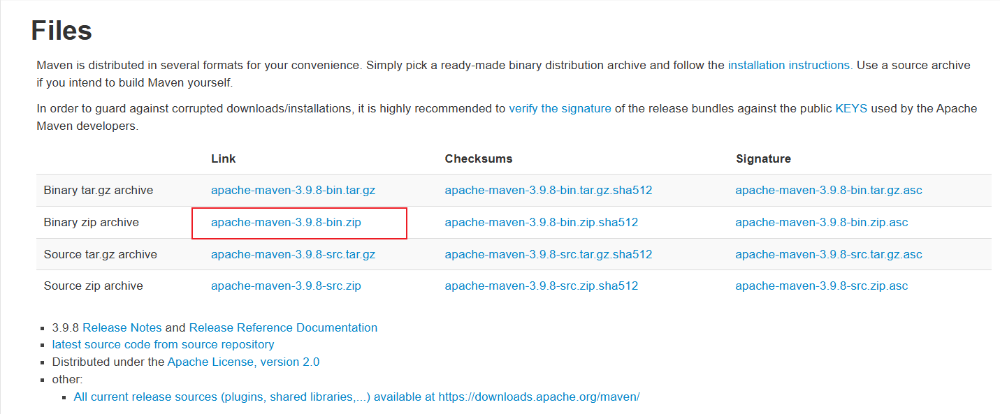
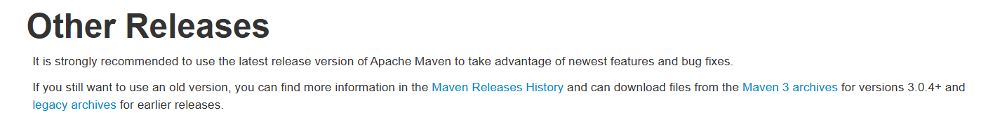
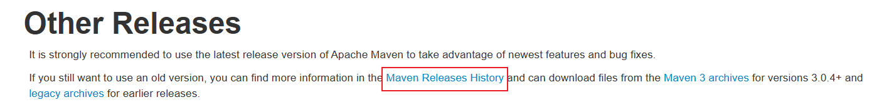
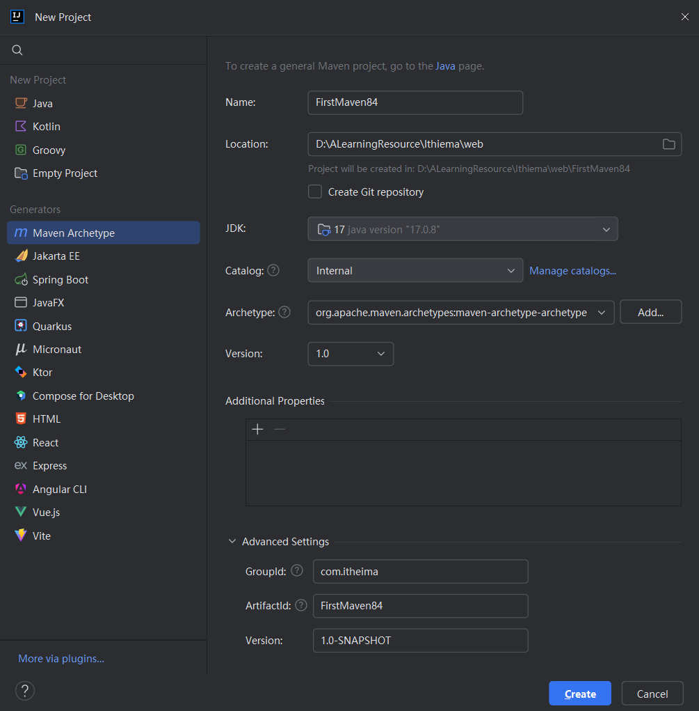
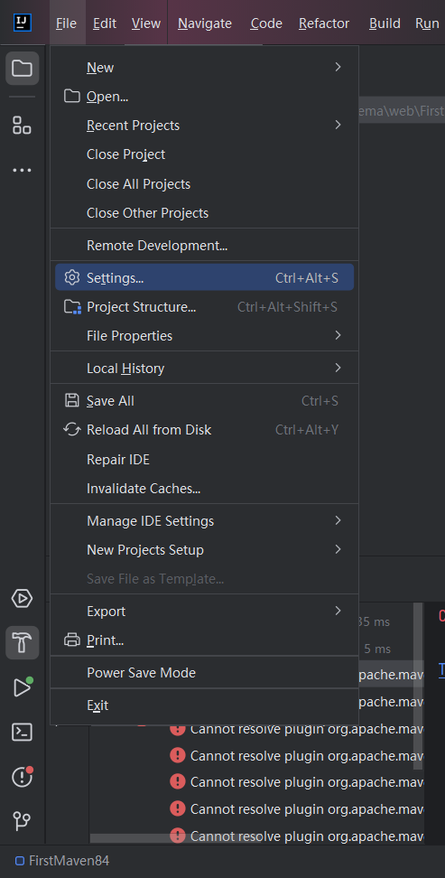
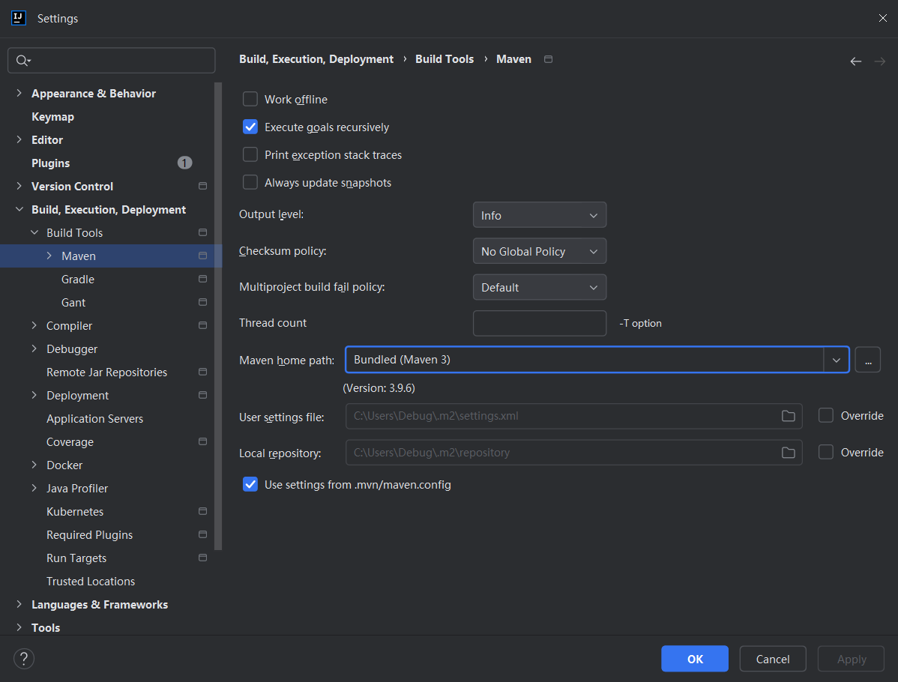
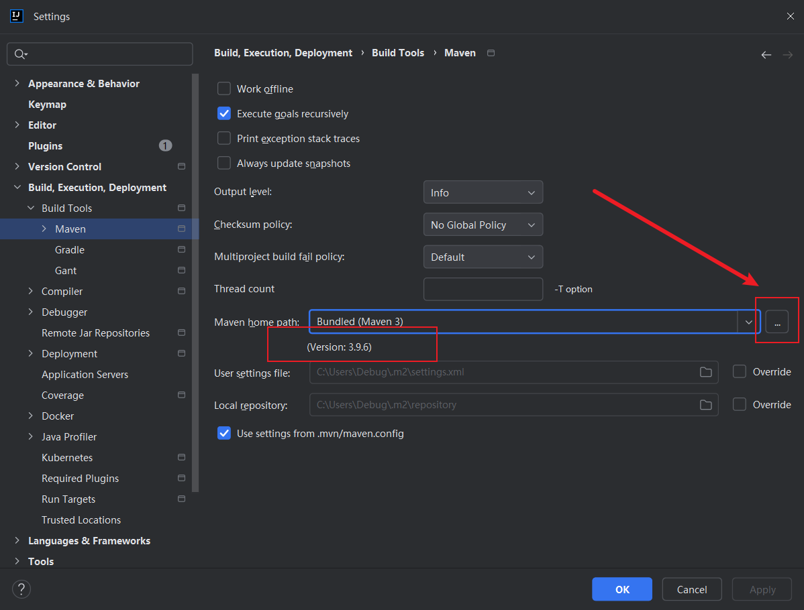
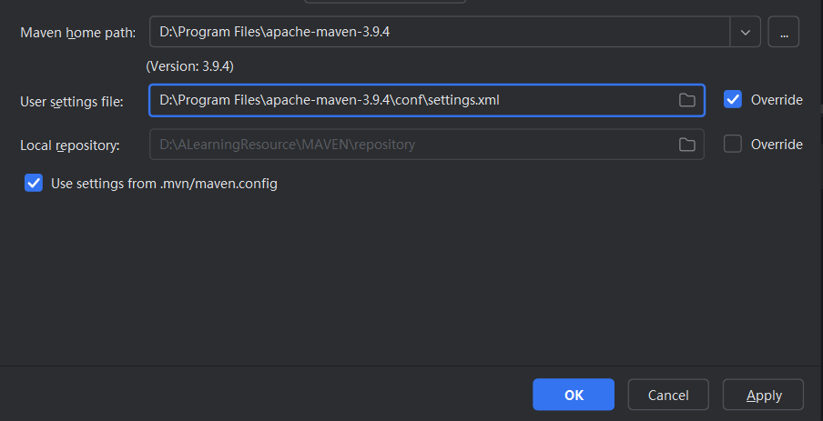
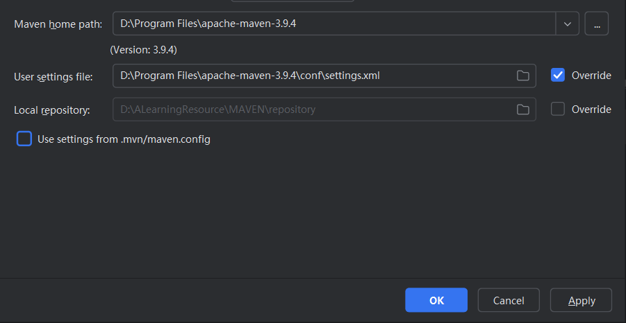

# Maven介绍


## Maven是什么？

Apache软件基金会下的一款用于构建java项目的开源软件
常见构建java项目的软件
		Ant
		Gradle


## 生命周期 Lifecycle

1. clean
   目的：清除之前构建产生的输出文件，如编
2. 译后的 .class 文件或打包后的 .jar 文件。
   命令：`mvn clean`
3. validate
   目的：验证项目是否正确设置并准备好构建。
   这个阶段通常用于执行一些检查，以确保项目的构建环境是正确的。
   命令：`mvn validate`
4. compile
   目的：编译项目的源代码。
   命令：`mvn compile`
5. test
   目的：运行项目的单元测试。
   这个阶段通常会跳过失败的测试，但不会阻止构建继续进行。
   命令：`mvn test`
6. package
   目的：将编译后的代码打包成可部署的格式，如 JAR 或 WAR 文件。
   命令：`mvn package`
7. verify
   目的：运行任何检查以验证包的有效性和完整性。
   这个阶段通常用于确认包的质量，例如通过运行集成测试。
   命令：`mvn verify`
8. install
   目的：将打包后的项目安装到本地仓库，供其他项目作为依赖使用。
   命令：`mvn install`
9. site
   目的：生成项目文档网站。
   这个阶段通常用于生成项目报告和其他文档。
   命令：`mvn site`
10. deploy
   目的：将打包后的项目部署到远程仓库，供其他开发人员或项目使用。
   命令：`mvn deploy`

# Maven 的下载安装

官网下载

http://maven.apache.org/download.cgi

最新版本



历史版本






# IDEA使用Maven项目













Apply->OK


# Maven仓库

新

https://central.sonatype.com/

旧

https://mvnrepository.com/


```xml
<build>
    <plugins>
        <!-- -->
        <plugin>
            <groupId>org.apache.maven.plugins</groupId>
            <artifactId>maven-jar-plugin</artifactId>
            <version>2.4</version>
            <configuration>
                <archive>
                    <manifest>
                        <addClasspath>true</addClasspath>
                        <!--设置了JAR文件的主类，也就是程序的入口点 -->
                        <mainClass>com.itheima.Test</mainClass>
                    </manifest>
                </archive>
            </configuration>
        </plugin>
    </plugins>
</build>
```

