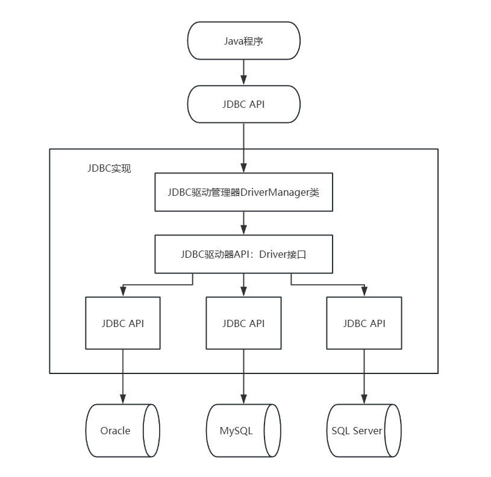

# JDBC

## 概述

全称Java Database Connectivity——其实就是Java操作数据库的一套API接口

思考为什么说是一套接口?

+ 屏蔽各大数据库厂商差异性,只提供访问规范
+ 因为数据库有很多mysql,oracle等,因此Java只提供java与数据库访问的规范接口,具体访问逻辑由各大数据库厂商自己提供jar包实现

## JDBC访问模型



## JDBC使用步骤

1. 先找到相应数据库厂商提供的mysql-connector-java jar包依赖

   通过MAVEN官网https://central.sonatype.com/或https://mvnrepository.com/

   寻找`mysql-connector-java`的Maven依赖项

2. 使用JDBC API操作数据库

   1. 加载驱动

      `Class.forName("com.mysql.jdbc.Driver");`

   2. 获取连接

      方法：`static Connection getConnection(String url,String user,String password)`

      + url：指定连接的路径
        语法：jdbc:mqsql://ip地址（域名）：端口号/数据库名称

        ```java
        jdbc:mysql://localhost:3306/db1?serverTimezone=Asia/Shanghai&characterEncoding=utf-8
        ```

      + user:用户名
      + password：密码

   3. 创建执行sql的对象
      `createStatement()`

   4. 执行Sql
      `executeQuery(String sql)`

   5. 获取结果，关闭连接

      - ResuleSet:结果集对象，封装查询结果

        + next()：游标向下移动一行

        + getXxx(参数)：获取数据

          > Xxx代表数据类型
          >
          > ​	如：int的用`getInt( )`，String的用`getString()`
          > 参数：
          > int：代表列的编号，从1开始
          >
          > ​	如：`getString(1);`
          > String：代表列名称。
          >
          > ​	如：`getDouble("balance");`

      - 使用步骤：

        1. 游标向下移动一行
        2. 判断是否有数据
        3. 获取数据

   6. 关闭资源

在pom.xml中添加`mysql-connector-java`依赖项，引入MySQL的JDBC驱动程序

```xml
<dependency>
  <groupId>mysql</groupId>
  <artifactId>mysql-connector-java</artifactId>
  <version>8.0.33</version>
</dependency>
```

```java

import java.sql.*;

/**
 * jdbc工具类
 */
public class JdbcUtil {
    public static void main(String[] args) {
        JdbcUtil.connectMysql();
    }

    private JdbcUtil() {
    }

    public static void connectMysql() {
        //存在问题
        //硬编码：代码充斥着大量的显示（明文）字符串
        try {
            //1.加载驱动
            Class.forName("com.mysql.cj.jdbc.Driver");
            //2.获取链接指定用户名以及密码以及mysql的url
            Connection connection = DriverManager.getConnection(
                    "jdbc:mysql://localhost:3306/test84?serverTimezone=Asia/Shanghai&characterEncoding=utf-8"
                    , "root"
                    , "123456");
            //3.创建sql执行对象
            Statement statement = connection.createStatement();
            //4.执行sql，得到结果集对象
            ResultSet resultSet = statement.executeQuery("select name,age,id_number as idNumber from student");
            while (resultSet.next()) {
                String name = resultSet.getString("name");
                int age = resultSet.getInt("age");
                String idNumber = resultSet.getString("idNumber");
                Student student = new Student();
                student.setAge(age);
                student.setIdNumber(idNumber);
                student.setName(name);
                System.out.println(student);
            }
        } catch (ClassNotFoundException | SQLException e) {
            throw new RuntimeException(e);
        }
    }
}

```


## 报错原因

> 找不到db数据库
>
> <font color="red">`Caused by: java.sql.SQLSyntaxErrorException: Unknown database 'db'`</font>


> 数据库连接用户名或密码错误
>
> <font color="red">`Caused by: java.sql.SQLException: Access denied for user 'root'@'localhost' (using password: YES)`</font>


> 与 MySQL 服务器的通信出现了问题
>
> <font color="red">`Caused by: com.mysql.cj.jdbc.exceptions.CommunicationsException: Communications link failure`<br><br>`The last packet sent successfully to the server was 0 milliseconds ago. The driver has not received any packets from the server.`</font>


> 名为 test84 的数据库中不存在名为 user 的表。
>
> <font color="red">`Caused by: java.sql.SQLSyntaxErrorException: Table 'test84.user' doesn't exist`</font>


>  SQL 查询中使用clazz_id作为列，但在数据库中没有找到对应的clazz_id列名
>
> <font color="red">`Caused by: java.sql.SQLSyntaxErrorException: Unknown column 'clazz_id' in 'field list'`</font>

​		

> ResultSet 中获取数据之前，未调用`next()`方法
>
> <font color="red">`Caused by: java.sql.SQLException: Before start of result set`</font>


> 获取的字段和列名没有匹配到
>
> <font color="red">`Caused by: java.sql.SQLException: Column 'id_number' not found.`</font>


# 数据库连接池

## 什么是数据源

JDBC2.0 提供了javax.sql.DataSource接口，它负责建立与数据库的连接，当在应用程序中访问数据库时不必编写连接数据库的代码，直接引用DataSource获取数据库的连接对象即可。用于获取操作数据Connection对象。

## 数据库连接池

概念

> Database Connection Pool
>
> 其实就是一个容器（集合），存放数据库连接的容器

工作原理

> 当系统初始化好后，容器被创建，容器中会申请一些连接对象，当用户来访问数据库时，从容器中获取连接对象，用户访问完成之后，会将连接对象归还给容器

好处

> 节约资源
> 用户访问高效

实现

> 标准接口：DataSource

方法：

> 获取连接：`getConnection()`
> 归还连接：`Connection.close()`

如果连接对象Connection是从连接池中获取的，那么调用`Connection.close()`方法，则不会关闭连接，而是归还连接

 一般我们不去实现它，有数据库厂商来实现


## 常见的数据库连接池

C3P0——比较早数据库连接池技术
DHCP——Tomcat7 使用的连接池（弃用）
Druid——数据库连接池实现技术，阿里巴巴提供
Hikari——由日本人研发,号称史上最快连接池

## Druid

使用步骤：

1. 下载jar包 druid-1.x.x.jar
2. 定义配置文件
3.  加载配置文件，Properties
4.  获取数据库连接对象：通过工厂类来获取
5.   获取连接：`getConnection()`
6. 创建声明：`getConnection()`
7. 执行查询：`createStatement()`

下载jar包 druid-1.x.x.jar

```xml
<dependency>
  <groupId>com.alibaba</groupId>
  <artifactId>druid</artifactId>
  <version>1.2.23</version>
</dependency>
```

定义配置文件（名称任意）——Druid.properties

```properties
driverClassName=com.mysql.cj.jdbc.Driver
# 指定数据库
url=
#指定用户名和密码
username=root
password=root
# 设置连接数和等待时间
initialSize=10
minIdle=5
maxActive=20
maxWait=5000
```


```java

、import javax.sql.DataSource;
import java.io.FileInputStream;
import java.io.FileNotFoundException;
import java.io.IOException;
import java.sql.Connection;
import java.sql.ResultSet;
import java.sql.SQLException;
import java.sql.Statement;
import java.util.Properties;

/**
 * 使用bruid链接池操作mysql
 */
public class DruidUtil {
    private DruidUtil() {
    }

    public static void connectMysqlByDruid() {
        //1. 加载存放mysql连接信息的配置信息
        Properties properties = new Properties();
        try {
            properties.load(new FileInputStream("src/main/resources/druid.properties"));
            //2. 获取连接池对象
            DataSource dataSource = DruidDataSourceFactory.createDataSource(properties);
            //3.从链接池中获取链接
            Connection connection = dataSource.getConnection();
            //3.创建sql执行对象
            Statement statement = connection.createStatement();
            //4.执行sql，得到结果集对象
            ResultSet resultSet = statement.executeQuery("select name,age,id_number as idNumber from student");
            while (resultSet.next()) {
                String name = resultSet.getString("name");
                int age = resultSet.getInt("age");
                String idNumber = resultSet.getString("idNumber");
                Student student = new Student();
                student.setAge(age);
                student.setIdNumber(idNumber);
                student.setName(name);
                System.out.println(student);
            }
        } catch (SQLException e) {
            throw new RuntimeException(e);
        } catch (FileNotFoundException e) {
            throw new RuntimeException(e);
        } catch (IOException e) {
            throw new RuntimeException(e);
        } catch (Exception e) {
            throw new RuntimeException(e);
        }
    }
}
```


## JDBC和连接池中的Close()方法

JDBC中作用是——销毁

连接池中作用是——归还