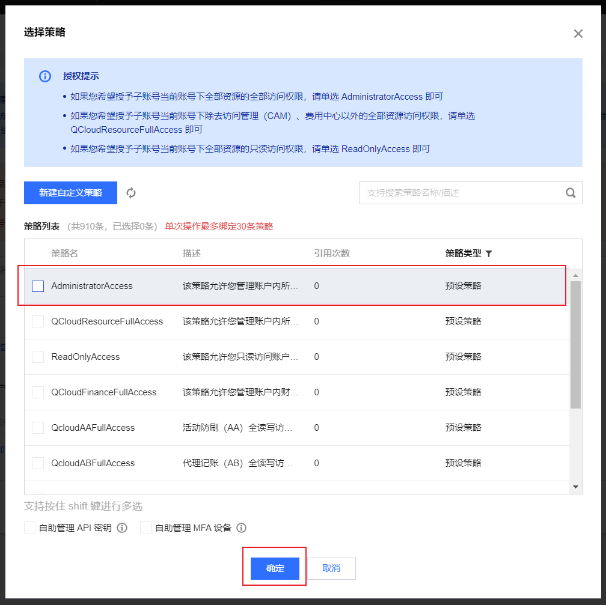
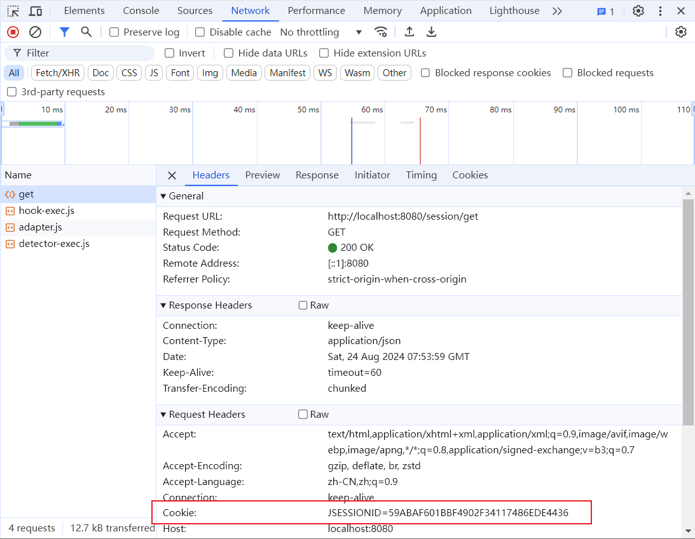

# 面试题

说说SpringBoot加载启动流程

说说SringIOC控制反转流程

如何进行依赖注入

说说Spring中用到类哪些设计模式

说说Springboot开发中的常见注解以及作用?

说说@Resource与@Autowire的区别

什么情况下Spring的事务会失效,怎么解决?


# Tomcat

下载

[Apache Tomcat](https://tomcat.apache.org/)

# Servlet


# SpringBoot

[SpringBoot 官网](https://spring.io/projects/spring-boot)


## 创建SprintBoot工程

在线创建

打开[ https://start.spring.io/](https://start.spring.io/)


## IDEA新建项目

IDEA->New Project


## 初始化项目

配置Maven


配置properties文件编码为UTF-8


## 基本配置

application.properties

```properties
spring.application.name=SprintBootDemo
#配置tomcat端口号
server.port=8080
#配置Servlet项目路径
server.servlet.context-path=/
```

## 查看SpringBoot依赖的JDK版本

1.打开Sprint官方网站

进入Sprint官方网站[spring.io](https://spring.io/)，点击菜单Projects->Sprint Boot->LEARN


**版本标识的意义**

**CURRENT**：代表了当前版本，最新发布版本，里程碑版本。

**GA**：通用正式发布版本，同release。

**SNAPSHOT**：快照版本，可用但非稳定版本。

**PRE**：预览版本。

**M版本**：M1,M2,M3中的M是milestone的简写，这个单词是里程碑的意思。

**Alpha**：也被称为内部测试版或预览版，这些版本通常不会对外部用户公开，因为它们可能包含许多尚未修复的漏洞和不完整的功能。通常只有开发团队和其他内部相关人士才能访问和使用 Alpha 版本。

**Beta**：是一种公开测试版，位于 Alpha 版本之后。这个阶段的版本通常会加入新功能，并且相较于 Alpha 版本来说会更加稳定。Beta 版本主要面向特定的用户群体进行测试，如合作伙伴、潜在客户或早期采用者。

2.查看Reference Doc（参考文档）

比如查看3.2.8，点击Reference Doc.


3.点击左侧的 Getting Started


3.接着点击左侧的System Requirements


Spring Boot 3.2.8 requires [Java 17](https://www.java.com/) and is compatible up to and including Java 22. [Spring Framework 6.1.11](https://docs.spring.io/spring-framework/reference/6.1/) or above is also required.

> Spring Boot 3.2.8 要求使用 Java 17，并且兼容直至包括 Java 22。还需要 Spring Framework 6.1.11 或更高版本


下面的表格列出了SpringBoot版本、JDK版本的兼容性，以及兼容性的来源，都在spring-boot的各个版本的文档中，有链接、描述java版本的原文。

| **SpringBoot Versions** | **JDK Versions** | Froms                                                        |
| ----------------------- | ---------------- | ------------------------------------------------------------ |
| 0.0 -1.1                | 6+(6 or higher)  | https://docs.spring.io/spring-boot/docs/0.0.x/reference/html/getting-started-installing-spring-boot.html<br/>Spring Boot can be used with “classic” Java development tools or installed as a command line tool. Regardless, you will need Java SDK v1.6 or higher.<br/>Spring Boot 可以与“传统的”Java开发工具一起使用，也可以安装为命令行工具。无论如何，你需要 Java SDK 1.6 或更高版本<br/>https://docs.spring.io/spring-boot/docs/1.0.x/reference/html/getting-started-installing-spring-boot.html<br/>Spring Boot can be used with “classic” Java development tools or installed as a command line tool. Regardless, you will need Java SDK v1.6 or higher.<br/>https://docs.spring.io/spring-boot/docs/1.1.x/reference/html/getting-started-installing-spring-boot.html<br/>Spring Boot can be used with “classic” Java development tools or installed as a command line tool. Regardless, you will need Java SDK v1.6 or higher.<br/> |
| 1.2 - 1.5               | 6 - 7            | https://docs.spring.io/spring-boot/docs/1.2.x/reference/html/getting-started-system-requirements.html<br/>By default, Spring Boot 1.2.8.RELEASE requires Java 7 and Spring Framework 4.1.5 or above. You can use Spring Boot with Java 6 with some additional configuration.<br/>默认情况下，Spring Boot 1.2.8.RELEASE 要求使用 Java 7 和 Spring Framework 4.1.5 或更高版本。你可以通过一些额外的配置来使用 Java 6 运行 Spring Boot。<br/>https://docs.spring.io/spring-boot/docs/1.3.x/reference/html/getting-started-system-requirements.html<br/>By default, Spring Boot 1.3.8.RELEASE requires Java 7 and Spring Framework 4.2.8.RELEASE or above. You can use Spring Boot with Java 6 with some additional configuration.<br/>https://docs.spring.io/spring-boot/docs/1.4.x/reference/html/getting-started-system-requirements.html<br/>By default, Spring Boot 1.4.7.RELEASE requires Java 7 and Spring Framework 4.3.9.RELEASE or above. You can use Spring Boot with Java 6 with some additional configuration.<br/>https://docs.spring.io/spring-boot/docs/1.5.x/reference/html/getting-started-system-requirements.html<br/>By default, Spring Boot 1.5.22.RELEASE requires Java 7 and Spring Framework 4.3.25.RELEASE or above. You can use Spring Boot with Java 6 with some additional configuration.<br/> |
| 2.0                     | 8 - 9            | https://docs.spring.io/spring-boot/docs/2.0.x/reference/html/getting-started-system-requirements.html<br/>Spring Boot 2.0.9.RELEASE requires Java 8 or 9 and Spring Framework 5.0.13.RELEASE or above.<br/>Spring Boot 2.0.9.RELEASE 要求使用 Java 8 或 9，并且需要 Spring Framework 5.0.13.RELEASE 或更高版本。<br/> |
| 2.1                     | 8 - 12           | https://docs.spring.io/spring-boot/docs/2.1.x/reference/html/getting-started-system-requirements.html<br/>Spring Boot 2.1.18.RELEASE requires Java 8 and is compatible up to Java 12 (included).<br/>Spring Boot 2.1.18.RELEASE 要求使用 Java 8，并且兼容直至包括 Java 12。<br/> |
| 2.2 - 2.3               | 8 - 15           | https://docs.spring.io/spring-boot/docs/2.2.x/reference/html/getting-started.html#getting-started-system-requirements<br/>Spring Boot 2.2.13.RELEASE requires Java 8 and is compatible up to Java 15 (included).<br/>https://docs.spring.io/spring-boot/docs/2.3.x/reference/html/getting-started.html#getting-started-system-requirements<br/>Spring Boot 2.3.12.RELEASE requires Java 8 and is compatible up to Java 15 (included).<br/>Spring Boot 2.2.13.RELEASE 要求使用 Java 8，并且兼容直至包括 Java 15。<br/> |
| 2.4                     | 8 - 16           | https://docs.spring.io/spring-boot/docs/2.4.x/reference/html/getting-started.html#getting-started-system-requirements<br/>Spring Boot 2.4.13 requires Java 8 and is compatible up to Java 16 (included).<br/> |
| 2.5                     | 8 - 18           | https://docs.spring.io/spring-boot/docs/2.5.x/reference/html/getting-started.html#getting-started.system-requirements<br/>Spring Boot 2.5.15 requires Java 8 and is compatible up to and including Java 18.<br/>Spring Boot 2.4.13 要求使用 Java 8，并且兼容直至包括 Java 16。<br/> |
| 2.6                     | 8 - 19           | https://docs.spring.io/spring-boot/docs/2.6.x/reference/html/getting-started.html#getting-started.system-requirements<br/>Spring Boot 2.6.15 requires Java 8 and is compatible up to and including Java 19.<br/> |
| 2.7                     | 8 - 21           | https://docs.spring.io/spring-boot/docs/2.7.x/reference/html/getting-started.html#getting-started.system-requirements<br/>Spring Boot 2.7.18 requires Java 8 and is compatible up to and including Java 21.<br/> |
| 3.0 - 3.2               | 17 - 21          | https://docs.spring.io/spring-boot/docs/3.0.x/reference/html/getting-started.html#getting-started<br/>Spring Boot 3.0.13 requires Java 17 and is compatible up to and including Java 21.<br/>Spring Boot 3.0.13 要求使用 Java 17，并且兼容直至包括 Java 21。<br/>https://docs.spring.io/spring-boot/docs/3.1.x/reference/html/getting-started.html#getting-started<br/>Spring Boot 3.1.6 requires Java 17 and is compatible up to and including Java 21.<br/>https://docs.spring.io/spring-boot/docs/3.2.x/reference/html/getting-started.html#getting-started<br/>Spring Boot 3.2.0 requires Java 17 and is compatible up to and including Java 21.<br/> |
|                         |                  |                                                              |


# SpringBoot整合Mybatis

```properties
#配置数据库连接信息
#配置mysql驱动
spring.datasource.driver-class-name=com.mysql.cj.jdbc.Driver
#配置连接url
spring.datasource.url=jdbc:mysql://localhost:3306/tlias?useUnicode=true&characterEncoding=utf-8&useSSL=false&serverTimezone=Asia/Shanghai
#配置用户名
spring.datasource.username=root
#配置密码
spring.datasource.password=123456
#配置mybatis下划线转小驼峰
mybatis.configuration.map-underscore-to-camel-case=true
#配置mybatis 执行jdbc sql控制台日志输出
mybatis.configuration.log-impl=org.apache.ibatis.logging.stdout.StdOutImpl
```

# SpringBoot整合Druid


# SpringBoot注解

@RequestMapping

@GetMapping

@PostMapping

@RestController

```
@RequestBody
```

```
@RequestBody
```

```
@PathVariable
```


@JsonFormat

@JsonIgnore

@JsonIgnoreProperties

@JsonInclude


@RequestMapping

> `@RequestMapping`是 Spring 框架中的一个核心注解，用于映射 Web 请求到特定的方法上。
>
> ```java
> @Target({ElementType.TYPE, ElementType.METHOD})
> @Retention(RetentionPolicy.RUNTIME)
> @Documented
> @Mapping
> @Reflective({ControllerMappingReflectiveProcessor.class})
> ```
>
> 可以被应用到类、接口、枚举`ElementType.TYPE`以及方法`ElementType.METHOD`上
>
> 声明在**类**上——提取一个controller中的重复路径
>
> 声明在**方法**上——定义该接口的请求方法被对应的GetMapping、PostMapping等替代了

```java
@RequestMapping("/dept")
```

@GetMapping

> `@GetMapping`是Spring框架的一个注解，用于处理Http Get请求
>
> ```java
> @Target({ElementType.METHOD})
> @Retention(RetentionPolicy.RUNTIME)
> @Documented
> @RequestMapping(
>     method = {RequestMethod.GET}
> )
> ```
>
> 是`@RequestMapping(method = RequestMethod.POST)`的便捷形式

```java
@GetMapping
public  method(){
    List<SelectAllDeptDTO> depts = deptMapper.selectAll();
    HashMap<String, Object> map = new HashMap<>();
    map.put("code", 1);
    map.put("data", depts);
    map.put("msg","查询成功");
    return map;
}
```

@PostMapping


@RestController

# Spring IOC&DI

IOC——Inversion of Control控制反转
对象的创建权限交给Spring，并把创建好的对象存到容器里(其实就是一个map集合)

DI——Dependency Injection依赖注入
自动注入放到IOC容器中的对象

实际就是给属性自动赋值

通过类名取对象

Bean——Spring Bean


# Transcation 事务


抛出RuntimeException和Error的异常才会RollBack回滚

private修饰的方法上，事务会失效

搭配try catch 事务会失效，除非在catch中


# SpringBoot配置对象存储

## 腾讯云COS

1.登录到腾讯云平台[https://cloud.tencent.com](https://cloud.tencent.com)

进入控制台


有账号->登录

无账号->注册


搜索框输入：对象存储，

控制台入口中，点击对象存储


### 创建存储桶Backet

存储桶列表->创建存储桶


默认选项，点击”下一步“


点击“创建”


### 获取Secretld和SecretKey

创建子用户

搜索访问管理->点击“访问管理”


取消勾选策略




创建SecretKey

下载CSV文件或复制

勾选“我已知晓并保存SecretKey”

点击“确定”


对象存储文档https://cloud.tencent.com/document/product/436

### 安装 SDK

用户可以通过 maven 和源码两种方式安装 Java SDK：

maven 安装 在 maven 工程的 pom.xml 文件中添加相关依赖，内容如下：

```xml
<dependency>
     <groupId>com.qcloud</groupId>
     <artifactId>cos_api</artifactId>
     <version>5.6.227</version>
</dependency>
```

**注意：**

依赖坐标可能并非最新版本，请 [单击此处](https://mvnrepository.com/artifact/com.qcloud/cos_api) 获取最新版本。


配置工具类TXCOSUtil

```java
package com.itheima.tlias.utils;
import com.qcloud.cos.COSClient;
import com.qcloud.cos.ClientConfig;
import com.qcloud.cos.auth.BasicCOSCredentials;
import com.qcloud.cos.auth.COSCredentials;
import com.qcloud.cos.exception.CosClientException;
import com.qcloud.cos.exception.CosServiceException;
import com.qcloud.cos.http.HttpProtocol;
import com.qcloud.cos.model.ObjectMetadata;
import com.qcloud.cos.region.Region;
import lombok.Data;
import lombok.extern.slf4j.Slf4j;
import org.springframework.web.multipart.MultipartFile;
import java.io.ByteArrayInputStream;
import java.io.IOException;
import java.util.UUID;


@Data
@Slf4j
public class TXCOSUtil {
    /**
     * 拥有桶权限的子用户的SecretId
     */
    private static String secretId="";
    /**
     *  拥有桶权限的子用户的SecretKey
     */
    private static String secretKey="";
    /**
     * 所属地域：ap-nanjing
     */
    private static String region="";
    /**
     * 存储桶名称：tilas-1300000009
     */
    private static String bucketName="";

    /**
     * 初始化用户身份信息
     */

    /**
     * 设置bucket的区域
     */

    /**
     * 生成COS客户端
     */

    private TXCOSUtil() {}


    /**
     * 上传文件
     * @param file
     * @return
     */
    public static String upload(MultipartFile file) {
        //拆分文件后缀（类型）
        String originalFilename = file.getOriginalFilename();
        int i = originalFilename.lastIndexOf(".");
        String suffix = originalFilename.substring(i);
        //生成不重复id
        String uuid = UUID.randomUUID().toString();
        //填写object完整路径，完整路径中不能包含Bucket名称，例如exampledir/exampleobject.txt
        String objectName = uuid+suffix;
        // 创建COSClient实例。
        COSCredentials cred = new BasicCOSCredentials(secretId, secretKey);
        ClientConfig clientConfig = new ClientConfig(new Region(region));
        clientConfig.setHttpProtocol(HttpProtocol.https);
        COSClient cosClient = new COSClient(cred, clientConfig);
        ObjectMetadata objectMetadata = new ObjectMetadata();
        try {
            // 创建PutObject请求。
//            cosClient.putObject(bucketName,objectName,new ByteArrayInputStream(bytes),objectMetadata);
            cosClient.putObject(bucketName,objectName,file.getInputStream(),objectMetadata);
        } catch (CosServiceException cse) {
            System.out.println("Caught an OSSException, which means your request made it to OSS, "
                               + "but was rejected with an error response for some reason.");
            System.out.println("Request ID:" + cse.getRequestId());
            System.out.println("Error traceId:" + cse.getTraceId());
            System.out.println("Error statusCode:" + cse.getStatusCode());
            System.out.println("Error errorType:" + cse.getErrorType());
            System.out.println("Error Code:" + cse.getErrorCode());
            System.out.println("Error Message:" + cse.getErrorMessage());
        } catch (CosClientException ce) {
            System.out.println("Caught an ClientException, which means the client encountered "
                               + "a serious internal problem while trying to communicate with OSS, "
                               + "such as not being able to access the network.");
            System.out.println("Error Message:" + ce.getMessage());
        } catch (IOException e) {
            throw new RuntimeException(e);
        } finally {
            if (cosClient != null) {
                cosClient.shutdown();
            }
        }
        //https://<bucketName>.cos.<region>.myqcloud.com
        //文件访问路径规则 https://BucketName.Endpoint/ObjectName
        StringBuilder stringBuilder = new StringBuilder("https://");
        stringBuilder
                .append(bucketName)
                .append(".cos.")
                .append(region)
                .append(".myqcloud.com/")
                .append(objectName);

        log.info("文件上传到:{}", stringBuilder.toString());
        return stringBuilder.toString();
    }
}
```

测试文件上传

```java
@RestController
@RequestMapping("/upload")
@Slf4j
public class UploadController {

    @PostMapping
    public ResultUtil upload(MultipartFile file){
        String path = TXCOSUtil.upload(file);
        log.info("path={}",path);
        return ResultUtil.success();
    }
}
```


# SpringBoot报错记录

## Public Key Retrieval is not allowed

<font color="red">
`2024-08-17T16:04:14.879+08:00 ERROR 3564 --- [tlias] [reate-379056819] com.alibaba.druid.pool.DruidDataSource   : create connection SQLException, url: jdbc:mysql://localhost:3306/tlias?useUnicode=true&characterEncoding=utf-8&useSSL=false&serverTimezone=Asia/Shanghai, errorCode 0, state 08001
java.sql.SQLNonTransientConnectionException: Public Key Retrieval is not allowed`</font>

原因：可能，SpringBoot运行过程中，mysql服务重新启动了，导致报错

具体原因未知...

解决，cmd控制台，开启mysql服务，输入用户名和密码连接mysql，重启SprintBoot项目

启动mysql服务

```shell
net start mysql
```

登录mysql

```shell
mysql -u root -p
```

登出mysql

```shell
exit
```


## Communications link failure

2024-08-17T16:14:02.051+08:00 ERROR 7404 --- [tlias] [eate-1704979234] com.alibaba.druid.pool.DruidDataSource   : create connection SQLException, url: jdbc:mysql://localhost:3306/tlias?useUnicode=true&characterEncoding=utf-8&useSSL=false&serverTimezone=Asia/Shanghai, errorCode 0, state 08S01

<font color="red">`com.mysql.cj.jdbc.exceptions.CommunicationsException: Communications link failure`</font>


原因：SpringBoot运行过程中，mysql服务停止，导致报错


## properties文件乱码

1. 设置Properties files 的默认编码

File->Settings->Editor->File Encodings


2. 如果重启IDEA仍然乱码，则可以尝试清除IDEA缓存

File->Invalidate Caches


3. 勾选第一、第二单选框->点击“Invalidate and Restart”

   Clear file system cache and Local History

   > 清除文件系统缓存和本地历史记录

   Clear VCS Log caches and indexes

   > 清除VCS日志缓存和索引


# 登录认证与拦截

## 会话技术

什么是会话?

> 一个用户的多个HTTP操作，代表一个用户操作的完整流程

为什么会出现会话技术?

> 在Web开发领域，会话机制是用于跟踪客户状态的普遍解决方案
>
> Http是无状态协议，所谓无状态指的是多次客户端与服务端的Http响应之间无法共享数据
>
> 一些特殊场景比如购物车的添加需要在Http请求当中添加额外数据跟踪客户信息以保存到不同的购物车当中

会话跟踪技术有两种：

1. Cookie（客户端会话跟踪技术）
   - 数据存储在客户端浏览器当中
2. Session（服务端会话跟踪技术）
   - 数据存储在储在服务端
3. 令牌技术

常见的会话技术

+ 客户端(Cookie)
+ 服务端(Session)
+ 令牌(token)技术

### Cookie

Cookie（客户端会话跟踪技术）

Cookie是HTTP提供的用于共享多次HTTP请求之间的数据的技术

> 数据存储在客户端浏览器当中
>
> 采用键值对（Key-Value）格式，通过分号和空格分隔：
>
> 例如：username=admin; password=123456

**优缺点**

- 优点：HTTP协议中支持的技术（像Set-Cookie 响应头的解析以及 Cookie 请求头数据的携带，都是浏览器自动进行的，是无需我们手动操作的）
- 缺点：
  - 移动端APP(Android、IOS)中无法使用Cookie
  - 不安全，用户可以自己禁用Cookie
  - Cookie不能跨域

```java
/**
 * Cookie控制器类
 * 处理与cookie相关的HTTP请求
 */
@RestController
@RequestMapping("/cookie")
public class TestCookieController {

    /**
     * 处理保存cookie的GET请求
     * 创建并添加两个cookie（username和password）到HTTP响应中
     *
     * @param response HTTP响应对象，用于添加cookie
     * @return 表示操作成功的结果对象
     */
    @GetMapping("/save")
    public Result saveCookie(HttpServletResponse response){
        // 创建并添加username cookie
        Cookie cookie = new Cookie("username","admin");
        response.addCookie(cookie);
        // 创建并添加password cookie
        Cookie cookie1 = new Cookie("password", "123456");
        response.addCookie(cookie1);
        return Result.success();
    }

    /**
     * 处理获取cookie的GET请求
     * 从HTTP请求中读取所有cookie，并将它们以JSON对象的形式返回
     *
     * @param request HTTP请求对象，用于获取cookie
     * @return 包含所有cookie的JSON对象的结果
     */
    @GetMapping("/get")
    public Result getCookie(HttpServletRequest request){
        // 获取所有cookie
        Cookie[] cookies = request.getCookies();
        JSONObject jsonObject = new JSONObject();
        // 遍历cookie数组，将cookie内容添加到JSON对象中
        for (Cookie cookie : cookies) {
            jsonObject.put(cookie.getName(),cookie.getValue());
        }
        // 返回包含所有cookie的JSON对象，表示操作成功
        return Result.success(jsonObject);
    }
}
```

访问接口，http://localhost:8080//cookie/save


通过响应头Set-Cookie响应给浏览器，并且浏览器会将Cookie，存储在浏览器


访问接口，http://localhost:8080//cookie/get

服务端从HTTP请求中读取所有cookie，并将它们以JSON对象的形式返回给前端


### Seeeion

Session（服务端会话跟踪技术）

Session是Servlet提供的用于共享多次Http请求之间的共享数据

> 数据存储在储在服务端
>
> 基于Cookie存储
> K
> 		SESSIONID
> V
> 		存在服务端

**优缺点**

- 优点：Session是存储在服务端的，安全
- 缺点：
  - 服务器集群环境下无法直接使用Session
  - 移动端APP(Android、IOS)中无法使用Cookie
  - 用户可以自己禁用Cookie
  - Cookie不能跨域

> PS：Session 底层是基于Cookie实现的会话跟踪，如果Cookie不可用，则该方案，也就失效了。


```java
/**
 * Session控制类
 * 提供保存会话信息的接口
 */
@Slf4j
@RestController
@RequestMapping("/session")
public class TestSessionController {

    /**
     * 保存会话信息方法
     * 模拟将用户名和密码保存到会话中，通常用于登录等场景
     *
     * @param session HttpSession对象，用于操作会话
     * @return 操作结果，成功或失败
     */
    @GetMapping("/save")
    public Result saveSession(HttpSession session) {
        log.info("HttpSession-save: {}", session.hashCode());
        session.setAttribute("username", "admin");
        session.setAttribute("password", "123456");
        return Result.success();
    }

    /**
     * 使用HTTP GET方法处理/get路径的请求，用于获取会话信息
     * 该方法主要目的是从当前的HTTP会话中检索用户名和密码，并返回它们的组合字符串
     *
     * @param session 当前的HTTP会话对象，用于存储和检索会话相关的属性
     * @return 包含用户名和密码的Result对象，表示请求的处理结果
     */
    @GetMapping("/get")
    public Result getSession(HttpSession session) {
        // 记录HTTP会话对象的信息，以便于跟踪和调试
        log.info("HttpSession-get: {}", session.hashCode());
        // 从会话中获取存储的用户名和密码
        String username = (String) session.getAttribute("username");
        String password = (String) session.getAttribute("password");
        // 记录获取到的用户名和密码，以便于跟踪和调试
        log.info("username:{},password:{}", username, password);
        // 返回包含用户名和密码的结果对象
        return Result.success(username + ":" + password);
    }
}

```

访问接口，http://localhost:8080/session/save


请求完成之后，在响应头中，就会看到有一个Set-Cookie的响应头，里面响应回来了一个Cookie，就是JSESSIONID，这个就是服务端会话对象 Session 的ID。


访问接口，http://localhost:8080/session/get



接下来，在后续的每次请求时，都会将Cookie的值，携带到服务端，那服务端呢，接收到Cookie之后，会自动的根据JSESSIONID的值，找到对应的会话对象Session。

通过这两步测试之后，在控制台中输出如下日志：


两次请求，获取到的Session会话对象的hashcode是一样的，就说明是同一个会话对象。

而且，第一次请求时，往Session会话对象中存储的值，第二次请求时，也获取到了。那这样，我们就可以通过Session会话对象，在同一个会话的多次请求之间来进行数据共享了。


### 令牌技术

**优缺点**

- 优点：
  - 支持PC端、移动端
  - 解决集群环境下的认证问题
  - 减轻服务器的存储压力（无需在服务器端存储）
- 缺点：需要自己实现（包括令牌的生成、令牌的传递、令牌的校验）


## JWT（JSON Web Token）

JWT全称：JSON Web Token（官网https://jwt.io/）

**用于对应用程序上的用户进行身份验证的标记**

——以JSON格式传输共享数据

JWT的组成：JWT由三个部分组成，三个部分之间使用英文的点来分割


利用JWT生成Token

- 第一部分：Header(头）， 记录令牌类型、签名算法等。 例如：{"alg":"HS256","type":"JWT"}

- 第二部分：Payload(有效载荷），携带一些自定义信息、默认信息等。 例如：{"id":"1","username":"Tom"}

- 第三部分：Signature(签名），防止Token被篡改、确保安全性。将header、payload，并加入指定秘钥，通过指定签名算法计算而来。


## Filter过滤器

> **Filter**读音：**/ˈfɪltər/**

Filter

过滤链放行


## Interceptor拦截器

> **Interceptor**读音：**/ˌɪntərˈseptər/**


## Filter（拦截器）和Interceptor（过滤器）区别

**相同点：**

> 都执行在Controller(Servlet)之前

**不同点：**

+ 技术提供方：

  > Filter过滤器——Servlet
  >
  > Interceptor拦截器——Spring

+ 执行顺序

  > 先执行Filter过滤器
  >
  > 后执行Interceptor过滤器

+ 执行粒度

  > Filter过滤器，过滤力度粗
  >
  > ——通常用于编码转换、时间格式转换
  >
  > Interceptor拦截器，过滤粒度细
  >
  > ——通常用于登录认证、接口日志记录


## 登录流程

# AOP面向切面编程

Aspect Oriented Programming面向切面编程

> 


## AOP与OOP

AOP

> **Aspect Oriented Programming**
>
> **/ˈæspekt  ˈɔːrientɪd  ˈproʊɡræmɪŋ/**
>
>  面向切面编程
>
> 处理面向对象编程中业务需求重复的部分，作为横切面插入到面向对象当中，一般有固定的应用场景
>
> 例如：日志记录，登录校验，数据验证，统计耗时，事务管理等

****

OOP

> **Object Oriented Programming**
>
> **/ˈɑːbdʒekt/  ˈɔːrientɪd  ˈproʊɡræmɪŋ/**
>
> 面向对象编程
>
> 处理业务逻辑

## AOP优点

灵活性

降低耦合度

提高开发效率

