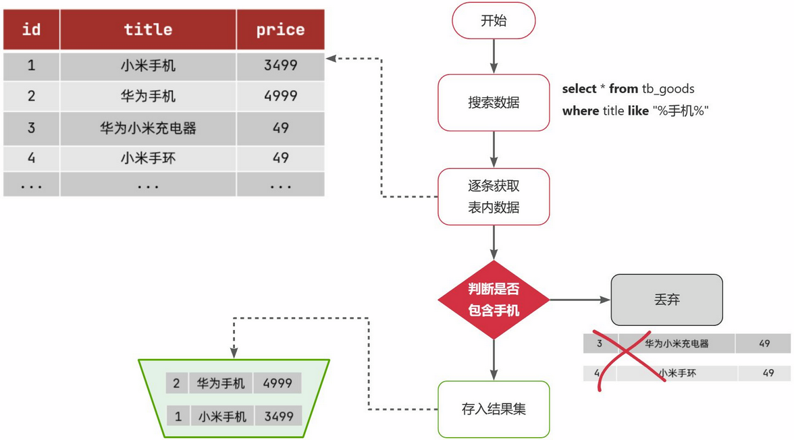
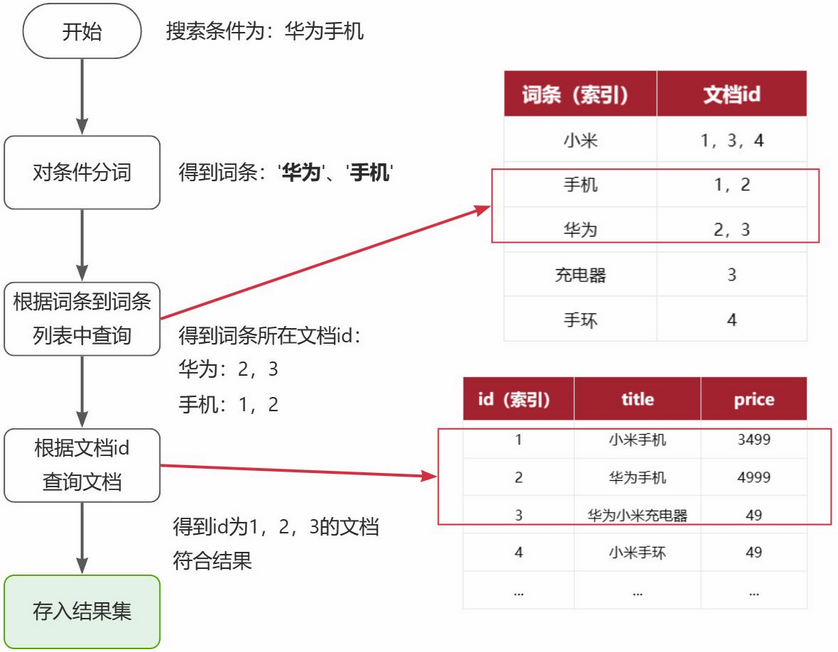
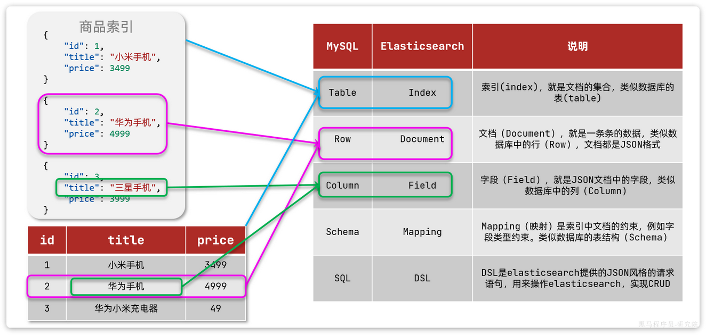
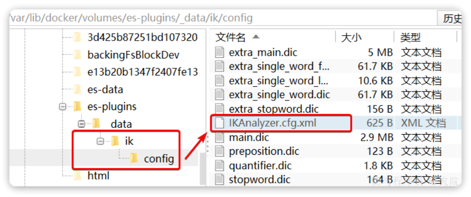

# Elasticsearch

# 概述

ES是一个可以实现复杂搜索的全文检索服务器

ES实现检索，kibana通过图形化界面去操作ES

# 倒排索引

**倒排索引**的概念是基于MySQL这样的**正向索引**而言的。

技术应用在Elasticsearch，得益于倒排索引，用来实现高性能的搜索功能

### 正向索引

例如有一张名为`tb_goods`的表：

| **id** | **title**      | **price** |
| :----- | :------------- | :-------- |
| 1      | 小米手机       | 3499      |
| 2      | 华为手机       | 4999      |
| 3      | 华为小米充电器 | 49        |
| 4      | 小米手环       | 49        |
| ...    | ...            | ...       |

其中的`id`字段已经创建了索引，由于索引底层采用了B+树结构，因此我们根据id搜索的速度会非常快。但是其他字段例如`title`，只在叶子节点上存在。

因此要根据`title`搜索的时候只能遍历树中的每一个叶子节点，判断title数据是否符合要求。

比如用户的SQL语句为：

```SQL
select * from tb_goods where title like '%手机%';
```

那搜索的大概流程如图：



说明：

- 1）检查到搜索条件为`like '%手机%'`，需要找到`title`中包含`手机`的数据
- 2）逐条遍历每行数据（每个叶子节点），比如第1次拿到`id`为1的数据
- 3）判断数据中的`title`字段值是否符合条件
- 4）如果符合则放入结果集，不符合则丢弃
- 5）回到步骤1

综上，根据id精确匹配时，可以走索引，查询效率较高。而当搜索条件为模糊匹配时，由于索引无法生效，导致从索引查询退化为全表扫描，效率很差。

因此，正向索引适合于根据索引字段的精确搜索，不适合基于部分词条的模糊匹配。

而倒排索引恰好解决的就是根据部分词条模糊匹配的问题。

### 倒排索引

倒排索引中有两个概念

- 文档（`Document`）：每一条数据就是一个文档。

  > 例如一个网页、一个商品信息

- 词条（`Term`）：文档按照语义分成的词语

  > 例如：我是中国人，就可以分为：我、是、中国人、中国、国人这样的几个词条

### 倒排索引创建流程

**创建倒排索引**是对正向索引的一种特殊处理和应用，流程如下

1. 先把文档进行分词，形成词条与文档的ID对应关系，为词条建立索引，而且具备唯一性

2. 对搜索内容进行分词，把分词后的关键字列表，更具关键字去词条中匹配，再找到对应的文档ID
3. 让后根据文档ID列表，找到对应的文档信息

此时形成的这张以词条为索引的表，就是倒排索引表，两者对比如下：

**正向索引**

| **id（索引）** |   **title**    | **price** |
| :------------: | :------------: | :-------: |
|       1        |    小米手机    |   3499    |
|       2        |    华为手机    |   4999    |
|       3        | 华为小米充电器 |    49     |
|       4        |    小米手环    |    49     |
|      ...       |      ...       |    ...    |

**倒排索引**

| **词条（索引）** | **文档id** |
| :--------------: | :--------: |
|       小米       |  1，3，4   |
|       手机       |    1，2    |
|       华为       |    2，3    |
|      充电器      |     3      |
|       手环       |     4      |

### 倒排索引的搜索流程

倒排索引的**搜索流程**如下（以搜索"华为手机"为例）



流程描述：

1）用户输入条件`"华为手机"`进行搜索。

2）对用户输入条件**分词**，得到词条：`华为`、`手机`。

3）拿着词条在倒排索引中查找（**由于词条有索引，查询效率很高**），即可得到包含词条的文档id：`1、2、3`。

4）拿着文档`id`到正向索引中查找具体文档即可（由于`id`也有索引，查询效率也很高）。

虽然要先查询倒排索引，再查询倒排索引，但是无论是词条、还是文档id都建立了索引，查询速度非常快！无需全表扫描。

### 正向和倒排

那么为什么一个叫做正向索引，一个叫做倒排索引呢？

-  **正向索引**是最传统的，根据id索引的方式。但根据词条查询时，必须先逐条获取每个文档，然后判断文档中是否包含所需要的词条，是**根据文档找词条的过程**。 
-  而**倒排索引**则相反，是先找到用户要搜索的词条，根据词条得到保护词条的文档的id，然后根据id获取文档。是**根据词条找文档的过程**。 

### 正向和倒排优缺点

**正向索引**：

- 优点： 
  - 可以给多个字段创建索引
  - 根据索引字段搜索、排序速度非常快
- 缺点： 
  - 根据非索引字段，或者索引字段中的部分词条查找时，只能全表扫描。

**倒排索引**：

- 优点： 
  - 根据词条搜索、模糊搜索时，速度非常快
- 缺点： 
  - 只能给词条创建索引，而不是字段
  - 无法根据字段做排序


# Elasticsearch与MySQL

Elasticsearch与MySQL的概念对比：

| MySQL  | Elasticsearch | 说明                                                         |
| ------ | ------------- | ------------------------------------------------------------ |
| Table  | Index         | 索引(index)，就是文档的集合，类似数据库的表(table)           |
| Row    | Document      | 文档(Document)，就是一条条的数据，类似数据库中的行(Row)，文档都是JSON格式 |
| Column | Filed         | 字段(Field)，就是JSON文档中的字段，类似数据库中的列(Column)  |
| Schema | Mapping       | Mapping(映射)是索引中文档的约束，例如字段类型约束。类似数据库的表结构(Schema) |
| SQL    | DSL           | DSL是elasticsearch提供的JSON风格的请求语句，用来定义搜索条件 |

如图：



面试官：我们在用ES的过程中，我们经常和MySQL做对比，有些概念是非常相近的，你能说一下吗？

实际中应用：

- 对安全性要求较高的写操作，使用mysql实现
- 对查询性能要求较高的搜索需求，使用elasticsearch实现
- 两者再基于某种方式，实现数据的同步，保证一致性


# 分词器

ES默认英文是一个单词一个词，中文是一个汉字一个词，网络词汇无法被定义成词，所以需要安装中文分词器

## IK分词器

IK分词器，可以可以扩展词、停用词，比如扩展网络词汇，停用违禁词汇

安装

**方案一**：在线安装

运行一个命令即可：

```Shell
docker exec -it es ./bin/elasticsearch-plugin  install https://github.com/medcl/elasticsearch-analysis-ik/releases/download/v7.12.1/elasticsearch-analysis-ik-7.12.1.zip
```

然后重启es容器

**方案二**：离线安装

如果服务器下载失败，也可以选择离线安装。

首先，查看之前安装的Elasticsearch容器的plugins数据卷目录：

```Shell
docker volume inspect es-plugins
```

结果如下：

```JSON
[
    {
        "CreatedAt": "2024-11-06T10:06:34+08:00",
        "Driver": "local",
        "Labels": null,
        "Mountpoint": "/var/lib/docker/volumes/es-plugins/_data",
        "Name": "es-plugins",
        "Options": null,
        "Scope": "local"
    }
]
```

可以看到elasticsearch的插件挂载到了`/var/lib/docker/volumes/es-plugins/_data`这个目录。我们需要把IK分词器上传至这个目录。

利用科学上网去github上外部下载，地址https://github.com/infinilabs/analysis-ik/tags

下载ik分词器压缩文件，对其解压，然后上传至虚拟机的`/var/lib/docker/volumes/es-plugins/_data`这个目录

最后，重启es容器：

```Shell
docker restart es
```

## 使用IK分词器

IK分词器包含两种模式：

-  `ik_smart`：智能语义切分 
-  `ik_max_word`：最细粒度切分 

我们在Kibana的DevTools上来测试分词器，首先测试Elasticsearch官方提供的标准分词器：

```JSON
POST /_analyze
{
  "analyzer": "standard",
  "text": "学习java泰裤辣"
}
```


可以看到，标准分词器智能1字1词条，无法正确对中文做分词。

```json
{
  "tokens" : [
    {
      "token" : "学",
      "start_offset" : 0,
      "end_offset" : 1,
      "type" : "<IDEOGRAPHIC>",
      "position" : 0
    },
    {
      "token" : "习",
      "start_offset" : 1,
      "end_offset" : 2,
      "type" : "<IDEOGRAPHIC>",
      "position" : 1
    },
    {
      "token" : "java",
      "start_offset" : 2,
      "end_offset" : 6,
      "type" : "<ALPHANUM>",
      "position" : 2
    },
    {
      "token" : "泰",
      "start_offset" : 6,
      "end_offset" : 7,
      "type" : "<IDEOGRAPHIC>",
      "position" : 3
    },
    {
      "token" : "裤",
      "start_offset" : 7,
      "end_offset" : 8,
      "type" : "<IDEOGRAPHIC>",
      "position" : 4
    },
    {
      "token" : "辣",
      "start_offset" : 8,
      "end_offset" : 9,
      "type" : "<IDEOGRAPHIC>",
      "position" : 5
    }
  ]
}

```

我们再测试IK分词器：

```JSON
POST /_analyze
{
  "analyzer": "ik_smart",
  "text": "学习java泰裤辣"
}
```

执行结果如下：

```json
{
  "tokens" : [
    {
      "token" : "学习",
      "start_offset" : 0,
      "end_offset" : 2,
      "type" : "CN_WORD",
      "position" : 0
    },
    {
      "token" : "java",
      "start_offset" : 2,
      "end_offset" : 6,
      "type" : "ENGLISH",
      "position" : 1
    },
    {
      "token" : "泰",
      "start_offset" : 6,
      "end_offset" : 7,
      "type" : "CN_CHAR",
      "position" : 2
    },
    {
      "token" : "裤",
      "start_offset" : 7,
      "end_offset" : 8,
      "type" : "CN_CHAR",
      "position" : 3
    },
    {
      "token" : "辣",
      "start_offset" : 8,
      "end_offset" : 9,
      "type" : "CN_CHAR",
      "position" : 4
    }
  ]
}

```

可以看到，为什么`泰裤辣`无法正确分词呢？

## 拓展词典

随着互联网的发展，“造词运动”也越发的频繁。出现了很多新的词语，在原有的词汇列表中并不存在。比如：“泰裤辣” 等。

IK分词器无法对这些词汇分词

所以要想正确分词，IK分词器的词库也需要不断的更新，IK分词器提供了扩展词汇的功能。

1）打开IK分词器config目录：

> 注意，如果采用在线安装的通过，默认是没有config目录的，
>
> 需要在ik目录下新建config目录



