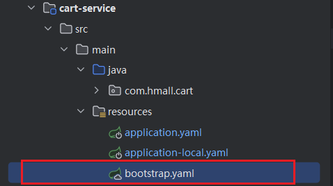
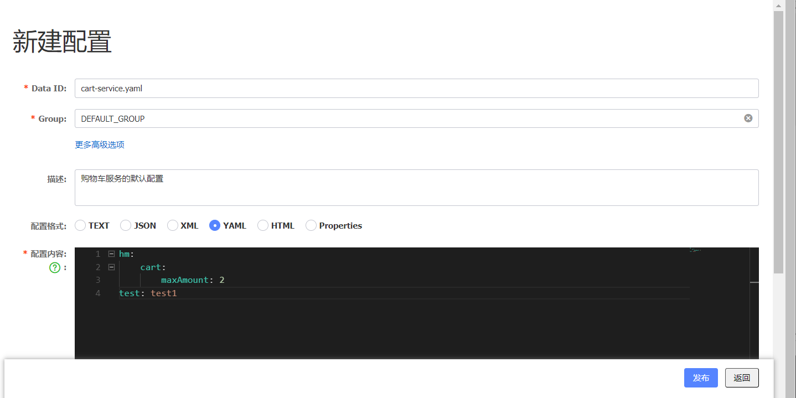
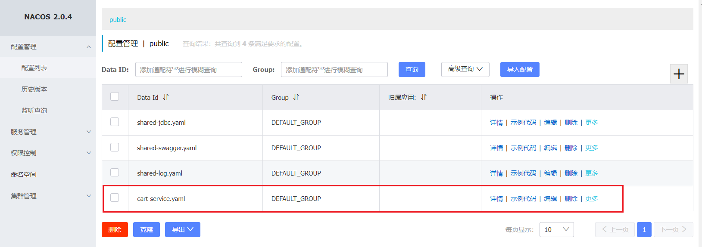
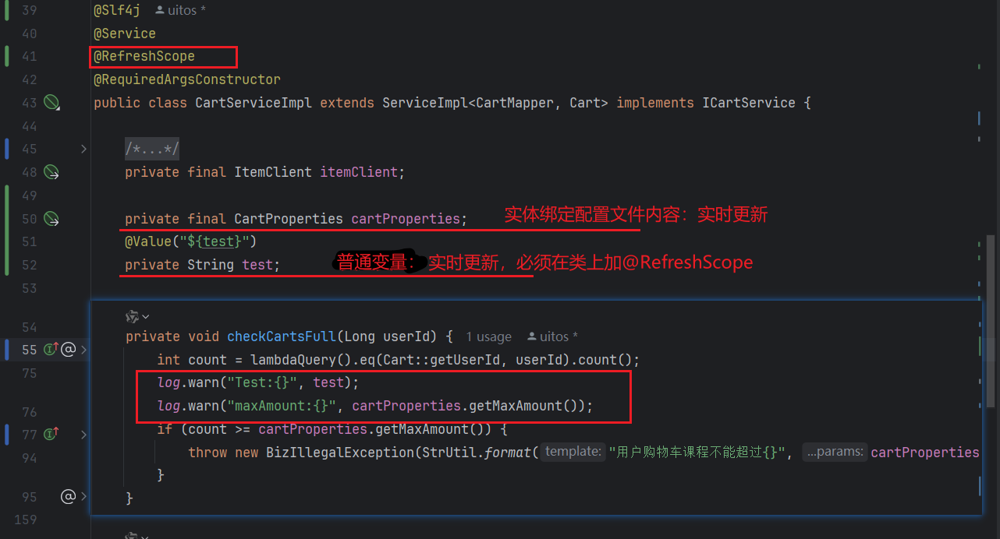
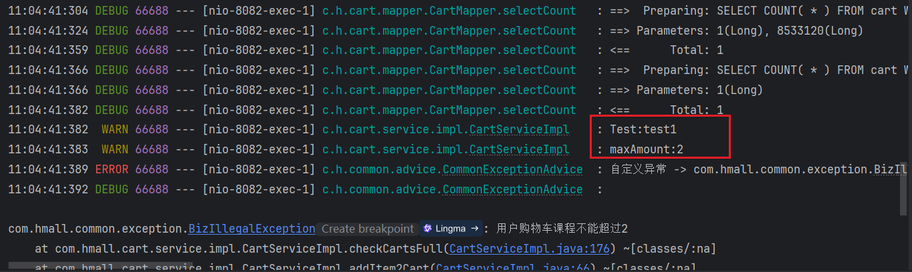
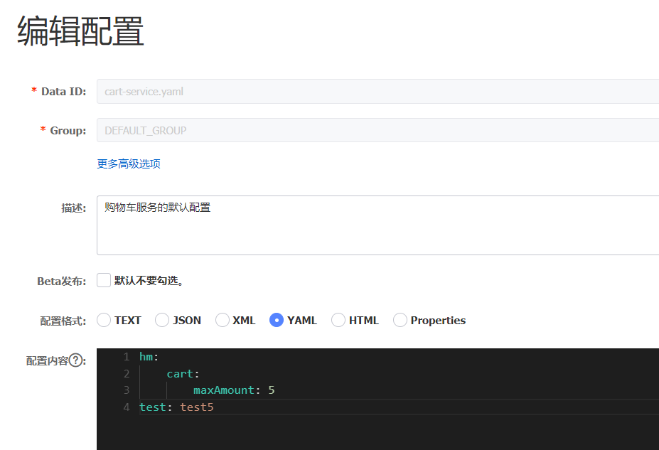
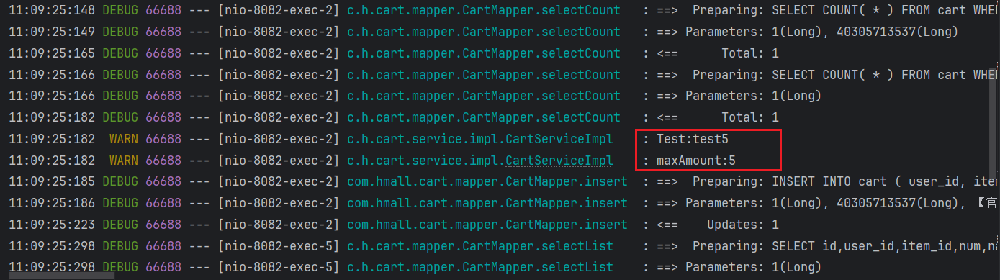

# 微服务

服务拆分
远程调用
服务治理
请求路由
身份认证
配置管理
服务保护
分布式事务
异步通信
消息可靠性
延迟消息
分布式搜索
倒排索引
数据聚合

围绕服务拆分的问题，来解决方案的学习

# 服务拆分

# 远程调用

## Nacos

/nɑː kɒz/

window启动Nacos

```
startup.cmd -m standalone
```


### OpenFeign

/ˈoʊpən feɪn/

## 配置管理（配置中心）

### 配置共享（配置统一管理）

我们可以把微服务共享的配置抽取到Nacos中统一管理，这样就不需要每个微服务都重复配置了

分为两步：

- 在Nacos中添加共享配置
- 微服务拉取配置

#### 添加共享配置

以cart-service为例，我们看看有哪些配置是重复的，可以抽取的：

JDBC相关配置：


然后，我们在Nacos控制台添加这些配置。

1. 在配置中心创建配置文件

   在`配置管理`->`配置列表`中点击`+`新建一个配置：


在表单中填写信息：


注意这里的JDBC的相关参数并没有写死，例如：

- `数据库ip`：通过`${hm.db.host:localhost}`配置了默认值为`localhost`，同时允许通过`${hm.db.host}`来覆盖默认值
- `数据库端口`：通过`${hm.db.port:3306}`配置了默认值为`3306`，同时允许通过`${hm.db.port}`来覆盖默认值
- `数据库database`：可以通过`${hm.db.database}`来设定，无默认值

#### 拉取共享配置

我们要在微服务拉取共享配置。将拉取到的共享配置与本地的`application.yaml`配置合并，完成项目上下文的初始化。

需要注意的是，读取Nacos配置是SpringCloud上下文（`ApplicationContext`）初始化时处理的，发生在项目的引导阶段。然后才会初始化SpringBoot上下文，去读取`application.yaml`。

也就是说引导阶段，`application.yaml`文件尚未读取，根本不知道nacos 地址，该如何去加载nacos中的配置文件呢？


SpringCloud在初始化上下文的时候会先读取一个名为`bootstrap.yaml`(或者`bootstrap.properties`)的文件，如果我们将nacos地址配置到`bootstrap.yaml`中，那么在项目引导阶段就可以读取nacos中的配置了。

微服务整合Nacos配置管理的步骤

1. 引入依赖

   注意使用实际的版本号替换`${version}`

```xml
<!--nacos配置管理-->
<dependency>
    <groupId>com.alibaba.cloud</groupId>
    <artifactId>spring-cloud-starter-alibaba-nacos-config</artifactId>
	<version>${version}</version>
</dependency>
<!--读取bootstrap文件-->
<dependency>
    <groupId>org.springframework.cloud</groupId>
    <artifactId>spring-cloud-starter-bootstrap</artifactId>
    <version>${version}</version>
</dependency>
```

2. 新建bootstrap.yaml

   在cart-service中的resources目录新建一个bootstrap.yaml文件



内容如下：

```yaml
spring:
  application:
    name: cart-service
  profiles:
    active: local
  cloud:
    nacos:
      config: #配置中心
        server-addr: localhost:8848 #nacos配置管理中心地址
        file-extension: yaml #配置中心中配置文件的后缀
        shared-configs:
          - data-id: shared-jdbc.yaml #需要拉取的配置文件名称
```

3. 修改application.yaml

   由于一些配置挪到了bootstrap.yaml，因此application.yaml需要修改为：

```yaml
server:
  port: 8082
spring:
  cloud:
    nacos:
      discovery:
        server-addr: localhost:8848
feign:
  okhttp:
    enabled: true # 开启OKHttp功能
```

​		application-local.yaml需要修改为

```yaml
hm:
  db:
    host: localhost # 修改为你自己的虚拟机IP地址
    port: 3306
    database: hmall
    un: root
    pw: 123456 # 修改为docker中的MySQL密码
```

重启服务，发现所有配置都生效了。

### 配置热更新（配置实时更新）

有很多的业务相关参数，将来可能会根据实际情况临时调整。

>  例如购物车业务，购物车数量有一个上限，默认是10

我们应该将其配置在配置文件中，方便后期修改。

但现在的问题是，即便写在配置文件中，修改了配置还是需要重新打包、重启服务才能生效。能不能不用重启，直接生效呢？

这就要用到Nacos的配置热更新能力了，分为两步：

- 在Nacos中添加配置
- 在微服务读取配置

#### 添加配置到Nacos

在Nacos中添加一个配置文件，将购物车的上限数量添加到配置中：



注意文件的dataId格式：

```
[服务名]-[spring.active.profile].[后缀名]
```

文件名称由三部分组成：

- **`服务名`**：我们是购物车服务，所以是`cart-service`
- **`spring.active.profile`**：就是spring boot中的`spring.active.profile`，可以省略，则所有profile共享该配置
- **`后缀名`**：例如yaml

>  当 配置中心有 `微服务名称.yaml` 文件时，本地微服务会自动从配置管理中心去拉取该内容

提交配置，在控制台能看到新添加的配置：



#### 配置热更新

配置热更新两种情况

- 实体绑定配置文件内容： 配置中心会实时更新

- 普通变量获取配置：需要类上标记@RefreshScop和变量上标记@Value注解，才能实时更新

接下来，在微服务中读取配置，实现配置热更新

1. 在`cart-service`中新建一个属性读取类CartProperties

```java
package com.hmall.cart.config;

import lombok.Data;
import org.springframework.boot.context.properties.ConfigurationProperties;
import org.springframework.stereotype.Component;

@Data
@Component
@ConfigurationProperties(prefix = "hm.cart")
public class CartProperties {
    private Integer maxAmount;
}
```

接着，在业务中使用该属性加载类：



向购物车中添加多个商品：

控制台输出：



我们在nacos控制台，将购物车上限配置为5，test配置为test5，点击【发布】：



无需重启，再次测试购物车功能：

控制台输出：



加入成功！

无需重启服务，配置热更新就生效了！

### 