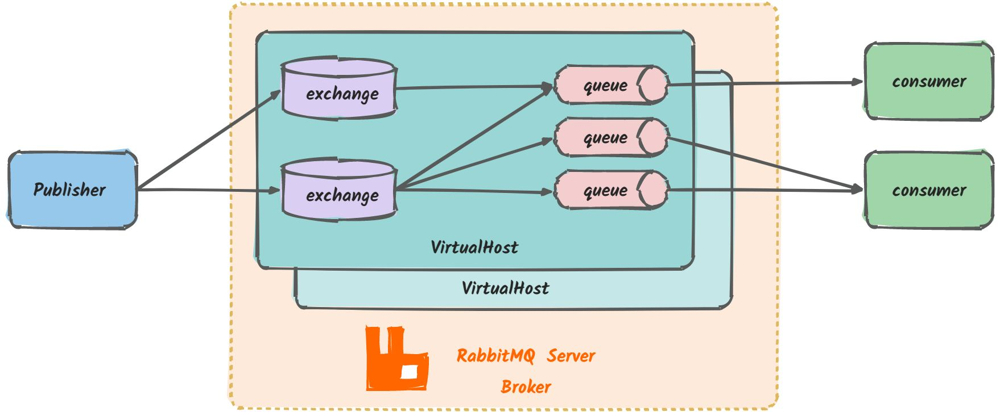
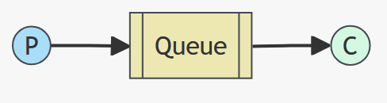
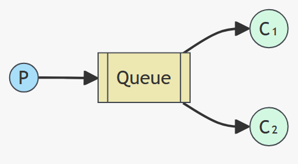
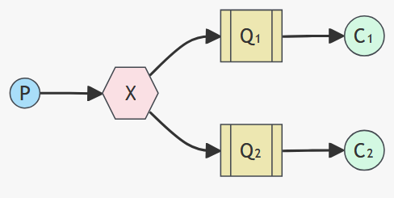
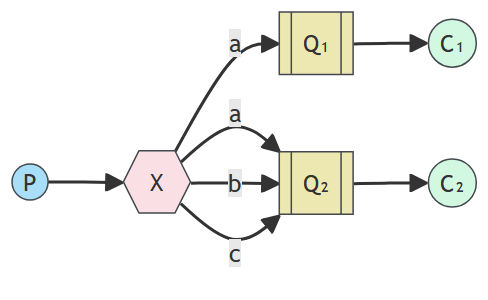
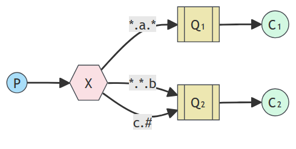

# RabbitMQ

RabbitMQ是基于Erlang语言开发的开源消息通信中间件，官网地址：[https://www.rabbitmq.com/](https://www.rabbitmq.com/)，

它基于AMQP（Advanced Message Queue 高级消息队列协议）协议实现的消息队列，是一种应用程序之间的通信方法。

RabbitMQ 基本架构图：

+ **Publisher**：生产者->发送消息的一方
+ **Consumer**：消费者->消费消息的一方
+ **queue**：队列->储存消息。生产者投递的消息会暂存在消息队列中，等待消费者处理
+ **exchange**：交换机->扶着消息路由。生产者发送的消息有交换机决定投递到哪个队列
+ **VirtualHost**：虚拟主机->起到数据隔离的作用。每个虚拟主机相互独立，有各自的 exchange、queue

# RabbitMQ的五种基本模式

## 简单模式（Hello World!）

一个生产者一个消费者

## 工作队列模式（Work Queues）

## 发布订阅模式（Publish/Subscribe）

## 路由模式（Routing）

## 主题模式（Topics）

