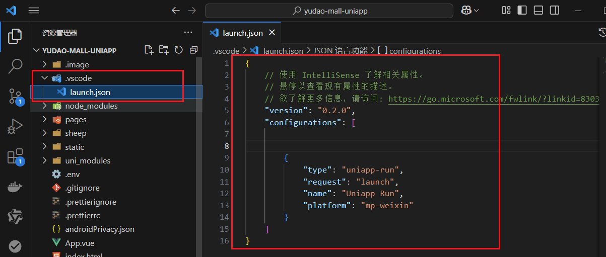
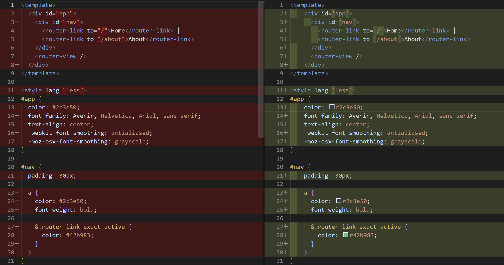

官网

https://uniapp.dcloud.net.cn/

# 创建 uni-app 项目

## uni-app 支持两种方式创建项目：

- 通过HBuilderX 创建
- 通过命令行创建(不必依赖 HBuilderX)

## 通过HBuilderX 创建

 	

## 命令行创建 uni-app 项目：

vue3+ts版: `npx degit dcloudio/uni-preset-vue#vite-ts 项目名称`

gitee下载：[https://gitee.com/dcloud/uni-preset-vue/repository/archive/vite-ts.zip](https://gitee.com/dcloud/uni-preset-vue/repository/archive/vite-ts.zip)

官网链接：[https://uniapp.dcloud.net.cn/quickstart-cli.html#创建uni-app](https://uniapp.dcloud.net.cn/quickstart-cli.html#创建uni-app)


# 启动 uni-app 项目

## 使用VSCode启动 通过HBuilder X创建的uni-app项目

1. 安装插件 uniapp run

   

2. 安装后配置

   

   配置安装地址

   

3. 添加配置，如果第一次使用可以使用默认模版方式快速创建 launch.json

   运行->添加配置->Uni App->Ctrl+s保存

   

   【如果有Uniapp Run，就直接点击，没有就安装扩展回到第一步】

   

   `.vscode`文件夹下的`launch.json`配置已经生成好啦

   

   新增如下两条 ，上面其他的是默认的，无需修改

   ```cobol
   "vueVersion": "v3",  // vue版本
   "openDevTool": true,  // 是否自动启动模拟器
   ```

   4. 添加完成之后点击启动即可

   

# 用 VS Code 开发 uni-app 项目

为什么选择 VS Code ？

- HbuilderX 对 TS 类型支持暂不完善
- VS Code 对 TS 类型支持友好，熟悉的编辑器

## 开发流程


### 安装uni-app插件


> 需要在uni-create-view插件那里打开【设置-扩展设置】
>
> 勾选【创建同名文件夹和文件名(Create-uniapp-view: Directory)】和更改【选择创建的模版(Create-uniapp-view: Template)】为Vue3
>
> 不然没有自动创建目录而且不是Vue3模板

### Ts型校验

1. 安装类型声明文件

   `pnpm i -D @types/wechat-miniprogram @uni-helper/uni-app-types`

2. 配置 tsconfig.json

   注：原配置 experimentalRuntimeMode 现调整为 nativeTags。

   > experimentalRuntimeMode 已废弃现调整为 nativeTags
   >
   > "nativeTags": ["block", "component", "template", "slot"]

   添加以下代码

   ```json
   // tsconfig.json
   {
   	"compilerOptions": {
           "types": [
               "@dcloudio/types",//uniapp默认类型声明文件
               "@types/wechat-miniprogram",//微信小程序的类型声明文件
               "@uni-helper/uni-app-types"//类型增强的类型声明文件
           ]
   	},
       "vueCompilerOptions": {
           "nativeTags": ["block", "component", "template", "slot"]
       }
   }
   ```

   

### Json注释问题

manifest.json和pages.json中，编译器是允许写注释的，但是vscode会严格json的格式

添加项->`manifest.json`和`pages.json`值为`jsonc`


## 拉取模板代码

`git clone -b vite-ts https://gitee.com/dcloud/uni-preset-vue.git`

1. 安装依赖 `pnpm install`

2. 运行项目

   + 终端命令行输入 `pnpm dev:mp-weixin`

   + 或者VSCode的npm脚本里找到dev:mp-weixin运行

   

3. 打开 微信开发者工具, 导入 dist\build\mp-weixin 运行

# 拉取小兔鲜儿项目模板代码

`git clone http://git.itcast.cn/heimaqianduan/erabbit-uni-app-vue3-ts.git heima-shop`

在 manifest.json 中添加微信小程序的 appid


# 基础架构

## 使用 uni-ui 组件库

安装 [uni-ui 组件库](https://uniapp.dcloud.net.cn/component/uniui/quickstart.html#npm安装)

```sh
pnpm i @dcloudio/uni-ui
```

**配置easycom自动导入组件**

```json
// pages.json
{
  // 组件自动导入
  "easycom": {
    //是否开启自动扫描，
    //开启后将会自动扫描符合 `components/组件名称/组件名称.vue` 目录结构的组件
    "autoscan": true,
    //以正则方式自定义组件匹配规则
    "custom": {
      // uni-ui 规则如下配置  // [!code ++]
      "^uni-(.*)": "@dcloudio/uni-ui/lib/uni-$1/uni-$1.vue" // [!code ++]
    }
  },
  "pages": [
    // …省略
  ]
}
```

**安装类型声明文件**

```sh
pnpm i -D @uni-helper/uni-ui-types
```

**配置类型声明文件**

uni-ui是用js开发的并没有升级到ts，所以官网提供uni-ui没有对应的类型声明文件

显示unknown或any


```json
// tsconfig.json
{
  "compilerOptions": {
    // ...
    "types": [
      "@dcloudio/types", // uni-app API 类型声明文件
      "miniprogram-api-typings", // 原生微信小程序类型声明文件
      "@uni-helper/uni-app-types", // uni-app 组件类型声明文件
      "@uni-helper/uni-ui-types" // uni-ui 组件类型声明文件  // [!code ++]
    ]
  },
  // vue 编译器类型，校验标签类型【加入配置，将标签视为原始组件】
  "vueCompilerOptions": {
    "nativeTags": ["block", "component", "template", "slot"]
  }
}
```


## 问题

text和view报错 就去找到vue-official插件，然后右键，点击安装特定版本，输入2.0.12版本，安装完成关掉项目，重新打开就好了


# 


# 【拓展】代码规范

**为什么需要代码规范**

如果没有统一代码风格，团队协作不便于查看代码提交时所做的修改。



### 统一代码风格

- 安装 `eslint` + `prettier`

```sh
pnpm i -D eslint prettier eslint-plugin-vue @vue/eslint-config-prettier @vue/eslint-config-typescript @rushstack/eslint-patch @vue/tsconfig
```

- 新建 `.eslintrc.cjs` 文件，添加以下 `eslint` 配置

```js
/* eslint-env node */
require('@rushstack/eslint-patch/modern-module-resolution')

module.exports = {
  root: true,
  extends: [
    'plugin:vue/vue3-essential',
    'eslint:recommended',
    '@vue/eslint-config-typescript',
    '@vue/eslint-config-prettier',
  ],
  // 小程序全局变量
  globals: {
    uni: true,
    wx: true,
    WechatMiniprogram: true,
    getCurrentPages: true,
    getApp: true,
    UniApp: true,
    UniHelper: true,
    App: true,
    Page: true,
    Component: true,
    AnyObject: true,
  },
  parserOptions: {
    ecmaVersion: 'latest',
  },
  rules: {
    'prettier/prettier': [
      'warn',
      {
        singleQuote: true,
        semi: false,
        printWidth: 100,
        trailingComma: 'all',
        endOfLine: 'auto',
      },
    ],
    'vue/multi-word-component-names': ['off'],
    'vue/no-setup-props-destructure': ['off'],
    'vue/no-deprecated-html-element-is': ['off'],
    '@typescript-eslint/no-unused-vars': ['off'],
  },
}
```

- 配置 `package.json`

```json
{
  "script": {
    // ... 省略 ...
    "lint": "eslint . --ext .vue,.js,.ts --fix --ignore-path .gitignore"
  }
}
```

- 运行

```sh
pnpm lint
```

tip 温馨提示
到此，你已完成 `eslint` + `prettier` 的配置。