# 安装

## 下载

## 安装

找到下载好的VMware-workstation-full-xx.x.x-xxxx.exe，鼠标双击应用安装程序

点击"下一步"

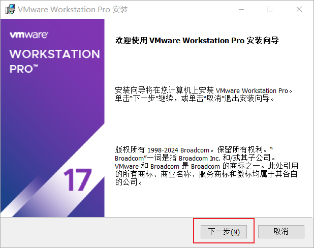

勾选"我接受许可协议中的条款"，点击"下一步"

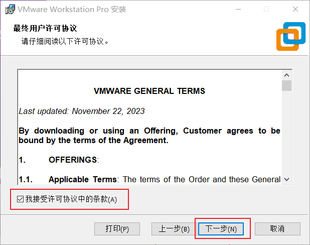

1.单击“更改”，来自定义VMware的安装位置

2.取消勾选“将 VMware Workstation 控制台工具添加到系统 PATH”

3.点击"下一步"

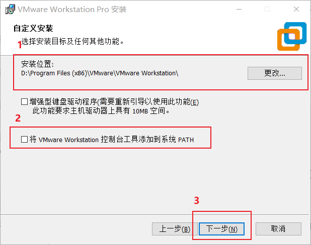

取消默认的两个勾选，点击"下一步"

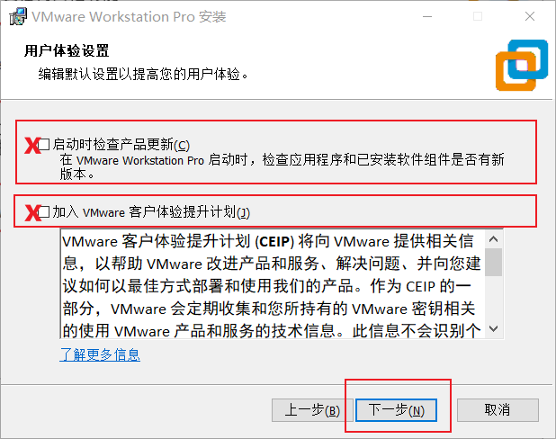

默认勾选，点击"下一步"

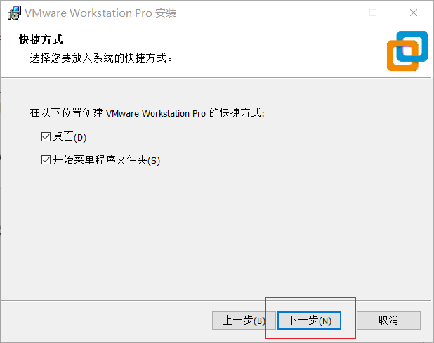

点击“安装”

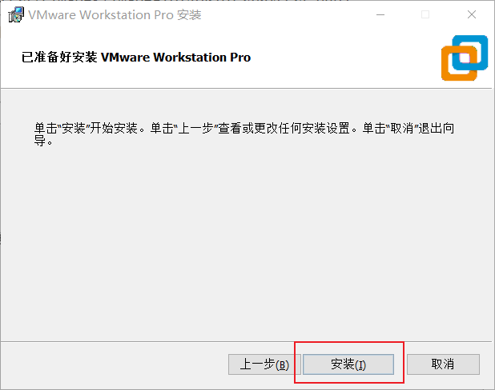

等待...

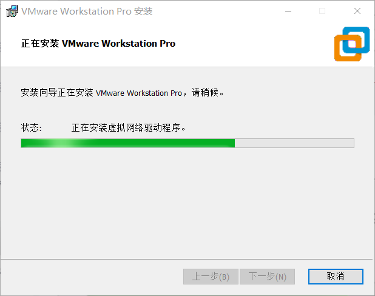

点击”许可证“

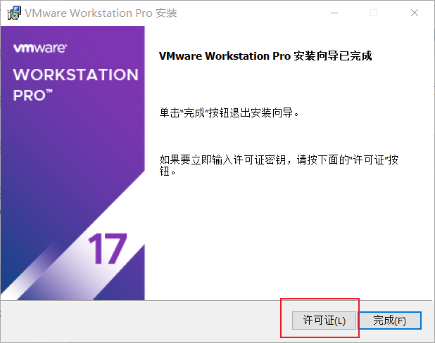

输入许可证密钥——自行百度

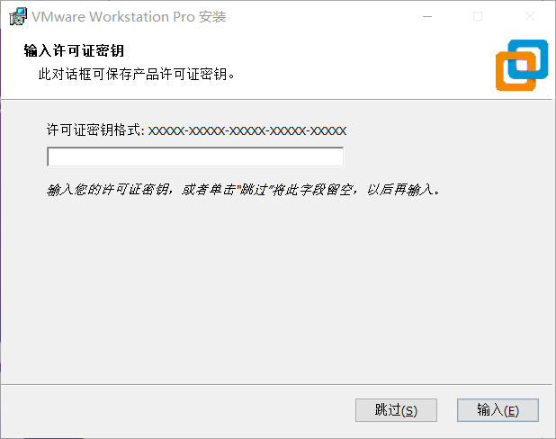

输入许可证密钥后，点击“输入“

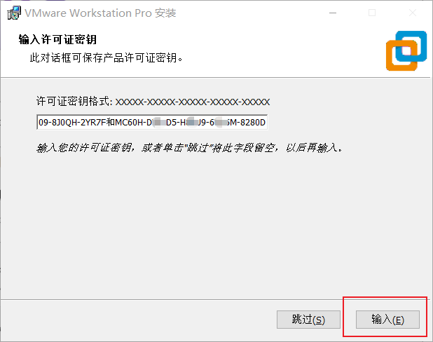

点击”完成”

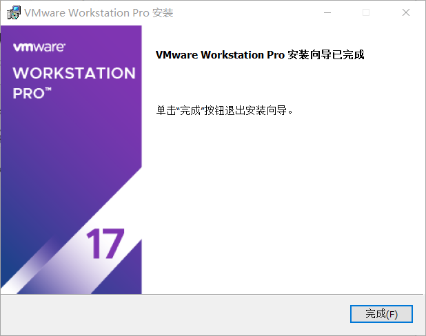