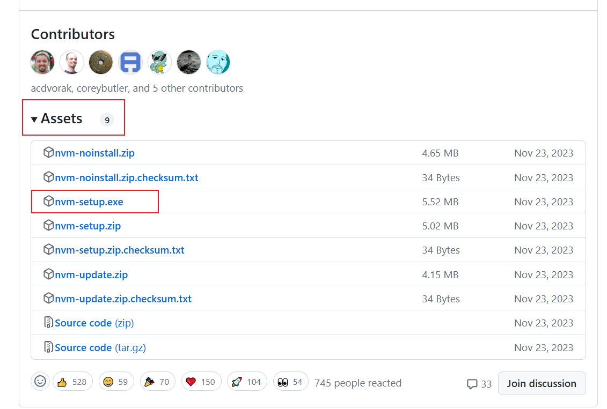
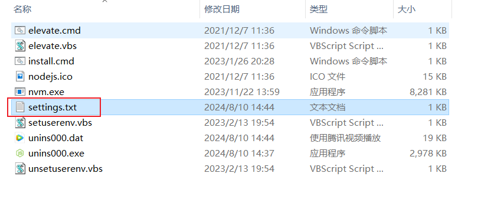
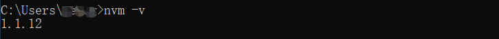
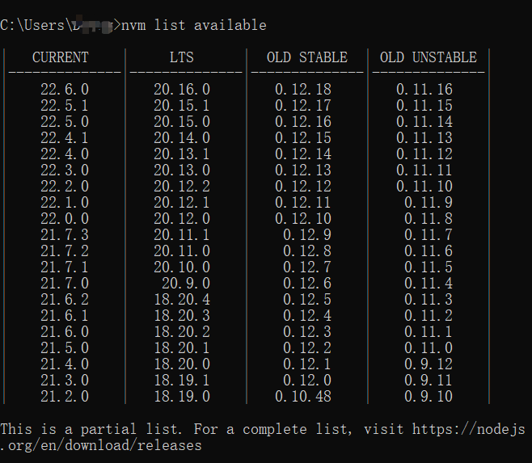
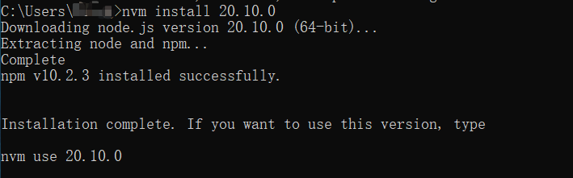
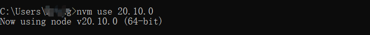

# NVM

nvm（[Node](https://so.csdn.net/so/search?q=Node&spm=1001.2101.3001.7020) Version Manager）是一款用于管理 Node.js 版本的工具，可以轻松地在一个系统中切换和安装多个 Node.js 版本。使用 nvm 可以让你轻松地升级或降级 Node.js 版本，也可以在同一台机器上同时使用多个版本的 Node.js。


**如果你的电脑已经安装了 node，那么在安装 nvm 之前要先卸载掉，避免后面产生不必要的冲突**


## Window 安装 nvm

1. **下载nvm**

[nvm GitHub下载地址](https://github.com/coreybutler/nvm-windows/releases)

在下载页面找到如图所示下载即可：



[nvm 官网下载地址](https://nvm.uihtm.com/)


2. **安装**

   路径不要有中文

3. **配置**

打开 nvm 安装目录下的 `settings.text` 如图：



在该文件里添加下面两行代码，然后保存。

使用淘宝境像安装 node 和 npm

```bash
node_mirror:npmmirror.com/mirrors/node/
npm_mirror:npmmirror.com/mirrors/npm/
```

或者

```bash
node_mirror: https://npm.taobao.org/mirrors/node/
npm_mirror: https://npm.taobao.org/mirrors/npm/
```

4. **检验**

```shell
nvm -v
```

显示`1.1.12`,表示安装成功



## 安装Node.js版本

显示可下载版本的部分列表

```shell
nvm list available
```



- **Current 版本**：Current 版本是 Node.js 的最新开发版本，通常每隔几个月发布一次。它包含最新的功能、改进和实验性特性，但不太稳定。Current 版本的目标是提供给开发人员一个平台来尝试新的功能和实验性特性，以便反馈和测试。
- **LTS 版本**：LTS（Long-Term Support）版本是 Node.js 的长期支持版本，通常每隔两年发布一次。LTS 版本的主要特点是稳定性和可靠性。它们接受持续的维护和安全更新，以确保企业和生产环境的稳定性。

指定下载20.10.0版本的node

```shell
nvm install 20.10.0
```



使用指定的20.10.0版本node

```shell
nvm use 20.10.0
```



## 安装node没有npm的问题

安装了 `node` 却没有 `npm` 的问题，那只能手动安装 `npm`，如下

先查看 `node` 不同版本对应 `npm` 版本号：[点击前往](https://nodejs.org/zh-cn/download/releases/)

再去下载对应的 `npm` 版本的 `zip` 文件：[点击前往]([CNPM Binaries Mirror (npmmirror.com)](https://registry.npmmirror.com/binary.html?path=npm/))

下载好之后：

- 把解压出来的文件夹(`cli-xxxx`)重命名为 `npm`
- 放入对应 node 版本下的 `node_modules` 文件夹里面
- 然后打开该 npm 文件夹里的 `bin` 文件夹，把里面的 `npm 文件` 和 `npm.cmd 文件` 复制，放到对应 node 版本下，和 `node_modules` 文件夹同级即可

上面操作完成之后，执行 `node -v` 和 `npm -v` 就都有了

接着需要执行 `nvm on` 命令来开启使用 nvm 来管理 node，**如果这个命令报错，请打开管理员模式的 `cmd` 或 `powershell`，再执行 `nvm on` 即可**

## 修改 npm 全局目录及环境变量

`Window` 下可以使用npm root -g查看npm安装位置

```shell
npm root -g
```

创建全局模块文件夹`node_global`和缓存文件夹`node_cache`

先执行如下两条命令修改默认 `npm` 全局安装路径，和安装过程缓存文件存储路径

```shell
# 上面的路径，如下，如果设置失败看后面的后续处理第 1 条
npm config set prefix 'D:/Program Files/node/node_global'
npm config set cache 'D:/Program Files/node/node_cache'
# 然后输入下面这个命令查看是否修改成功
npm config ls
```


## nvm 常用命令

- `nvm arch`：

  显示node是运行在32位还是64位。

- `nvm install <version> [arch]` ：

  安装node， version是特定版本也可以是最新稳定版本latest。可选参数arch指定安装32位还是64位版本，默认是系统位数。可以添加--insecure绕过远程服务器的SSL。

- `nvm list [available]` ：

  显示已安装的列表。可选参数available，显示可安装的所有版本。list可简化为ls。

- `nvm on` ：

  开启node.js版本管理。

- `nvm off` ：

  关闭node.js版本管理。

- `nvm proxy [url]` ：

  设置下载代理。不加可选参数url，显示当前代理。将url设置为none则移除代理。

- `nvm node_mirror [url]` ：

  设置node镜像。默认是https://nodejs.org/dist/。如果不写url，则使用默认url。设置后可至安装目录settings.txt文件查看，也可直接在该文件操作。

- `nvm npm_mirror [url]` ：

  设置npm镜像。https://github.com/npm/cli/archive/。如果不写url，则使用默认url。设置后可至安装目录settings.txt文件查看，也可直接在该文件操作。

- `nvm uninstall <version>` ：

  卸载指定版本node。

- `nvm use [version] [arch]` ：

  使用指定版本node。可指定32/64位。

- `nvm root [path]` ：

  设置存储不同版本node的目录。如果未设置，默认使用当前目录。

- `nvm version` ：

  显示nvm版本。version可简化为v。

## 报错及解决方法

Error retrieving "http://npm.taobao.org/mirrors/node/index.json": HTTP Status 404

因为淘宝的镜像域名更换，npm.taobao.org域名[HTTPS证书](https://so.csdn.net/so/search?q=HTTPS证书&spm=1001.2101.3001.7020)到期更换为npmmirror.com，故此导致安装依赖报错

```
# 配置node镜像：
node_mirror:npmmirror.com/mirrors/node/
# 配置npm镜像：
npm_mirror:npmmirror.com/mirrors/npm/
```

# 安装Vue

## 安装vue-cli 3.x

1.卸载旧版本

卸载2.x版本 `npm uninstall vue-cli -g`
卸载3.x版本 `npm uninstall @vue/cli -g`

```
npm ERR! network request to https://registry.npm.taobao.orge/@vue%2fcli failed, reason: getaddrinfo ENOTFOUND registry.npm.taobao.orge
npm ERR! network This is a problem related to network connectivity.
npm ERR! network In most cases you are behind a proxy or have bad network settings.
npm ERR! network
npm ERR! network If you are behind a proxy, please make sure that the
npm ERR! network 'proxy' config is set properly.  See: 'npm help config'
报错：
npm犯错!network与网络连通性有关的问题。 
npm犯错!网络在大多数情况下，你背后的代理或有坏的网络设置。 
npm犯错!网络 npm犯错!网络如果你是一个代理，请确保 npm犯错!网络“代理”配置设置正确。
参见:'npm help config'
```

原理：后台设置的[proxy代理](https://so.csdn.net/so/search?q=proxy代理&spm=1001.2101.3001.7020)环境有问题，可能会有缓存

解决办法：

可以关闭代理然后清理代理环境在进行下载

1. 设置代理关闭

```
npm config set proxy false
```

2. 清除缓存

```
npm cache clean
```

注意，如果出现：清除缓存时报错，如下所示：

```
npm ERR! As of npm@5, the npm cache self-heals from corruption issues 
npm ERR!   by treating integrity mismatches as cache misses.  As a result, 
npm ERR!   data extracted from the cache is guaranteed to be valid.  If you 
npm ERR!   want to make sure 
```

则使用强制清除缓存指令

```
npm cache clean --force
```

注意：若是显示

```
npm WARN using --force Recommended protections disabled.
```

那就说明需要降低npm的版本了，因为安装的npm版本过高


**问题描述：**

近期使用npm淘宝镜像新建项目或依赖时出现报错

**npm ERR! request to https://registry.npm.taobao.org/XXX failed, reason: certificate has expired**


 

**错误原因：**

 

淘宝镜像过期，具体补充说明如下：

 

早在 2021 年，淘宝就发文称，npm 淘宝镜像已经从 [http://registry.npm.taobao.org](https://link.zhihu.com/?target=http%3A//registry.npm.taobao.org) 切换到了 [http://registry.npmmirror.com](https://link.zhihu.com/?target=http%3A//registry.npmmirror.com)。旧域名也将于 2022 年 5 月 31 日停止服务（直到 HTTPS 证书到期才真正不能用了）

 

2024年1 月 22 日，淘宝原镜像域名（[http://registry.npm.taobao.org](https://link.zhihu.com/?target=http%3A//registry.npm.taobao.org)）的 HTTPS 证书正式到期，导致旧的 npm 淘宝镜像在使用时出错了。

 

**解决方案：**

### 1 清空缓存

```text
npm cache clean --force
```

### 2 查看当前的npm镜像设置

```text
npm config get registry
```

### 3 切换新源

```text
npm config set registry https://registry.npmmirror.com
```

### 4 查看新源是否设置成功

```text
npm config get registry

```

### 5 可以正常安装需要的工具了

```text
npm insatll
```

 