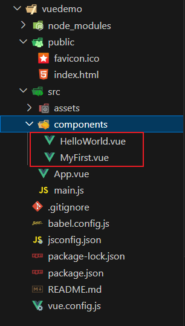
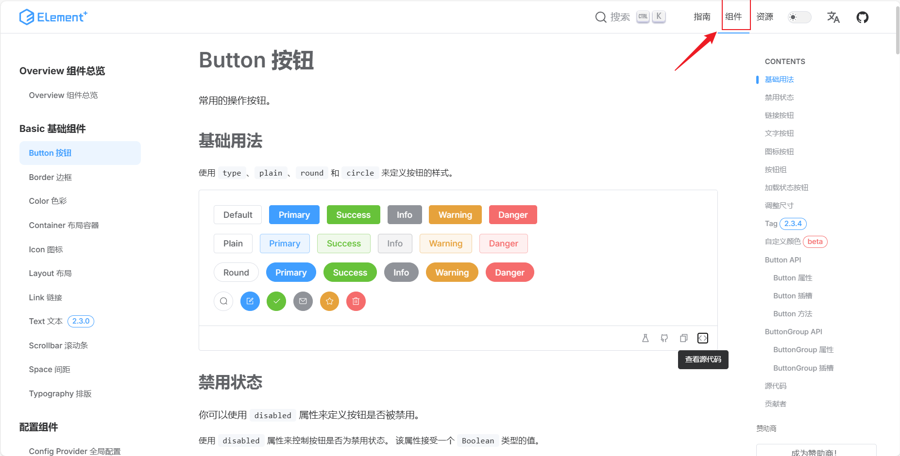
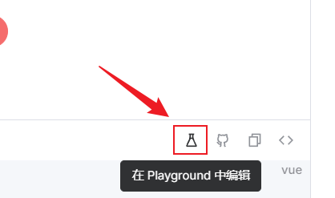
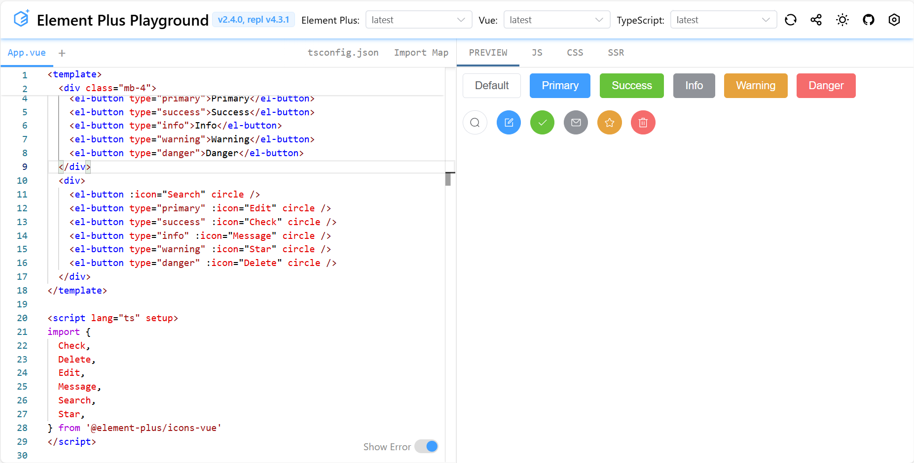

前言

[Html5+CSS3](./Html5+CSS3)笔记

[JavaScript](./JavaScript)笔记

[NVM](./NVM)笔记


# Vue

目的：减少对原生Dom的操作

双向数据绑定: 

> js数据变量和html标签内容进行绑定

响应式数据:

> 不需要操作原生dom对象,自动实现双向数据绑定

Vue工程化与组件化

# Vue工程化

环境准备
`node.js`——vue项目运行环境
`npm`——vue打包以及依赖管理工具
`vue-cli`——vue项目构建工具
创建第一个Vue项目
vue-cli
详见手册

安装vue-cli 3.x

1.卸载旧版本

卸载2.x版本 `npm uninstall vue-cli -g`
卸载3.x版本 `npm uninstall @vue/cli -g`

# Vue组件化

### 什么是组件

组件（component）是vue中最强大的功能之一，一个组件你可以简单想像成一个html页面

### 开发组件

使用步骤

1. 定义组件

   在src/components文件夹内新建一个.vue后缀的文件作为组件

   组件的名称（代码严格检查）——大驼峰、多个单词

   

   关闭代码严格检查

   vue.config.js

   ```js
   module.exports = defineConfig({
   	/*
   	...
   	*/
     //禁用代码严格检查，用途：保存的时候把严格检查禁掉
     lintOnSave: false
   })
   ```

   

   每一个.vue文件由templete、script、style构成

   > template——代表html页面
   > script——代表数据和行为
   > style——代表样式 ,style写上scoped属性，css样式只对当前的组件生效

   HelloWorld.vue

   ```vue
   <template>
     <div class="hello">
       <h1>{{ msg }}</h1>
     </div>
   </template>
   
   <script>
   export default {
     name: 'HelloWorld',
     props: {
       msg: String
     }
   }
   </script>
   
   <!-- Add "scoped" attribute to limit CSS to this component only -->
   <style scoped>
   </style>
   
   ```

   MyFirst.vue

   ```vue
   <template>
       <div>
           <h1>第一个Vue组件,{{ word }}</h1>
           <span v-for="item in arr" >{{ item }}</span>
       </div>
   </template>
   <script setup>
       var word = '你好';
       var arr = [1,2,3,4,5];
   </script>
   <style>
   </style>
   ```

   

2. 引入组件
   格式：import 自定义组件名 from '组件路径 

   > 若导入的文件名为vue后缀则可以省略（vue中可以自动识别.vue文件后缀）
   >
   > 导入的路径可以写绝对路径（@默认代表项目中的src目录）

3. 导出组件

App.vue

```vue
<template>
  <HelloWorld msg="Welcome to Your Vue.js App"/> 
  <!-- 在根组件中使用子组件把子组件当成一个html标签，-->
   <!-- vue会自动捕获该子组件中的template中的html代码 ，拼接在根组件--> 
  <MyFirst/>
  
</template>

<script>
import HelloWorld from './components/HelloWorld.vue'
//在跟组件中导入子组件
import MyFirst from '@/components/MyFirst.vue'
//导出子组件
export default {
  name: 'App',
  components: {
    HelloWorld,
    MyFirst
  }
}
</script>

<style>
#app {
  font-family: Avenir, Helvetica, Arial, sans-serif;
  -webkit-font-smoothing: antialiased;
  -moz-osx-font-smoothing: grayscale;
  text-align: center;
  color: #2c3e50;
  margin-top: 60px;
}
</style>

```

运行效果


## vue文件中setup组合式api的使用

+ 第一种

  > 给script标签添加一个setup标识即可，并且定义的所有属性和函数都会直接暴露给template，不需要返回

  ```vue
  <script setup>
  	
  </script>
  ```

+ 第二种

  > script标签显示写出setup函数
  >
  > export default负责导出setup函数给外部使用

  ```vue
  <script>
  export default {
      setup() {
          return {
              
          }
      }
  }
  </script>
  ```

# Vue3 UI框架

## Element plus

Element plus只适用于Vue3框架！

官方网站https://element-plus.org/

1. 安装element-plus

   ```shell
   npm install element-plus --save
   如果安装后启动失败,可能由于依赖有缓存,执行以下命令
   npm cache clean --force  //清除缓存
   npm install  //重新安装依赖
   或者以管理员身份运行VSCode
   ```

2. 完整引入

   完整引入整个element plus 库，即把所有的组件全部下载到项目中，这样前端项目会变得有些大

3. 国际化

   Element plus是国际版的，默认使用的英文的，配置语言为中文

4. 完整配置

   main.js

    ```js
   import { createApp } from 'vue'
   import App from './App.vue'
   //导入element plus 库
   import ElementPlus from 'element-plus'
   import 'element-plus/dist/index.css'
   //导入中文语言包
   import zhCn from 'element-plus/es/locale/lang/zh-cn'
   
   const app = createApp(App)
   
   //vue使用element plus样式库，设置组件语言为中文
   app.use(ElementPlus, {
       locale: zhCn,
   })
   //把vue应用挂载到 页面上
   app.mount('#app')
    ```

5. Element plus组件使用

   点击页面中的”组件“，进行组件的挑选

   

   可在Playground中在线编辑及预览

   

   

# Vue路由（Vue Router）

## 为什么使用路由

为了实现页面跳转

## 安装路由


`npm install vue-router@4`

## 路由的两种基本方式

+ 声明式路由
  利用`<router-link to=''></router-link>`标签指定路径进行跳转
  在`<route-link>`标签后添加路由占位标签`<router-view></router-view>`

+ 编程式路由（点击事件路由）

  ```vue
  <script>
  import router from '@/router/router';
  export default{
      setup(){
          function jump(){
              router.push(跳转路径)
          }
          return {
              jump
          }
      }
  }
  </script>
  ```


# Npm


## 报错

```
npm ERR! network request to https://registry.npm.taobao.orge/@vue%2fcli failed, reason: getaddrinfo ENOTFOUND registry.npm.taobao.orge
npm ERR! network This is a problem related to network connectivity.
npm ERR! network In most cases you are behind a proxy or have bad network settings.
npm ERR! network
npm ERR! network If you are behind a proxy, please make sure that the
npm ERR! network 'proxy' config is set properly.  See: 'npm help config'
报错：
npm犯错!network与网络连通性有关的问题。 
npm犯错!网络在大多数情况下，你背后的代理或有坏的网络设置。 
npm犯错!网络 npm犯错!网络如果你是一个代理，请确保 npm犯错!网络“代理”配置设置正确。
参见:'npm help config'
```

原理：后台设置的[proxy代理](https://so.csdn.net/so/search?q=proxy代理&spm=1001.2101.3001.7020)环境有问题，可能会有缓存

解决办法：

可以关闭代理然后清理代理环境在进行下载

1. 设置代理关闭

```
npm config set proxy false
```

2. 清除缓存

```
npm cache clean
```

注意，如果出现：清除缓存时报错，如下所示：

```
npm ERR! As of npm@5, the npm cache self-heals from corruption issues 
npm ERR!   by treating integrity mismatches as cache misses.  As a result, 
npm ERR!   data extracted from the cache is guaranteed to be valid.  If you 
npm ERR!   want to make sure 
```

则使用强制清除缓存指令

```
npm cache clean --force
```

注意：若是显示

```
npm WARN using --force Recommended protections disabled.
```

那就说明需要降低npm的版本了，因为安装的npm版本过高


**问题描述：**

近期使用npm淘宝镜像新建项目或依赖时出现报错

**npm ERR! request to https://registry.npm.taobao.org/XXX failed, reason: certificate has expired**


**错误原因：**

淘宝镜像过期，具体补充说明如下：

早在 2021 年，淘宝就发文称，npm 淘宝镜像已经从 [http://registry.npm.taobao.org](https://link.zhihu.com/?target=http%3A//registry.npm.taobao.org) 切换到了 [http://registry.npmmirror.com](https://link.zhihu.com/?target=http%3A//registry.npmmirror.com)。旧域名也将于 2022 年 5 月 31 日停止服务（直到 HTTPS 证书到期才真正不能用了）

2024年1 月 22 日，淘宝原镜像域名（[http://registry.npm.taobao.org](https://link.zhihu.com/?target=http%3A//registry.npm.taobao.org)）的 HTTPS 证书正式到期，导致旧的 npm 淘宝镜像在使用时出错了。


**解决方案：**

### 1 清空缓存

```text
npm cache clean --force
```

### 2 查看当前的npm镜像设置

```text
npm config get registry
```

### 3 切换新源

```text
npm config set registry https://registry.npmmirror.com
```

### 4 查看新源是否设置成功

```text
npm config get registry
```

### 5 可以正常安装需要的工具了

```text
npm insatll
```

 可以看到镜像已经切换，再运行npm install

还是报错。。。。。。

后面才发现是package-lock.json中的镜像是之前的淘宝镜像，所以光是在终端更改镜像是没用的。删掉package-lock.json文件，再执行npm install命令，下载依赖成功。

# Yarn

yarn安装

```
npm install -g
```

yarn卸载

```
 yarn npm uninstall yarn -g  
```

## 报错

<font color="red">`yarn : 无法加载文件 D:\Program Files\nodejs\yarn.ps1，因为在此系统上禁止运行脚本。`</font>

先输入 `get-ExecutionPolicy` 查看状态
Restricted 表示禁用

再输入`set-ExecutionPolicy RemoteSigned`

然后就可以正常使用了

<font color="red">`error Error: certificate has expired <br>at TLSSocket.onConnectSecure (_tls_wrap.js:1502:34) at TLSSocket.emit (events.js:314:20)
    at TLSSocket._finishInit (_tls_wrap.js:937:8)`</font>

这个问题提示是证书过期导致的。

可以尝试禁用[SSL证书](https://so.csdn.net/so/search?q=SSL证书&spm=1001.2101.3001.7020)验证。

```vbnet
yarn config set strict-ssl false
```

然后再继续安装。

就可以了。

<font color="red">`[2/4] Fetching packages...
info There appears to be trouble with your network connection. Retrying...
info There appears to be trouble with your network connection. Retrying...
info There appears to be trouble with your network connection. Retrying...
info There appears to be trouble with your network connection. Retrying...
info There appears to be trouble with your network connection. Retrying...
error Error: connect ETIMEDOUT 104.16.0.35:443
    at TCPConnectWrap.afterConnect [as oncomplete] (net.js:1144:16)
info Visit https://yarnpkg.com/en/docs/cli/install for documentation about this command.`</font>

```
[2/4] Fetching packages...
info There appears to be trouble with your network connection. Retrying...
info There appears to be trouble with your network connection. Retrying...
info There appears to be trouble with your network connection. Retrying...
info There appears to be trouble with your network connection. Retrying...
info There appears to be trouble with your network connection. Retrying...
error Error: connect ETIMEDOUT 104.16.0.35:443
    at TCPConnectWrap.afterConnect [as oncomplete] (net.js:1144:16)
info Visit https://yarnpkg.com/en/docs/cli/install for documentation about this command.
```

将strict-ssl设置为false   yarn config set strict-ssl false 重新运行还是会报同样的错

然后将资源地址设置为淘宝镜像

yarn config set registry https://registry.npmmirror.com/

查看设置项 

yarn config get registry

如下


再次yarn install 成功了

